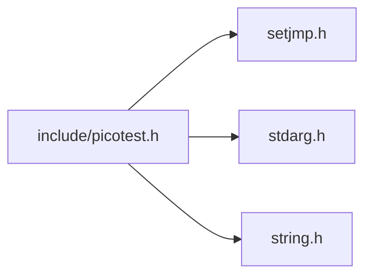

<a id="picotest_8h"></a>
# File picotest.h

![][C++]

**Location**: `include/picotest.h`

This file defines a minimalist unit testing framework for C programs.

The assertion mechanism relies on <code>setjmp()</code> / <code>longjmp()</code>. While these functions are discouraged for production code, their usage is acceptable in the context of unit testing: in our case, <code>longjmp()</code> is only called when an assertion fails, a situation where the actual process state is no longer reliable anyway. Moreover, they constitute the only standard exception handling mechanism for plain C code.


**License**:

PicoTest is released under the terms of the 3-Clause BSD License:


[https://opensource.org/licenses/BSD-3-Clause](https://opensource.org/licenses/BSD-3-Clause)


Copyright (c) 2018 Frederic Bonnet


Redistribution and use in source and binary forms, with or without modification, are permitted provided that the following conditions are met:


1. Redistributions of source code must retain the above copyright notice, this list of conditions and the following disclaimer.

2. Redistributions in binary form must reproduce the above copyright notice, this list of conditions and the following disclaimer in the documentation and/or other materials provided with the distribution.

3. Neither the name of the copyright holder nor the names of its contributors may be used to endorse or promote products derived from this software without specific prior written permission.


THIS SOFTWARE IS PROVIDED BY THE COPYRIGHT HOLDERS AND CONTRIBUTORS "AS IS" AND ANY EXPRESS OR IMPLIED WARRANTIES, INCLUDING, BUT NOT LIMITED TO, THE IMPLIED WARRANTIES OF MERCHANTABILITY AND FITNESS FOR A PARTICULAR PURPOSE ARE DISCLAIMED. IN NO EVENT SHALL THE COPYRIGHT HOLDER OR CONTRIBUTORS BE LIABLE FOR ANY DIRECT, INDIRECT, INCIDENTAL, SPECIAL, EXEMPLARY, OR CONSEQUENTIAL DAMAGES (INCLUDING, BUT NOT LIMITED TO, PROCUREMENT OF SUBSTITUTE GOODS OR SERVICES; LOSS OF USE, DATA, OR PROFITS; OR BUSINESS INTERRUPTION) HOWEVER CAUSED AND ON ANY THEORY OF LIABILITY, WHETHER IN CONTRACT, STRICT LIABILITY, OR TORT (INCLUDING NEGLIGENCE OR OTHERWISE) ARISING IN ANY WAY OUT OF THE USE OF THIS SOFTWARE, EVEN IF ADVISED OF THE POSSIBILITY OF SUCH DAMAGE.

## Classes

* [PicoTestMetadata](struct_pico_test_metadata.md#struct_pico_test_metadata)

## Includes

* <setjmp.h>
* <stdarg.h>
* <string.h>





## Included by

* <include/picotestRunner.inc>


## Version

PicoTest follows the Semantic Versioning Specification (SemVer) 2.0.0:


[https://semver.org/spec/v2.0.0.html](https://semver.org/spec/v2.0.0.html)

<a id="group__public__interface_1ga1402f3301dff3f468aac77622f877f2d"></a>
### Macro PICOTEST\_VERSION


```cpp
#define PICOTEST_VERSION
```


<a id="group__public__interface_1ga9ea29549254cbe44f25ef974d0458e57"></a>
### Macro PICOTEST\_VERSION\_MAJOR


```cpp
#define PICOTEST_VERSION_MAJOR
```


<a id="group__public__interface_1ga6488c76f8a06a1a8222c2309b170bd1d"></a>
### Macro PICOTEST\_VERSION\_MINOR


```cpp
#define PICOTEST_VERSION_MINOR
```


<a id="group__public__interface_1gafc9d1ab6d8cced95f3560c3a006d8005"></a>
### Macro PICOTEST\_VERSION\_PATCH


```cpp
#define PICOTEST_VERSION_PATCH
```


## Namespaces

<a id="group__public__interface_1gae82b43024340d2c047e29052f6b541cf"></a>
### Macro PICOTEST\_NAMESPACE


```cpp
#define PICOTEST_NAMESPACE
```


<a id="group__public__interface_1ga8f5ca8a0365eab9bb822126b61399dd0"></a>
### Macro PICOTEST\_NAMESPACE\_DELIMITER


```cpp
#define PICOTEST_NAMESPACE_DELIMITER
```


<a id="group__public__interface_1gacaba613d5189a6fa6dc4be50a2e366d3"></a>
### Macro PICOTEST\_EXPORT


```cpp
#define PICOTEST_EXPORT
```


## Test Functions

<a id="group__public__interface_1ga88033e8fb73d885670773cfc8ad1d024"></a>
### Macro PICOTEST\_EXTERN


```cpp
#define PICOTEST_EXTERN
```


<a id="group__public__interface_1gaa7f907387dd96cac614ad0dfe4cbb858"></a>
### Macro PICOTEST\_METADATA


```cpp
#define PICOTEST_METADATA
```


<a id="group__public__interface_1ga5c445b2f0ea8f269813f7e479753bff9"></a>
### Typedef PicoTestProc

## Test Filters

PicoTest provides a way for client code to select tests to be run using custom filter functions.

<a id="group__public__interface_1ga7dccbea985fb578ba6b7639fb66fc3ea"></a>
### Macro PICOTEST\_FILTER\_DEFAULT


```cpp
#define PICOTEST_FILTER_DEFAULT
```


<a id="group__public__interface_1gabd82de0bec174d972151cd122a0a03ff"></a>
### Macro PICOTEST\_FILTER


```cpp
#define PICOTEST_FILTER
```


<a id="group__public__interface_1gaf5acf1a68605f6c8b758bae0224e03fc"></a>
### Enumeration type PicoTestFilterResult


```cpp
enum PicoTestFilterResult { /* ... */ }
```


<a id="group__public__interface_1ga6d5c4a903f131bbed4913008d9e3b212"></a>
### Typedef PicoTestFilterProc

<a id="group__public__interface_1gace2d0b7428d63b90190fe65b619a8680"></a>
### Function \_picoTest\_filterByName

## Test hierarchy traversal

Tests can form hierarchies of test suites and test cases. PicoTest provides two ways to traverse such hierarchies with a simple visitor pattern. This can be used for e.g. test list discovery in build systems.

<a id="group__public__interface_1gaee8202c2543c7fb59fa08aec75b6cc63"></a>
### Macro PICOTEST\_TRAVERSE


```cpp
#define PICOTEST_TRAVERSE
```


<a id="group__public__interface_1ga84b8e9060ee56ca5c5b64da168ee7f6f"></a>
### Macro PICOTEST\_VISIT


```cpp
#define PICOTEST_VISIT
```


<a id="group__public__interface_1gad78162429011bb689a76e91530ac7a22"></a>
### Enumeration type PicoTestVisitStep


```cpp
enum PicoTestVisitStep { /* ... */ }
```


<a id="group__public__interface_1ga403413d76b48c48740171b3a234af5c5"></a>
### Typedef PicoTestTraverseProc

<a id="group__public__interface_1ga2b14de2e8f56c8e7efb8e883069abb34"></a>
### Typedef PicoTestVisitProc

<a id="group__public__interface_1gaacd9c37695afbb5b3bb8c5373c527641"></a>
### Function \_picoTest\_traverse

<a id="group__public__interface_1ga114c577e2b5e238b8545c80be5783fea"></a>
### Function \_picoTest\_visit

## Logging

PicoTest provides a way for client code to intercept test failure events. This can be used for e.g. logging purpose or reporting.

<a id="group__public__interface_1gaf08fabb517d01d11ce72614d1df51687"></a>
### Macro PICOTEST\_FAILURE\_LOGGER\_DEFAULT


```cpp
#define PICOTEST_FAILURE_LOGGER_DEFAULT
```


<a id="group__public__interface_1gae4b2f943bef59bd05fb7a328a6c39d48"></a>
### Macro PICOTEST\_FAILURE\_LOGGER


```cpp
#define PICOTEST_FAILURE_LOGGER
```


<a id="group__public__interface_1gafc6530e30c90b9f92367ef643c8f4e00"></a>
### Typedef PicoTestFailureLoggerProc

<a id="group__public__interface_1gae3c669f4ae731be32a25df3d3a97b599"></a>
### Function \_picoTest\_logFailure

## Test Case Definitions

<a id="group__test__cases_1gadca8898d29eb42dde764ed83a5d9faf5"></a>
### Macro PICOTEST\_CASE


```cpp
#define PICOTEST_CASE
```


## Test Case Hooks

PicoTest provides a way for client code to intercept test case events. This can be used for e.g. logging purpose or reporting.

<a id="group__test__cases_1ga4a4a1356f85b26cd29f2f7ae4c09cf91"></a>
### Macro PICOTEST\_CASE\_ENTER\_DEFAULT


```cpp
#define PICOTEST_CASE_ENTER_DEFAULT
```


<a id="group__test__cases_1gad1f702ab6600b04f66731d35bf38fc67"></a>
### Macro PICOTEST\_CASE\_ENTER


```cpp
#define PICOTEST_CASE_ENTER
```


<a id="group__test__cases_1ga5ff2295c5a324991c72a81bcfb949522"></a>
### Macro PICOTEST\_CASE\_LEAVE\_DEFAULT


```cpp
#define PICOTEST_CASE_LEAVE_DEFAULT
```


<a id="group__test__cases_1ga4fd71dfed1ce3733b0d670c86b8d523a"></a>
### Macro PICOTEST\_CASE\_LEAVE


```cpp
#define PICOTEST_CASE_LEAVE
```


<a id="group__test__cases_1ga2148fa53887bde18878299c0941d9844"></a>
### Typedef PicoTestCaseEnterProc

<a id="group__test__cases_1ga2649b7563a8a3c14c93f310cb6699185"></a>
### Typedef PicoTestCaseLeaveProc

## Assertion Definitions

<a id="group__assertions_1gad71b76cf1173654acc95df79d1c7040b"></a>
### Macro PICOTEST\_ASSERT


```cpp
#define PICOTEST_ASSERT
```


<a id="group__assertions_1gacd07b017f38d1e3ad784f369345357a2"></a>
### Macro PICOTEST\_VERIFY


```cpp
#define PICOTEST_VERIFY
```


<a id="group__assertions_1ga89a35f18021df570967bb707a8537f3b"></a>
### Macro PICOTEST\_FAILURE


```cpp
#define PICOTEST_FAILURE
```


<a id="group__assertions_1ga62031fa5f6f86e517565b77a1fa37f59"></a>
### Macro PICOTEST\_ABORT


```cpp
#define PICOTEST_ABORT
```


<a id="group__assertions_1ga8d7eb92ca21dfb7fe46fc2472e11f496"></a>
### Variable \_picoTest\_fail

<a id="group__assertions_1ga2fdb4a73b6a0abc186a27065a36db6ed"></a>
### Variable \_picoTest\_failureEnv

<a id="group__assertions_1gadd80bff454009ce1077d81f1f5552f34"></a>
### Function \_picoTest\_assertFailed

## Assertion Hooks

PicoTest provides a way for client code to intercept assertions events. This can be used for e.g. logging purpose or reporting.

<a id="group__assertions_1ga331ef495337f7e2aae8be15cfd2a170a"></a>
### Macro PICOTEST\_ASSERT\_BEFORE\_DEFAULT


```cpp
#define PICOTEST_ASSERT_BEFORE_DEFAULT
```


<a id="group__assertions_1gaa38b1a0014fe2ab172a5466f9031aafb"></a>
### Macro PICOTEST\_ASSERT\_BEFORE


```cpp
#define PICOTEST_ASSERT_BEFORE
```


<a id="group__assertions_1gab1f1711109e4a8443a61c228194a6825"></a>
### Macro PICOTEST\_ASSERT\_AFTER\_DEFAULT


```cpp
#define PICOTEST_ASSERT_AFTER_DEFAULT
```


<a id="group__assertions_1gae6c0c62e54611c6d92a3a8b81545f934"></a>
### Macro PICOTEST\_ASSERT\_AFTER


```cpp
#define PICOTEST_ASSERT_AFTER
```


<a id="group__assertions_1ga507d93a48b3c01ec9c43499d129d6db0"></a>
### Typedef PicoTestAssertBeforeProc

<a id="group__assertions_1ga8f5650aa00db35bc50511fa2a01a45e7"></a>
### Typedef PicoTestAssertAfterProc

## Test Fixture Definitions

<a id="group__fixtures_1ga983cffc937dca4baa55f59afad404f03"></a>
### Macro PICOTEST\_FIXTURE\_CONTEXT


```cpp
#define PICOTEST_FIXTURE_CONTEXT
```


<a id="group__fixtures_1ga1e98cba23391e13521100528ee1a2181"></a>
### Macro PICOTEST\_FIXTURE\_SETUP


```cpp
#define PICOTEST_FIXTURE_SETUP
```


<a id="group__fixtures_1ga0d887bdb08e22489fc3cf9fb28a35fd1"></a>
### Macro PICOTEST\_FIXTURE\_TEARDOWN


```cpp
#define PICOTEST_FIXTURE_TEARDOWN
```


## Test Fixture Hooks

PicoTest provides a way for client code to intercept test fixture events. This can be used for e.g. logging purpose or reporting.

<a id="group__fixtures_1ga503733d3013e81575c72a1100437ccf0"></a>
### Macro PICOTEST\_FIXTURE\_BEFORE\_SETUP\_DEFAULT


```cpp
#define PICOTEST_FIXTURE_BEFORE_SETUP_DEFAULT
```


<a id="group__fixtures_1gab6053367243af2ee7745bf35a3baaa4e"></a>
### Macro PICOTEST\_FIXTURE\_BEFORE\_SETUP


```cpp
#define PICOTEST_FIXTURE_BEFORE_SETUP
```


<a id="group__fixtures_1ga8bfe212f7c3bed6d83be102510086012"></a>
### Macro PICOTEST\_FIXTURE\_AFTER\_SETUP\_DEFAULT


```cpp
#define PICOTEST_FIXTURE_AFTER_SETUP_DEFAULT
```


<a id="group__fixtures_1ga679063021accc32a74c1e617ed68423f"></a>
### Macro PICOTEST\_FIXTURE\_AFTER\_SETUP


```cpp
#define PICOTEST_FIXTURE_AFTER_SETUP
```


<a id="group__fixtures_1ga11bbe6bcd529ac78264411add1275635"></a>
### Macro PICOTEST\_FIXTURE\_BEFORE\_TEARDOWN\_DEFAULT


```cpp
#define PICOTEST_FIXTURE_BEFORE_TEARDOWN_DEFAULT
```


<a id="group__fixtures_1gaf68cbda0bf19afd7994c2e0a15278f8d"></a>
### Macro PICOTEST\_FIXTURE\_BEFORE\_TEARDOWN


```cpp
#define PICOTEST_FIXTURE_BEFORE_TEARDOWN
```


<a id="group__fixtures_1ga667b954d1448d95e022451b8711e6abf"></a>
### Macro PICOTEST\_FIXTURE\_AFTER\_TEARDOWN\_DEFAULT


```cpp
#define PICOTEST_FIXTURE_AFTER_TEARDOWN_DEFAULT
```


<a id="group__fixtures_1ga1a910236e326a942bc3a5be5c6013520"></a>
### Macro PICOTEST\_FIXTURE\_AFTER\_TEARDOWN


```cpp
#define PICOTEST_FIXTURE_AFTER_TEARDOWN
```


<a id="group__fixtures_1ga8aa61845d5a3f09e8d6df140a31c36d7"></a>
### Typedef PicoTestFixtureBeforeSetupProc

<a id="group__fixtures_1ga0e4c1719160ac09c22d3b4ce06704962"></a>
### Typedef PicoTestFixtureAfterSetupProc

<a id="group__fixtures_1gaf69eeeb219ed143a9a978d49850cb072"></a>
### Typedef PicoTestFixtureBeforeTeardownProc

<a id="group__fixtures_1gaf955a2ec76f0278eac70de7315ecb844"></a>
### Typedef PicoTestFixtureAfterTeardownProc

## Test Suite Definitions

<a id="group__test__suites_1ga7a9c873e5e377bd88fcc4849689c1e6f"></a>
### Macro PICOTEST\_SUITE


```cpp
#define PICOTEST_SUITE
```


## Test Suite Hooks

PicoTest provides a way for client code to intercept test execution events on test suites and their subtests. This can be used for e.g. logging purpose or reporting.

<a id="group__test__suites_1ga50f13419afbe35f17150bacd7a906838"></a>
### Macro PICOTEST\_SUITE\_ENTER\_DEFAULT


```cpp
#define PICOTEST_SUITE_ENTER_DEFAULT
```


<a id="group__test__suites_1gae569b3a4f05ebefc297411072e505fd3"></a>
### Macro PICOTEST\_SUITE\_ENTER


```cpp
#define PICOTEST_SUITE_ENTER
```


<a id="group__test__suites_1gaf24c1f7c243e1990463aea4fbd4d5324"></a>
### Macro PICOTEST\_SUITE\_LEAVE\_DEFAULT


```cpp
#define PICOTEST_SUITE_LEAVE_DEFAULT
```


<a id="group__test__suites_1ga2ce5e2f78882e9f26067dc4ca9d0570c"></a>
### Macro PICOTEST\_SUITE\_LEAVE


```cpp
#define PICOTEST_SUITE_LEAVE
```


<a id="group__test__suites_1gab5b747836950016e04544e29879f3da3"></a>
### Macro PICOTEST\_SUITE\_BEFORE\_SUBTEST\_DEFAULT


```cpp
#define PICOTEST_SUITE_BEFORE_SUBTEST_DEFAULT
```


<a id="group__test__suites_1ga5a49439f633f383f0bb3d2a6e700d464"></a>
### Macro PICOTEST\_SUITE\_BEFORE\_SUBTEST


```cpp
#define PICOTEST_SUITE_BEFORE_SUBTEST
```


<a id="group__test__suites_1ga0aa7b03502294fee8f3e5b4951027145"></a>
### Macro PICOTEST\_SUITE\_AFTER\_SUBTEST\_DEFAULT


```cpp
#define PICOTEST_SUITE_AFTER_SUBTEST_DEFAULT
```


<a id="group__test__suites_1gaab4493d86071cc9263827bf9a05a3b24"></a>
### Macro PICOTEST\_SUITE\_AFTER\_SUBTEST


```cpp
#define PICOTEST_SUITE_AFTER_SUBTEST
```


<a id="group__test__suites_1ga4e09d95df5430205a201b5a02b522f25"></a>
### Typedef PicoTestSuiteEnterProc

<a id="group__test__suites_1ga5d8415df8755804fe1479ff21d17ed90"></a>
### Typedef PicoTestSuiteLeaveProc

<a id="group__test__suites_1ga7547327d267d2bad9362c7adcc96bb24"></a>
### Typedef PicoTestSuiteBeforeSubtestProc

<a id="group__test__suites_1gabce697eb4326140f89b0546d773da31c"></a>
### Typedef PicoTestSuiteAfterSubtestProc

## Macros

<a id="picotest_8h_1ab3f51c6e814dfdb310878e904dae18cd"></a>
### Macro \_PICOTEST\_PARENS

![][public]


```cpp
#define _PICOTEST_PARENS
```


## Source


```cpp


#ifndef _PICOTEST
#define _PICOTEST

#include <setjmp.h>
#include <stdarg.h>
#include <string.h>

#if !defined(_MSVC_TRADITIONAL) || _MSVC_TRADITIONAL
#define _PICOTEST_PARENS
#endif /* defined(_MSC_VER) */


#define PICOTEST_VERSION "1.5.0"
#define PICOTEST_VERSION_MAJOR 1
#define PICOTEST_VERSION_MINOR 5
#define PICOTEST_VERSION_PATCH 0


#ifdef DOXYGEN
#define PICOTEST_NAMESPACE
#endif

#ifndef PICOTEST_NAMESPACE_DELIMITER
#define PICOTEST_NAMESPACE_DELIMITER "."
#endif

#ifdef PICOTEST_NAMESPACE
#define _PICOTEST_NAMESPACED(name)                                             \
    _PICOTEST_CONCATENATE(PICOTEST_NAMESPACE, _PICOTEST_CONCATENATE(_, name))
#define _PICOTEST_DISPLAY_NAME(name)                                           \
    _PICOTEST_STRINGIZE(PICOTEST_NAMESPACE)                                    \
    PICOTEST_NAMESPACE_DELIMITER _PICOTEST_STRINGIZE(name)
#else
#define _PICOTEST_NAMESPACED(name) name
#define _PICOTEST_DISPLAY_NAME(name) _PICOTEST_STRINGIZE(name)
#endif

#ifdef PICOTEST_NAMESPACE
#define PICOTEST_EXPORT(_testName)                                             \
    int _testName(const char *cond) {                                          \
        return _PICOTEST_NAMESPACED(_testName)(cond);                          \
    }                                                                          \
    extern PicoTestMetadata _PICOTEST_METADATA(                                \
        _PICOTEST_NAMESPACED(_testName));                                      \
    static PicoTestMetadata *_testName##_exported_subtests[] = {               \
        &_PICOTEST_METADATA(_PICOTEST_NAMESPACED(_testName)), NULL};           \
    PicoTestMetadata _PICOTEST_METADATA(_testName) = {                         \
        _PICOTEST_STRINGIZE(_testName),                                        \
        __FILE__,                                                              \
        __LINE__,                                                              \
        _testName,                                                             \
        1,                                                                     \
        (const struct PicoTestMetadata **)_testName##_exported_subtests};
#else
#define PICOTEST_EXPORT(_testName)
#endif


typedef int(PicoTestProc)(const char *cond);

typedef struct PicoTestMetadata {
    const char *name;         
    const char *file;         
    int line;                 
    PicoTestProc *const test; 
    int nbSubtests;           
    const struct PicoTestMetadata *
        *subtests; 
} PicoTestMetadata;

#define PICOTEST_EXTERN(_testName)                                             \
    extern PicoTestProc _PICOTEST_NAMESPACED(_testName);                       \
    extern PicoTestMetadata _PICOTEST_METADATA(_PICOTEST_NAMESPACED(_testName));

#define PICOTEST_METADATA(_testName)                                           \
    &_PICOTEST_METADATA(_PICOTEST_NAMESPACED(_testName))

#define _PICOTEST_METADATA(_testName)                                          \
    _PICOTEST_CONCATENATE(_testName, _metadata)
#define _PICOTEST_TEST_DECLARE(_testName, _nbSubtests, _subtests)              \
    PicoTestProc _PICOTEST_NAMESPACED(_testName);                              \
    PicoTestMetadata _PICOTEST_METADATA(_PICOTEST_NAMESPACED(_testName)) = {   \
        _PICOTEST_DISPLAY_NAME(_testName),                                     \
        __FILE__,                                                              \
        __LINE__,                                                              \
        _PICOTEST_NAMESPACED(_testName),                                       \
        _nbSubtests,                                                           \
        (const struct PicoTestMetadata **)_subtests};


typedef enum PicoTestFilterResult {
    PICOTEST_FILTER_SKIP = 0,

    PICOTEST_FILTER_PASS = 1,

    PICOTEST_FILTER_SKIP_PROPAGATE = 2,

    PICOTEST_FILTER_PASS_PROPAGATE = 3,
} PicoTestFilterResult;

typedef PicoTestFilterResult(PicoTestFilterProc)(PicoTestProc *test,
                                                 const char *testName,
                                                 const char *cond);

static PicoTestFilterResult _picoTest_filterByName(PicoTestProc *test,
                                                   const char *testName,
                                                   const char *cond) {
    return (strcmp(testName, cond) == 0 ? PICOTEST_FILTER_PASS
                                        : PICOTEST_FILTER_SKIP_PROPAGATE);
}

#define PICOTEST_FILTER_DEFAULT _picoTest_filterByName

#define PICOTEST_FILTER PICOTEST_FILTER_DEFAULT


typedef void(PicoTestTraverseProc)(const char *name, int nb);

#define PICOTEST_TRAVERSE(_testName, _proc)                                    \
    _picoTest_traverse(PICOTEST_METADATA(_testName), _proc)

static void _picoTest_traverse(const PicoTestMetadata *metadata,
                               PicoTestTraverseProc *proc) {
    const PicoTestMetadata **subtest = metadata->subtests;
    proc(metadata->name, metadata->nbSubtests);
    if (metadata->nbSubtests) {
        for (; *subtest; subtest++) {
            _picoTest_traverse(*subtest, proc);
        }
    }
}

typedef enum PicoTestVisitStep {
    PICOTEST_VISIT_ENTER = 0,

    PICOTEST_VISIT_LEAVE = 1,
} PicoTestVisitStep;

typedef void(PicoTestVisitProc)(const PicoTestMetadata *metadata,
                                PicoTestVisitStep step);

#define PICOTEST_VISIT(_testName, _proc)                                       \
    _picoTest_visit(PICOTEST_METADATA(_testName), _proc)

static void _picoTest_visit(const PicoTestMetadata *metadata,
                            PicoTestVisitProc *proc) {
    const PicoTestMetadata **subtest = metadata->subtests;
    proc(metadata, PICOTEST_VISIT_ENTER);
    if (metadata->nbSubtests) {
        for (; *subtest; subtest++) {
            _picoTest_visit(*subtest, proc);
        }
    }
    proc(metadata, PICOTEST_VISIT_LEAVE);
}


typedef void(PicoTestFailureLoggerProc)(const char *file, int line,
                                        const char *type, const char *test,
                                        const char *msg, va_list args);

static void _picoTest_logFailure(const char *file, int line, const char *type,
                                 const char *test, const char *msg,
                                 va_list args) {}

#define PICOTEST_FAILURE_LOGGER_DEFAULT _picoTest_logFailure

#define PICOTEST_FAILURE_LOGGER PICOTEST_FAILURE_LOGGER_DEFAULT


#if defined(_PICOTEST_PARENS)
#define PICOTEST_CASE(...)                                                     \
    _PICOTEST_CONCATENATE(_PICOTEST_CASE_, _PICOTEST_ARGCOUNT(__VA_ARGS__))    \
    _PICOTEST_PARENS(__VA_ARGS__)
#else
#define PICOTEST_CASE(...)                                                     \
    _PICOTEST_CONCATENATE(_PICOTEST_CASE_, _PICOTEST_ARGCOUNT(__VA_ARGS__))    \
    (__VA_ARGS__)
#endif /* defined(_PICOTEST_PARENS) */

#define _PICOTEST_CASE_DECLARE(_testName)                                      \
    _PICOTEST_TEST_DECLARE(_testName, 0, NULL);                                \
    static int _PICOTEST_CONCATENATE(_PICOTEST_NAMESPACED(_testName),          \
                                     _testCaseRunner)(void);                   \
    int _PICOTEST_NAMESPACED(_testName)(const char *cond) {                    \
        int fail = 0;                                                          \
        PicoTestFilterResult filterResult =                                    \
            (cond == NULL)                                                     \
                ? PICOTEST_FILTER_PASS                                         \
                : PICOTEST_FILTER(_PICOTEST_NAMESPACED(_testName),             \
                                  _PICOTEST_DISPLAY_NAME(_testName), cond);    \
        switch (filterResult) {                                                \
        case PICOTEST_FILTER_PASS:                                             \
        case PICOTEST_FILTER_PASS_PROPAGATE:                                   \
            fail += _PICOTEST_CONCATENATE(_PICOTEST_NAMESPACED(_testName),     \
                                          _testCaseRunner)();                  \
            break;                                                             \
        default:;                                                              \
        }                                                                      \
        return fail;                                                           \
    }

#define _PICOTEST_CASE_RUNNER_BEGIN(_testName)                                 \
    static int _PICOTEST_CONCATENATE(_PICOTEST_NAMESPACED(_testName),          \
                                     _testCaseRunner)() {                      \
        int abort;                                                             \
        jmp_buf failureEnv;                                                    \
        jmp_buf *oldEnv = _picoTest_failureEnv;                                \
        int fail, oldFail = _picoTest_fail;                                    \
        _picoTest_failureEnv = &failureEnv;                                    \
        _picoTest_fail = 0;                                                    \
        PICOTEST_CASE_ENTER(_PICOTEST_DISPLAY_NAME(_testName));                \
        abort = setjmp(failureEnv);

#define _PICOTEST_CASE_RUNNER_END(_testName)                                   \
    fail = _picoTest_fail;                                                     \
    PICOTEST_CASE_LEAVE(_PICOTEST_DISPLAY_NAME(_testName), fail);              \
    _picoTest_failureEnv = oldEnv;                                             \
    _picoTest_fail = oldFail;                                                  \
    return fail;                                                               \
    }

#define _PICOTEST_CASE_1(_testName)                                            \
    _PICOTEST_CASE_DECLARE(_testName)                                          \
    static void _PICOTEST_CONCATENATE(_PICOTEST_NAMESPACED(_testName),         \
                                      _testCase)(void);                        \
    _PICOTEST_CASE_RUNNER_BEGIN(_testName)                                     \
    if (!abort) {                                                              \
        _PICOTEST_CONCATENATE(_PICOTEST_NAMESPACED(_testName), _testCase)();   \
    }                                                                          \
    _PICOTEST_CASE_RUNNER_END(_testName)                                       \
    static void _PICOTEST_CONCATENATE(_PICOTEST_NAMESPACED(_testName),         \
                                      _testCase)(void)

#define _PICOTEST_CASE_2(_testName, _fixtureName)                              \
    _PICOTEST_CASE_DECLARE(_testName)                                          \
    static void _PICOTEST_CONCATENATE(_PICOTEST_NAMESPACED(_testName),         \
                                      _testCase)(void);                        \
    _PICOTEST_CASE_RUNNER_BEGIN(_testName)                                     \
    if (!abort) {                                                              \
        _PICOTEST_FIXTURE_CALL_SETUP(_fixtureName,                             \
                                     _PICOTEST_NAMESPACED(_testName), NULL);   \
        _PICOTEST_CONCATENATE(_PICOTEST_NAMESPACED(_testName), _testCase)();   \
    }                                                                          \
    _PICOTEST_FIXTURE_CALL_TEARDOWN(                                           \
        _fixtureName, _PICOTEST_NAMESPACED(_testName), NULL, _picoTest_fail);  \
    _PICOTEST_CASE_RUNNER_END(_testName)                                       \
    static void _PICOTEST_CONCATENATE(_PICOTEST_NAMESPACED(_testName),         \
                                      _testCase)()

#define _PICOTEST_CASE_3(_testName, _fixtureName, _context)                    \
    _PICOTEST_CASE_DECLARE(_testName)                                          \
    static void _PICOTEST_CONCATENATE(_PICOTEST_NAMESPACED(_testName),         \
                                      _testCase)(                              \
        struct _fixtureName##_Context *);                                      \
    _PICOTEST_CASE_RUNNER_BEGIN(_testName) {                                   \
        struct _fixtureName##_Context context;                                 \
        if (!abort) {                                                          \
            _PICOTEST_FIXTURE_CALL_SETUP(                                      \
                _fixtureName, _PICOTEST_NAMESPACED(_testName), &context);      \
            _PICOTEST_CONCATENATE(_PICOTEST_NAMESPACED(_testName),             \
                                  _testCase)(&context);                        \
        }                                                                      \
        _PICOTEST_FIXTURE_CALL_TEARDOWN(_fixtureName,                          \
                                        _PICOTEST_NAMESPACED(_testName),       \
                                        &context, _picoTest_fail);             \
    }                                                                          \
    _PICOTEST_CASE_RUNNER_END(_testName)                                       \
    static void _PICOTEST_CONCATENATE(_PICOTEST_NAMESPACED(_testName),         \
                                      _testCase)(                              \
        struct _fixtureName##_Context * _context)


typedef void(PicoTestCaseEnterProc)(const char *testName);

#define PICOTEST_CASE_ENTER_DEFAULT(testName)

#define PICOTEST_CASE_ENTER PICOTEST_CASE_ENTER_DEFAULT

typedef void(PicoTestCaseLeaveProc)(const char *testName, int fail);

#define PICOTEST_CASE_LEAVE_DEFAULT(testName, fail)

#define PICOTEST_CASE_LEAVE PICOTEST_CASE_LEAVE_DEFAULT


#define PICOTEST_ASSERT(x, /* msg, */...)                                      \
    {                                                                          \
        _PICOTEST_ASSERT(x, #x, ##__VA_ARGS__);                                \
    }

#define _PICOTEST_ASSERT(x, ...)                                               \
    PICOTEST_ASSERT_BEFORE("ASSERT", #x);                                      \
    {                                                                          \
        int _PICOTEST_FAIL = !(x);                                             \
        PICOTEST_ASSERT_AFTER("ASSERT", #x, _PICOTEST_FAIL);                   \
        if (_PICOTEST_FAIL) {                                                  \
            PICOTEST_FAILURE("ASSERT", ##__VA_ARGS__);                         \
            PICOTEST_ABORT();                                                  \
        }                                                                      \
    }

#define PICOTEST_VERIFY(x, /* msg, */...)                                      \
    {                                                                          \
        _PICOTEST_VERIFY(x, #x, ##__VA_ARGS__);                                \
    }

#define _PICOTEST_VERIFY(x, ...)                                               \
    PICOTEST_ASSERT_BEFORE("VERIFY", #x);                                      \
    {                                                                          \
        int _PICOTEST_FAIL = !(x);                                             \
        PICOTEST_ASSERT_AFTER("VERIFY", #x, _PICOTEST_FAIL);                   \
        if (_PICOTEST_FAIL) {                                                  \
            PICOTEST_FAILURE("VERIFY", ##__VA_ARGS__);                         \
        }                                                                      \
    }

#define PICOTEST_FAILURE(type, test, /* msg, */...)                            \
    _PICOTEST_FAILURE(type, test, ##__VA_ARGS__)

#define _PICOTEST_FAILURE(type, ...)                                           \
    _picoTest_fail++;                                                          \
    _picoTest_assertFailed(PICOTEST_FAILURE_LOGGER, __FILE__, __LINE__, type,  \
                           _PICOTEST_ARGCOUNT(__VA_ARGS__), __VA_ARGS__);      \


static int _picoTest_fail = 0;

static jmp_buf *_picoTest_failureEnv = NULL;

#define PICOTEST_ABORT() longjmp(*_picoTest_failureEnv, 1)

static void _picoTest_assertFailed(PicoTestFailureLoggerProc *proc,
                                   const char *file, int line, const char *type,
                                   int count, const char *test, ...) {
    if (count > 1) {
        /* Extra args after **test** */
        va_list args;
        const char *msg;
        va_start(args, test);
        msg = va_arg(args, const char *);
        proc(file, line, type, test, msg, args);
    } else {
        proc(file, line, type, test, NULL, NULL);
    }
}


typedef void(PicoTestAssertBeforeProc)(const char *type, const char *test);

#define PICOTEST_ASSERT_BEFORE_DEFAULT(type, test)

#define PICOTEST_ASSERT_BEFORE PICOTEST_ASSERT_BEFORE_DEFAULT

typedef void(PicoTestAssertAfterProc)(const char *type, const char *test,
                                      int fail);

#define PICOTEST_ASSERT_AFTER_DEFAULT(type, test, fail)

#define PICOTEST_ASSERT_AFTER PICOTEST_ASSERT_AFTER_DEFAULT


#define PICOTEST_FIXTURE_CONTEXT(_fixtureName) struct _fixtureName##_Context

#if defined(_PICOTEST_PARENS)
#define PICOTEST_FIXTURE_SETUP(...)                                            \
    _PICOTEST_CONCATENATE(_PICOTEST_FIXTURE_SETUP_,                            \
                          _PICOTEST_ARGCOUNT(__VA_ARGS__))                     \
    _PICOTEST_PARENS(__VA_ARGS__)
#else
#define PICOTEST_FIXTURE_SETUP(...)                                            \
    _PICOTEST_CONCATENATE(_PICOTEST_FIXTURE_SETUP_,                            \
                          _PICOTEST_ARGCOUNT(__VA_ARGS__))                     \
    (__VA_ARGS__)
#endif /* defined(_PICOTEST_PARENS) */

#define _PICOTEST_FIXTURE_SETUP_1(_fixtureName)                                \
    static void _fixtureName##_setup(void *_fixtureName##_DUMMY)

#define _PICOTEST_FIXTURE_SETUP_2(_fixtureName, _context)                      \
    static void _fixtureName##_setup(struct _fixtureName##_Context *_context)

#define _PICOTEST_FIXTURE_CALL_SETUP(_fixtureName, _testName, context)         \
    PICOTEST_FIXTURE_BEFORE_SETUP(_PICOTEST_STRINGIZE(_fixtureName),           \
                                  _PICOTEST_STRINGIZE(_testName));             \
    _fixtureName##_setup(context);                                             \
    PICOTEST_FIXTURE_AFTER_SETUP(_PICOTEST_STRINGIZE(_fixtureName),            \
                                 _PICOTEST_STRINGIZE(_testName));

#if defined(_PICOTEST_PARENS)
#define PICOTEST_FIXTURE_TEARDOWN(...)                                         \
    _PICOTEST_CONCATENATE(_PICOTEST_FIXTURE_TEARDOWN_,                         \
                          _PICOTEST_ARGCOUNT(__VA_ARGS__))                     \
    _PICOTEST_PARENS(__VA_ARGS__)
#else
#define PICOTEST_FIXTURE_TEARDOWN(...)                                         \
    _PICOTEST_CONCATENATE(_PICOTEST_FIXTURE_TEARDOWN_,                         \
                          _PICOTEST_ARGCOUNT(__VA_ARGS__))                     \
    (__VA_ARGS__)
#endif /* defined(_PICOTEST_PARENS) */

#define _PICOTEST_FIXTURE_TEARDOWN_1(_fixtureName)                             \
    static void _fixtureName##_teardown(int PICOTEST_FAIL,                     \
                                        void *_fixtureName##_DUMMY)

#define _PICOTEST_FIXTURE_TEARDOWN_2(_fixtureName, _context)                   \
    static void _fixtureName##_teardown(                                       \
        int PICOTEST_FAIL, struct _fixtureName##_Context *_context)

#define _PICOTEST_FIXTURE_CALL_TEARDOWN(_fixtureName, _testName, context,      \
                                        fail)                                  \
    PICOTEST_FIXTURE_BEFORE_TEARDOWN(_PICOTEST_STRINGIZE(_fixtureName),        \
                                     _PICOTEST_STRINGIZE(_testName), fail);    \
    _fixtureName##_teardown(fail, context);                                    \
    PICOTEST_FIXTURE_AFTER_TEARDOWN(_PICOTEST_STRINGIZE(_fixtureName),         \
                                    _PICOTEST_STRINGIZE(_testName), fail);     \


typedef void(PicoTestFixtureBeforeSetupProc)(const char *fixtureName,
                                             const char *testName);

#define PICOTEST_FIXTURE_BEFORE_SETUP_DEFAULT(fixtureName, testName)

#define PICOTEST_FIXTURE_BEFORE_SETUP PICOTEST_FIXTURE_BEFORE_SETUP_DEFAULT

typedef void(PicoTestFixtureAfterSetupProc)(const char *fixtureName,
                                            const char *testName);

#define PICOTEST_FIXTURE_AFTER_SETUP_DEFAULT(fixtureName, testName)

#define PICOTEST_FIXTURE_AFTER_SETUP PICOTEST_FIXTURE_AFTER_SETUP_DEFAULT

typedef void(PicoTestFixtureBeforeTeardownProc)(const char *fixtureName,
                                                const char *testName, int fail);

#define PICOTEST_FIXTURE_BEFORE_TEARDOWN_DEFAULT(fixtureName, testName, fail)

#define PICOTEST_FIXTURE_BEFORE_TEARDOWN                                       \
    PICOTEST_FIXTURE_BEFORE_TEARDOWN_DEFAULT

typedef void(PicoTestFixtureAfterTeardownProc)(const char *fixtureName,
                                               const char *testName, int fail);

#define PICOTEST_FIXTURE_AFTER_TEARDOWN_DEFAULT(fixtureName, testName, fail)

#define PICOTEST_FIXTURE_AFTER_TEARDOWN PICOTEST_FIXTURE_AFTER_TEARDOWN_DEFAULT


#define PICOTEST_SUITE(_suiteName, ...)                                        \
    _PICOTEST_FOR_EACH(PICOTEST_EXTERN, __VA_ARGS__)                           \
    static PicoTestMetadata *_PICOTEST_CONCATENATE(                            \
        _PICOTEST_NAMESPACED(_suiteName), _subtests)[] = {                     \
        _PICOTEST_FOR_EACH(_PICOTEST_SUITE_ENUMERATE_SUBTEST, __VA_ARGS__)     \
            NULL};                                                             \
    _PICOTEST_TEST_DECLARE(                                                    \
        _suiteName, _PICOTEST_ARGCOUNT(__VA_ARGS__),                           \
        _PICOTEST_CONCATENATE(_PICOTEST_NAMESPACED(_suiteName), _subtests));   \
    static int _PICOTEST_CONCATENATE(_PICOTEST_NAMESPACED(_suiteName),         \
                                     _testSuiteRunner)(const char *cond) {     \
        const int nb = _PICOTEST_ARGCOUNT(__VA_ARGS__);                        \
        PicoTestMetadata **subtest = _PICOTEST_CONCATENATE(                    \
            _PICOTEST_NAMESPACED(_suiteName), _subtests);                      \
        int fail = 0;                                                          \
        PICOTEST_SUITE_ENTER(_PICOTEST_DISPLAY_NAME(_suiteName), nb);          \
        for (; *subtest; subtest++) {                                          \
            const int index =                                                  \
                (int)(subtest -                                                \
                      _PICOTEST_CONCATENATE(_PICOTEST_NAMESPACED(_suiteName),  \
                                            _subtests));                       \
            int sfail = 0;                                                     \
            PICOTEST_SUITE_BEFORE_SUBTEST(_PICOTEST_DISPLAY_NAME(_suiteName),  \
                                          nb, fail, index, (*subtest)->name);  \
            sfail = (*subtest)->test(cond);                                    \
            fail += sfail;                                                     \
            PICOTEST_SUITE_AFTER_SUBTEST(_PICOTEST_DISPLAY_NAME(_suiteName),   \
                                         nb, fail, index, (*subtest)->name,    \
                                         sfail);                               \
        }                                                                      \
        PICOTEST_SUITE_LEAVE(_PICOTEST_DISPLAY_NAME(_suiteName), nb, fail);    \
        return fail;                                                           \
    }                                                                          \
    int _PICOTEST_NAMESPACED(_suiteName)(const char *cond) {                   \
        int fail = 0;                                                          \
        PicoTestFilterResult filterResult =                                    \
            (cond == NULL)                                                     \
                ? PICOTEST_FILTER_PASS                                         \
                : PICOTEST_FILTER(_PICOTEST_NAMESPACED(_suiteName),            \
                                  _PICOTEST_DISPLAY_NAME(_suiteName), cond);   \
        switch (filterResult) {                                                \
        case PICOTEST_FILTER_PASS:                                             \
            cond = NULL;                                                       \
        case PICOTEST_FILTER_PASS_PROPAGATE:                                   \
            fail += _PICOTEST_CONCATENATE(_PICOTEST_NAMESPACED(_suiteName),    \
                                          _testSuiteRunner)(cond);             \
            break;                                                             \
        case PICOTEST_FILTER_SKIP:                                             \
            break;                                                             \
        case PICOTEST_FILTER_SKIP_PROPAGATE: {                                 \
            PicoTestMetadata **subtest = _PICOTEST_CONCATENATE(                \
                _PICOTEST_NAMESPACED(_suiteName), _subtests);                  \
            for (; *subtest; subtest++) {                                      \
                fail += (*subtest)->test(cond);                                \
            }                                                                  \
        } break;                                                               \
        }                                                                      \
        return fail;                                                           \
    }

#define _PICOTEST_SUITE_ENUMERATE_SUBTEST(_testName)                           \
    PICOTEST_METADATA(_testName),


typedef void(PicoTestSuiteEnterProc)(const char *suiteName, int nb);

#define PICOTEST_SUITE_ENTER_DEFAULT(suiteName, nb)

#define PICOTEST_SUITE_ENTER PICOTEST_SUITE_ENTER_DEFAULT

typedef void(PicoTestSuiteLeaveProc)(const char *suiteName, int nb, int fail);

#define PICOTEST_SUITE_LEAVE_DEFAULT(suiteName, nb, fail)

#define PICOTEST_SUITE_LEAVE PICOTEST_SUITE_LEAVE_DEFAULT

typedef void(PicoTestSuiteBeforeSubtestProc)(const char *suiteName, int nb,
                                             int fail, int index,
                                             const char *testName);

#define PICOTEST_SUITE_BEFORE_SUBTEST_DEFAULT(suiteName, nb, fail, index,      \
                                              testName)

#define PICOTEST_SUITE_BEFORE_SUBTEST PICOTEST_SUITE_BEFORE_SUBTEST_DEFAULT

typedef void(PicoTestSuiteAfterSubtestProc)(const char *suiteName, int nb,
                                            int fail, int index,
                                            const char *testName, int sfail);

#define PICOTEST_SUITE_AFTER_SUBTEST_DEFAULT(suiteName, nb, fail, index,       \
                                             testName, sfail)

#define PICOTEST_SUITE_AFTER_SUBTEST PICOTEST_SUITE_AFTER_SUBTEST_DEFAULT


#define _PICOTEST_STRINGIZE(arg) _PICOTEST_STRINGIZE2(arg)

#define _PICOTEST_STRINGIZE2(arg) #arg

#define _PICOTEST_CONCATENATE(arg1, arg2) _PICOTEST_CONCATENATE1(arg1, arg2)

#define _PICOTEST_CONCATENATE1(arg1, arg2) _PICOTEST_CONCATENATE2(arg1, arg2)
#define _PICOTEST_CONCATENATE2(arg1, arg2) arg1##arg2


#if defined(_PICOTEST_PARENS)
#define _PICOTEST_ARGCOUNT(...)                                                \
    _PICOTEST_LASTARG _PICOTEST_PARENS(                                        \
        __VA_ARGS__, 63, 62, 61, 60, 59, 58, 57, 56, 55, 54, 53, 52, 51, 50,   \
        49, 48, 47, 46, 45, 44, 43, 42, 41, 40, 39, 38, 37, 36, 35, 34, 33,    \
        32, 31, 30, 29, 28, 27, 26, 25, 24, 23, 22, 21, 20, 19, 18, 17, 16,    \
        15, 14, 13, 12, 11, 10, 9, 8, 7, 6, 5, 4, 3, 2, 1, 0)
#else
#define _PICOTEST_ARGCOUNT(...)                                                \
    _PICOTEST_LASTARG(__VA_ARGS__, 63, 62, 61, 60, 59, 58, 57, 56, 55, 54, 53, \
                      52, 51, 50, 49, 48, 47, 46, 45, 44, 43, 42, 41, 40, 39,  \
                      38, 37, 36, 35, 34, 33, 32, 31, 30, 29, 28, 27, 26, 25,  \
                      24, 23, 22, 21, 20, 19, 18, 17, 16, 15, 14, 13, 12, 11,  \
                      10, 9, 8, 7, 6, 5, 4, 3, 2, 1, 0)
#endif /* defined(_PICOTEST_PARENS) */

#define _PICOTEST_LASTARG(                                                     \
    _1, _2, _3, _4, _5, _6, _7, _8, _9, _10, _11, _12, _13, _14, _15, _16,     \
    _17, _18, _19, _20, _21, _22, _23, _24, _25, _26, _27, _28, _29, _30, _31, \
    _32, _33, _34, _35, _36, _37, _38, _39, _40, _41, _42, _43, _44, _45, _46, \
    _47, _48, _49, _50, _51, _52, _53, _54, _55, _56, _57, _58, _59, _60, _61, \
    _62, _63, N, ...)                                                          \
    N

#if defined(_PICOTEST_PARENS)
#define _PICOTEST_FOR_EACH(what, ...)                                          \
    _PICOTEST_CONCATENATE(_PICOTEST_FOR_EACH_,                                 \
                          _PICOTEST_ARGCOUNT(__VA_ARGS__))                     \
    _PICOTEST_PARENS(what, __VA_ARGS__)
#else
#define _PICOTEST_FOR_EACH(what, ...)                                          \
    _PICOTEST_CONCATENATE(_PICOTEST_FOR_EACH_,                                 \
                          _PICOTEST_ARGCOUNT(__VA_ARGS__))                     \
    (what, __VA_ARGS__)
#endif /* defined(_PICOTEST_PARENS) */

#if defined(_PICOTEST_PARENS)
#define _PICOTEST_FOR_EACH_1(what, x) what(x)
#define _PICOTEST_FOR_EACH_2(what, x, ...)                                     \
    what(x) _PICOTEST_FOR_EACH_1 _PICOTEST_PARENS(what, __VA_ARGS__)
#define _PICOTEST_FOR_EACH_3(what, x, ...)                                     \
    what(x) _PICOTEST_FOR_EACH_2 _PICOTEST_PARENS(what, __VA_ARGS__)
#define _PICOTEST_FOR_EACH_4(what, x, ...)                                     \
    what(x) _PICOTEST_FOR_EACH_3 _PICOTEST_PARENS(what, __VA_ARGS__)
#define _PICOTEST_FOR_EACH_5(what, x, ...)                                     \
    what(x) _PICOTEST_FOR_EACH_4 _PICOTEST_PARENS(what, __VA_ARGS__)
#define _PICOTEST_FOR_EACH_6(what, x, ...)                                     \
    what(x) _PICOTEST_FOR_EACH_5 _PICOTEST_PARENS(what, __VA_ARGS__)
#define _PICOTEST_FOR_EACH_7(what, x, ...)                                     \
    what(x) _PICOTEST_FOR_EACH_6 _PICOTEST_PARENS(what, __VA_ARGS__)
#define _PICOTEST_FOR_EACH_8(what, x, ...)                                     \
    what(x) _PICOTEST_FOR_EACH_7 _PICOTEST_PARENS(what, __VA_ARGS__)
#define _PICOTEST_FOR_EACH_9(what, x, ...)                                     \
    what(x) _PICOTEST_FOR_EACH_8 _PICOTEST_PARENS(what, __VA_ARGS__)
#define _PICOTEST_FOR_EACH_10(what, x, ...)                                    \
    what(x) _PICOTEST_FOR_EACH_9 _PICOTEST_PARENS(what, __VA_ARGS__)
#define _PICOTEST_FOR_EACH_11(what, x, ...)                                    \
    what(x) _PICOTEST_FOR_EACH_10 _PICOTEST_PARENS(what, __VA_ARGS__)
#define _PICOTEST_FOR_EACH_12(what, x, ...)                                    \
    what(x) _PICOTEST_FOR_EACH_11 _PICOTEST_PARENS(what, __VA_ARGS__)
#define _PICOTEST_FOR_EACH_13(what, x, ...)                                    \
    what(x) _PICOTEST_FOR_EACH_12 _PICOTEST_PARENS(what, __VA_ARGS__)
#define _PICOTEST_FOR_EACH_14(what, x, ...)                                    \
    what(x) _PICOTEST_FOR_EACH_13 _PICOTEST_PARENS(what, __VA_ARGS__)
#define _PICOTEST_FOR_EACH_15(what, x, ...)                                    \
    what(x) _PICOTEST_FOR_EACH_14 _PICOTEST_PARENS(what, __VA_ARGS__)
#define _PICOTEST_FOR_EACH_16(what, x, ...)                                    \
    what(x) _PICOTEST_FOR_EACH_15 _PICOTEST_PARENS(what, __VA_ARGS__)
#define _PICOTEST_FOR_EACH_17(what, x, ...)                                    \
    what(x) _PICOTEST_FOR_EACH_16 _PICOTEST_PARENS(what, __VA_ARGS__)
#define _PICOTEST_FOR_EACH_18(what, x, ...)                                    \
    what(x) _PICOTEST_FOR_EACH_17 _PICOTEST_PARENS(what, __VA_ARGS__)
#define _PICOTEST_FOR_EACH_19(what, x, ...)                                    \
    what(x) _PICOTEST_FOR_EACH_18 _PICOTEST_PARENS(what, __VA_ARGS__)
#define _PICOTEST_FOR_EACH_20(what, x, ...)                                    \
    what(x) _PICOTEST_FOR_EACH_19 _PICOTEST_PARENS(what, __VA_ARGS__)
#define _PICOTEST_FOR_EACH_21(what, x, ...)                                    \
    what(x) _PICOTEST_FOR_EACH_20 _PICOTEST_PARENS(what, __VA_ARGS__)
#define _PICOTEST_FOR_EACH_22(what, x, ...)                                    \
    what(x) _PICOTEST_FOR_EACH_21 _PICOTEST_PARENS(what, __VA_ARGS__)
#define _PICOTEST_FOR_EACH_23(what, x, ...)                                    \
    what(x) _PICOTEST_FOR_EACH_22 _PICOTEST_PARENS(what, __VA_ARGS__)
#define _PICOTEST_FOR_EACH_24(what, x, ...)                                    \
    what(x) _PICOTEST_FOR_EACH_23 _PICOTEST_PARENS(what, __VA_ARGS__)
#define _PICOTEST_FOR_EACH_25(what, x, ...)                                    \
    what(x) _PICOTEST_FOR_EACH_24 _PICOTEST_PARENS(what, __VA_ARGS__)
#define _PICOTEST_FOR_EACH_26(what, x, ...)                                    \
    what(x) _PICOTEST_FOR_EACH_25 _PICOTEST_PARENS(what, __VA_ARGS__)
#define _PICOTEST_FOR_EACH_27(what, x, ...)                                    \
    what(x) _PICOTEST_FOR_EACH_26 _PICOTEST_PARENS(what, __VA_ARGS__)
#define _PICOTEST_FOR_EACH_28(what, x, ...)                                    \
    what(x) _PICOTEST_FOR_EACH_27 _PICOTEST_PARENS(what, __VA_ARGS__)
#define _PICOTEST_FOR_EACH_29(what, x, ...)                                    \
    what(x) _PICOTEST_FOR_EACH_28 _PICOTEST_PARENS(what, __VA_ARGS__)
#define _PICOTEST_FOR_EACH_30(what, x, ...)                                    \
    what(x) _PICOTEST_FOR_EACH_29 _PICOTEST_PARENS(what, __VA_ARGS__)
#define _PICOTEST_FOR_EACH_31(what, x, ...)                                    \
    what(x) _PICOTEST_FOR_EACH_30 _PICOTEST_PARENS(what, __VA_ARGS__)
#define _PICOTEST_FOR_EACH_32(what, x, ...)                                    \
    what(x) _PICOTEST_FOR_EACH_31 _PICOTEST_PARENS(what, __VA_ARGS__)
#define _PICOTEST_FOR_EACH_33(what, x, ...)                                    \
    what(x) _PICOTEST_FOR_EACH_32 _PICOTEST_PARENS(what, __VA_ARGS__)
#define _PICOTEST_FOR_EACH_34(what, x, ...)                                    \
    what(x) _PICOTEST_FOR_EACH_33 _PICOTEST_PARENS(what, __VA_ARGS__)
#define _PICOTEST_FOR_EACH_35(what, x, ...)                                    \
    what(x) _PICOTEST_FOR_EACH_34 _PICOTEST_PARENS(what, __VA_ARGS__)
#define _PICOTEST_FOR_EACH_36(what, x, ...)                                    \
    what(x) _PICOTEST_FOR_EACH_35 _PICOTEST_PARENS(what, __VA_ARGS__)
#define _PICOTEST_FOR_EACH_37(what, x, ...)                                    \
    what(x) _PICOTEST_FOR_EACH_36 _PICOTEST_PARENS(what, __VA_ARGS__)
#define _PICOTEST_FOR_EACH_38(what, x, ...)                                    \
    what(x) _PICOTEST_FOR_EACH_37 _PICOTEST_PARENS(what, __VA_ARGS__)
#define _PICOTEST_FOR_EACH_39(what, x, ...)                                    \
    what(x) _PICOTEST_FOR_EACH_38 _PICOTEST_PARENS(what, __VA_ARGS__)
#define _PICOTEST_FOR_EACH_40(what, x, ...)                                    \
    what(x) _PICOTEST_FOR_EACH_39 _PICOTEST_PARENS(what, __VA_ARGS__)
#define _PICOTEST_FOR_EACH_41(what, x, ...)                                    \
    what(x) _PICOTEST_FOR_EACH_40 _PICOTEST_PARENS(what, __VA_ARGS__)
#define _PICOTEST_FOR_EACH_42(what, x, ...)                                    \
    what(x) _PICOTEST_FOR_EACH_41 _PICOTEST_PARENS(what, __VA_ARGS__)
#define _PICOTEST_FOR_EACH_43(what, x, ...)                                    \
    what(x) _PICOTEST_FOR_EACH_42 _PICOTEST_PARENS(what, __VA_ARGS__)
#define _PICOTEST_FOR_EACH_44(what, x, ...)                                    \
    what(x) _PICOTEST_FOR_EACH_43 _PICOTEST_PARENS(what, __VA_ARGS__)
#define _PICOTEST_FOR_EACH_45(what, x, ...)                                    \
    what(x) _PICOTEST_FOR_EACH_44 _PICOTEST_PARENS(what, __VA_ARGS__)
#define _PICOTEST_FOR_EACH_46(what, x, ...)                                    \
    what(x) _PICOTEST_FOR_EACH_45 _PICOTEST_PARENS(what, __VA_ARGS__)
#define _PICOTEST_FOR_EACH_47(what, x, ...)                                    \
    what(x) _PICOTEST_FOR_EACH_46 _PICOTEST_PARENS(what, __VA_ARGS__)
#define _PICOTEST_FOR_EACH_48(what, x, ...)                                    \
    what(x) _PICOTEST_FOR_EACH_47 _PICOTEST_PARENS(what, __VA_ARGS__)
#define _PICOTEST_FOR_EACH_49(what, x, ...)                                    \
    what(x) _PICOTEST_FOR_EACH_48 _PICOTEST_PARENS(what, __VA_ARGS__)
#define _PICOTEST_FOR_EACH_50(what, x, ...)                                    \
    what(x) _PICOTEST_FOR_EACH_49 _PICOTEST_PARENS(what, __VA_ARGS__)
#define _PICOTEST_FOR_EACH_51(what, x, ...)                                    \
    what(x) _PICOTEST_FOR_EACH_50 _PICOTEST_PARENS(what, __VA_ARGS__)
#define _PICOTEST_FOR_EACH_52(what, x, ...)                                    \
    what(x) _PICOTEST_FOR_EACH_51 _PICOTEST_PARENS(what, __VA_ARGS__)
#define _PICOTEST_FOR_EACH_53(what, x, ...)                                    \
    what(x) _PICOTEST_FOR_EACH_52 _PICOTEST_PARENS(what, __VA_ARGS__)
#define _PICOTEST_FOR_EACH_54(what, x, ...)                                    \
    what(x) _PICOTEST_FOR_EACH_53 _PICOTEST_PARENS(what, __VA_ARGS__)
#define _PICOTEST_FOR_EACH_55(what, x, ...)                                    \
    what(x) _PICOTEST_FOR_EACH_54 _PICOTEST_PARENS(what, __VA_ARGS__)
#define _PICOTEST_FOR_EACH_56(what, x, ...)                                    \
    what(x) _PICOTEST_FOR_EACH_55 _PICOTEST_PARENS(what, __VA_ARGS__)
#define _PICOTEST_FOR_EACH_57(what, x, ...)                                    \
    what(x) _PICOTEST_FOR_EACH_56 _PICOTEST_PARENS(what, __VA_ARGS__)
#define _PICOTEST_FOR_EACH_58(what, x, ...)                                    \
    what(x) _PICOTEST_FOR_EACH_57 _PICOTEST_PARENS(what, __VA_ARGS__)
#define _PICOTEST_FOR_EACH_59(what, x, ...)                                    \
    what(x) _PICOTEST_FOR_EACH_58 _PICOTEST_PARENS(what, __VA_ARGS__)
#define _PICOTEST_FOR_EACH_60(what, x, ...)                                    \
    what(x) _PICOTEST_FOR_EACH_59 _PICOTEST_PARENS(what, __VA_ARGS__)
#define _PICOTEST_FOR_EACH_61(what, x, ...)                                    \
    what(x) _PICOTEST_FOR_EACH_60 _PICOTEST_PARENS(what, __VA_ARGS__)
#define _PICOTEST_FOR_EACH_62(what, x, ...)                                    \
    what(x) _PICOTEST_FOR_EACH_61 _PICOTEST_PARENS(what, __VA_ARGS__)
#define _PICOTEST_FOR_EACH_63(what, x, ...)                                    \
    what(x) _PICOTEST_FOR_EACH_62 _PICOTEST_PARENS(what, __VA_ARGS__)
#else
#define _PICOTEST_FOR_EACH_1(what, x) what(x)
#define _PICOTEST_FOR_EACH_2(what, x, ...)                                     \
    what(x) _PICOTEST_FOR_EACH_1(what, __VA_ARGS__)
#define _PICOTEST_FOR_EACH_3(what, x, ...)                                     \
    what(x) _PICOTEST_FOR_EACH_2(what, __VA_ARGS__)
#define _PICOTEST_FOR_EACH_4(what, x, ...)                                     \
    what(x) _PICOTEST_FOR_EACH_3(what, __VA_ARGS__)
#define _PICOTEST_FOR_EACH_5(what, x, ...)                                     \
    what(x) _PICOTEST_FOR_EACH_4(what, __VA_ARGS__)
#define _PICOTEST_FOR_EACH_6(what, x, ...)                                     \
    what(x) _PICOTEST_FOR_EACH_5(what, __VA_ARGS__)
#define _PICOTEST_FOR_EACH_7(what, x, ...)                                     \
    what(x) _PICOTEST_FOR_EACH_6(what, __VA_ARGS__)
#define _PICOTEST_FOR_EACH_8(what, x, ...)                                     \
    what(x) _PICOTEST_FOR_EACH_7(what, __VA_ARGS__)
#define _PICOTEST_FOR_EACH_9(what, x, ...)                                     \
    what(x) _PICOTEST_FOR_EACH_8(what, __VA_ARGS__)
#define _PICOTEST_FOR_EACH_10(what, x, ...)                                    \
    what(x) _PICOTEST_FOR_EACH_9(what, __VA_ARGS__)
#define _PICOTEST_FOR_EACH_11(what, x, ...)                                    \
    what(x) _PICOTEST_FOR_EACH_10(what, __VA_ARGS__)
#define _PICOTEST_FOR_EACH_12(what, x, ...)                                    \
    what(x) _PICOTEST_FOR_EACH_11(what, __VA_ARGS__)
#define _PICOTEST_FOR_EACH_13(what, x, ...)                                    \
    what(x) _PICOTEST_FOR_EACH_12(what, __VA_ARGS__)
#define _PICOTEST_FOR_EACH_14(what, x, ...)                                    \
    what(x) _PICOTEST_FOR_EACH_13(what, __VA_ARGS__)
#define _PICOTEST_FOR_EACH_15(what, x, ...)                                    \
    what(x) _PICOTEST_FOR_EACH_14(what, __VA_ARGS__)
#define _PICOTEST_FOR_EACH_16(what, x, ...)                                    \
    what(x) _PICOTEST_FOR_EACH_15(what, __VA_ARGS__)
#define _PICOTEST_FOR_EACH_17(what, x, ...)                                    \
    what(x) _PICOTEST_FOR_EACH_16(what, __VA_ARGS__)
#define _PICOTEST_FOR_EACH_18(what, x, ...)                                    \
    what(x) _PICOTEST_FOR_EACH_17(what, __VA_ARGS__)
#define _PICOTEST_FOR_EACH_19(what, x, ...)                                    \
    what(x) _PICOTEST_FOR_EACH_18(what, __VA_ARGS__)
#define _PICOTEST_FOR_EACH_20(what, x, ...)                                    \
    what(x) _PICOTEST_FOR_EACH_19(what, __VA_ARGS__)
#define _PICOTEST_FOR_EACH_21(what, x, ...)                                    \
    what(x) _PICOTEST_FOR_EACH_20(what, __VA_ARGS__)
#define _PICOTEST_FOR_EACH_22(what, x, ...)                                    \
    what(x) _PICOTEST_FOR_EACH_21(what, __VA_ARGS__)
#define _PICOTEST_FOR_EACH_23(what, x, ...)                                    \
    what(x) _PICOTEST_FOR_EACH_22(what, __VA_ARGS__)
#define _PICOTEST_FOR_EACH_24(what, x, ...)                                    \
    what(x) _PICOTEST_FOR_EACH_23(what, __VA_ARGS__)
#define _PICOTEST_FOR_EACH_25(what, x, ...)                                    \
    what(x) _PICOTEST_FOR_EACH_24(what, __VA_ARGS__)
#define _PICOTEST_FOR_EACH_26(what, x, ...)                                    \
    what(x) _PICOTEST_FOR_EACH_25(what, __VA_ARGS__)
#define _PICOTEST_FOR_EACH_27(what, x, ...)                                    \
    what(x) _PICOTEST_FOR_EACH_26(what, __VA_ARGS__)
#define _PICOTEST_FOR_EACH_28(what, x, ...)                                    \
    what(x) _PICOTEST_FOR_EACH_27(what, __VA_ARGS__)
#define _PICOTEST_FOR_EACH_29(what, x, ...)                                    \
    what(x) _PICOTEST_FOR_EACH_28(what, __VA_ARGS__)
#define _PICOTEST_FOR_EACH_30(what, x, ...)                                    \
    what(x) _PICOTEST_FOR_EACH_29(what, __VA_ARGS__)
#define _PICOTEST_FOR_EACH_31(what, x, ...)                                    \
    what(x) _PICOTEST_FOR_EACH_30(what, __VA_ARGS__)
#define _PICOTEST_FOR_EACH_32(what, x, ...)                                    \
    what(x) _PICOTEST_FOR_EACH_31(what, __VA_ARGS__)
#define _PICOTEST_FOR_EACH_33(what, x, ...)                                    \
    what(x) _PICOTEST_FOR_EACH_32(what, __VA_ARGS__)
#define _PICOTEST_FOR_EACH_34(what, x, ...)                                    \
    what(x) _PICOTEST_FOR_EACH_33(what, __VA_ARGS__)
#define _PICOTEST_FOR_EACH_35(what, x, ...)                                    \
    what(x) _PICOTEST_FOR_EACH_34(what, __VA_ARGS__)
#define _PICOTEST_FOR_EACH_36(what, x, ...)                                    \
    what(x) _PICOTEST_FOR_EACH_35(what, __VA_ARGS__)
#define _PICOTEST_FOR_EACH_37(what, x, ...)                                    \
    what(x) _PICOTEST_FOR_EACH_36(what, __VA_ARGS__)
#define _PICOTEST_FOR_EACH_38(what, x, ...)                                    \
    what(x) _PICOTEST_FOR_EACH_37(what, __VA_ARGS__)
#define _PICOTEST_FOR_EACH_39(what, x, ...)                                    \
    what(x) _PICOTEST_FOR_EACH_38(what, __VA_ARGS__)
#define _PICOTEST_FOR_EACH_40(what, x, ...)                                    \
    what(x) _PICOTEST_FOR_EACH_39(what, __VA_ARGS__)
#define _PICOTEST_FOR_EACH_41(what, x, ...)                                    \
    what(x) _PICOTEST_FOR_EACH_40(what, __VA_ARGS__)
#define _PICOTEST_FOR_EACH_42(what, x, ...)                                    \
    what(x) _PICOTEST_FOR_EACH_41(what, __VA_ARGS__)
#define _PICOTEST_FOR_EACH_43(what, x, ...)                                    \
    what(x) _PICOTEST_FOR_EACH_42(what, __VA_ARGS__)
#define _PICOTEST_FOR_EACH_44(what, x, ...)                                    \
    what(x) _PICOTEST_FOR_EACH_43(what, __VA_ARGS__)
#define _PICOTEST_FOR_EACH_45(what, x, ...)                                    \
    what(x) _PICOTEST_FOR_EACH_44(what, __VA_ARGS__)
#define _PICOTEST_FOR_EACH_46(what, x, ...)                                    \
    what(x) _PICOTEST_FOR_EACH_45(what, __VA_ARGS__)
#define _PICOTEST_FOR_EACH_47(what, x, ...)                                    \
    what(x) _PICOTEST_FOR_EACH_46(what, __VA_ARGS__)
#define _PICOTEST_FOR_EACH_48(what, x, ...)                                    \
    what(x) _PICOTEST_FOR_EACH_47(what, __VA_ARGS__)
#define _PICOTEST_FOR_EACH_49(what, x, ...)                                    \
    what(x) _PICOTEST_FOR_EACH_48(what, __VA_ARGS__)
#define _PICOTEST_FOR_EACH_50(what, x, ...)                                    \
    what(x) _PICOTEST_FOR_EACH_49(what, __VA_ARGS__)
#define _PICOTEST_FOR_EACH_51(what, x, ...)                                    \
    what(x) _PICOTEST_FOR_EACH_50(what, __VA_ARGS__)
#define _PICOTEST_FOR_EACH_52(what, x, ...)                                    \
    what(x) _PICOTEST_FOR_EACH_51(what, __VA_ARGS__)
#define _PICOTEST_FOR_EACH_53(what, x, ...)                                    \
    what(x) _PICOTEST_FOR_EACH_52(what, __VA_ARGS__)
#define _PICOTEST_FOR_EACH_54(what, x, ...)                                    \
    what(x) _PICOTEST_FOR_EACH_53(what, __VA_ARGS__)
#define _PICOTEST_FOR_EACH_55(what, x, ...)                                    \
    what(x) _PICOTEST_FOR_EACH_54(what, __VA_ARGS__)
#define _PICOTEST_FOR_EACH_56(what, x, ...)                                    \
    what(x) _PICOTEST_FOR_EACH_55(what, __VA_ARGS__)
#define _PICOTEST_FOR_EACH_57(what, x, ...)                                    \
    what(x) _PICOTEST_FOR_EACH_56(what, __VA_ARGS__)
#define _PICOTEST_FOR_EACH_58(what, x, ...)                                    \
    what(x) _PICOTEST_FOR_EACH_57(what, __VA_ARGS__)
#define _PICOTEST_FOR_EACH_59(what, x, ...)                                    \
    what(x) _PICOTEST_FOR_EACH_58(what, __VA_ARGS__)
#define _PICOTEST_FOR_EACH_60(what, x, ...)                                    \
    what(x) _PICOTEST_FOR_EACH_59(what, __VA_ARGS__)
#define _PICOTEST_FOR_EACH_61(what, x, ...)                                    \
    what(x) _PICOTEST_FOR_EACH_60(what, __VA_ARGS__)
#define _PICOTEST_FOR_EACH_62(what, x, ...)                                    \
    what(x) _PICOTEST_FOR_EACH_61(what, __VA_ARGS__)
#define _PICOTEST_FOR_EACH_63(what, x, ...)                                    \
    what(x) _PICOTEST_FOR_EACH_62(what, __VA_ARGS__)
#endif /* defined(_PICOTEST_PARENS) */


#endif /* _PICOTEST */
```


[public]: https://img.shields.io/badge/-public-brightgreen (public)
[C++]: https://img.shields.io/badge/language-C%2B%2B-blue (C++)
[Markdown]: https://img.shields.io/badge/language-Markdown-blue (Markdown)
[private]: https://img.shields.io/badge/-private-red (private)
[static]: https://img.shields.io/badge/-static-lightgrey (static)