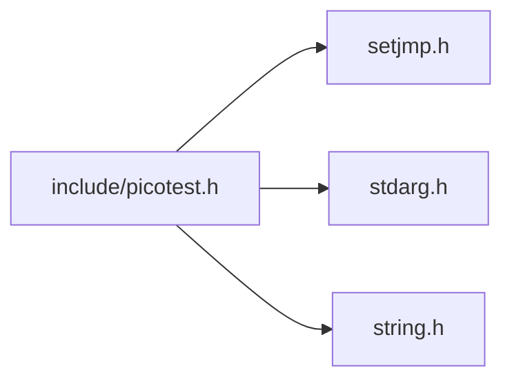

<a id="picotest_8h"></a>
# File picotest.h

![][C++]

**Location**: `include/picotest.h`

This file defines a minimalist unit testing framework for C programs.

The assertion mechanism relies on <code>setjmp()</code> / <code>longjmp()</code>. While these functions are discouraged for production code, their usage is acceptable in the context of unit testing: in our case, <code>longjmp()</code> is only called when an assertion fails, a situation where the actual process state is no longer reliable anyway. Moreover, they constitute the only standard exception handling mechanism for plain C code.


**License**:

PicoTest is released under the terms of the The 3-Clause BSD License:


[https://opensource.org/licenses/BSD-3-Clause](https://opensource.org/licenses/BSD-3-Clause)


Copyright (c) 2018 Frederic Bonnet


Redistribution and use in source and binary forms, with or without modification, are permitted provided that the following conditions are met:


1. Redistributions of source code must retain the above copyright notice, this list of conditions and the following disclaimer.

2. Redistributions in binary form must reproduce the above copyright notice, this list of conditions and the following disclaimer in the documentation and/or other materials provided with the distribution.

3. Neither the name of the copyright holder nor the names of its contributors may be used to endorse or promote products derived from this software without specific prior written permission.


THIS SOFTWARE IS PROVIDED BY THE COPYRIGHT HOLDERS AND CONTRIBUTORS "AS IS" AND ANY EXPRESS OR IMPLIED WARRANTIES, INCLUDING, BUT NOT LIMITED TO, THE IMPLIED WARRANTIES OF MERCHANTABILITY AND FITNESS FOR A PARTICULAR PURPOSE ARE DISCLAIMED. IN NO EVENT SHALL THE COPYRIGHT HOLDER OR CONTRIBUTORS BE LIABLE FOR ANY DIRECT, INDIRECT, INCIDENTAL, SPECIAL, EXEMPLARY, OR CONSEQUENTIAL DAMAGES (INCLUDING, BUT NOT LIMITED TO, PROCUREMENT OF SUBSTITUTE GOODS OR SERVICES; LOSS OF USE, DATA, OR PROFITS; OR BUSINESS INTERRUPTION) HOWEVER CAUSED AND ON ANY THEORY OF LIABILITY, WHETHER IN CONTRACT, STRICT LIABILITY, OR TORT (INCLUDING NEGLIGENCE OR OTHERWISE) ARISING IN ANY WAY OUT OF THE USE OF THIS SOFTWARE, EVEN IF ADVISED OF THE POSSIBILITY OF SUCH DAMAGE.

## Classes

* [PicoTestMetadata](struct_pico_test_metadata.md#struct_pico_test_metadata)

## Includes

* <setjmp.h>
* <stdarg.h>
* <string.h>



## Version

PicoTest follows the Semantic Versioning Specification (SemVer) 2.0.0:


[https://semver.org/spec/v2.0.0.html](https://semver.org/spec/v2.0.0.html)

<a id="group__public__interface_1ga1402f3301dff3f468aac77622f877f2d"></a>
### Macro PICOTEST\_VERSION

![][public]

```cpp
#define PICOTEST_VERSION
```


<a id="group__public__interface_1ga9ea29549254cbe44f25ef974d0458e57"></a>
### Macro PICOTEST\_VERSION\_MAJOR

![][public]

```cpp
#define PICOTEST_VERSION_MAJOR
```


<a id="group__public__interface_1ga6488c76f8a06a1a8222c2309b170bd1d"></a>
### Macro PICOTEST\_VERSION\_MINOR

![][public]

```cpp
#define PICOTEST_VERSION_MINOR
```


<a id="group__public__interface_1gafc9d1ab6d8cced95f3560c3a006d8005"></a>
### Macro PICOTEST\_VERSION\_PATCH

![][public]

```cpp
#define PICOTEST_VERSION_PATCH
```


## Test Functions

<a id="group__public__interface_1ga88033e8fb73d885670773cfc8ad1d024"></a>
### Macro PICOTEST\_EXTERN

![][public]

```cpp
#define PICOTEST_EXTERN( _testName )
```

Declare an extern test for metadata access.

**Parameters**:

* **_testName**: Test name.


**See also**: [PICOTEST\_METADATA](picotest_8h.md#group__public__interface_1gaa7f907387dd96cac614ad0dfe4cbb858)


<a id="group__public__interface_1gaa7f907387dd96cac614ad0dfe4cbb858"></a>
### Macro PICOTEST\_METADATA

![][public]

```cpp
#define PICOTEST_METADATA( _testName )
```

Get test metadata.

?> Tests in other modules need to be declared first with PICOTEST_EXTERN.


**Parameters**:

* **_testName**: Test name.


**See also**: [PicoTestMetadata](struct_pico_test_metadata.md#struct_pico_test_metadata), [PICOTEST\_EXTERN](picotest_8h.md#group__public__interface_1ga88033e8fb73d885670773cfc8ad1d024)


<a id="group__public__interface_1ga824e8707dfbd1726aa15beb5f27b957a"></a>
### Typedef PicoTestProc

![][public]

**Definition**: `include/picotest.h` (line 104)

```cpp
typedef int() PicoTestProc(const char *cond)
```

Signature of test functions.

Both [Test Suites](group__test__suites.md#group__test__suites) and [Test Cases](group__test__cases.md#group__test__cases) follow this signature.


**Parameters**:

* **cond**: Test filtering condition, or **NULL**. In the former case, passed to the active test filter before running the test.


**Returns**:

Number of failed tests.


**See also**: [PICOTEST\_SUITE](picotest_8h.md#group__test__suites_1ga7a9c873e5e377bd88fcc4849689c1e6f), [PICOTEST\_CASE](picotest_8h.md#group__test__cases_1gadca8898d29eb42dde764ed83a5d9faf5), [PICOTEST\_FILTER](picotest_8h.md#group__public__interface_1gabd82de0bec174d972151cd122a0a03ff)


**Return type**: int()

## Test Filters

PicoTest provides a way for client code to select tests to be run using custom filter functions.

<a id="group__public__interface_1ga7dccbea985fb578ba6b7639fb66fc3ea"></a>
### Macro PICOTEST\_FILTER\_DEFAULT

![][public]

```cpp
#define PICOTEST_FILTER_DEFAULT
```

Default test filter function.

Does a simple string equality test between **testName** and **cond**, and propagates to subtests if it doesn't match.


**See also**: [PicoTestFilterProc](picotest_8h.md#group__public__interface_1gafc743c5aa3870900472bc701b3ad35a4), [PICOTEST\_FILTER](picotest_8h.md#group__public__interface_1gabd82de0bec174d972151cd122a0a03ff)


<a id="group__public__interface_1gabd82de0bec174d972151cd122a0a03ff"></a>
### Macro PICOTEST\_FILTER

![][public]

```cpp
#define PICOTEST_FILTER
```

Define the test filter function.

Called before calling a test with a non- **NULL** condition.


The default filter does a simple string equality test between its **testName** and **cond** arguments, and propagates to subtests if it doesn't match. Redefine this macro to use a custom filter function, which must follow the [PicoTestFilterProc](picotest_8h.md#group__public__interface_1gafc743c5aa3870900472bc701b3ad35a4) signature.


?> Custom functions only apply to the tests defined after the macro redefinition. As macros can be redefined several times, this means that different functions may apply for the same source.


**Usage**:

```cpp
/* Custom test filter declaration. */
PicoTestFilterProc matchSubstring;
#undef PICOTEST_FILTER
#define PICOTEST_FILTER matchSubstring

/* Test filter function. */
PicoTestFilterResult matchSubstring(PicoTestProc *test, const char *testName, const char *cond) {
    /* Match tests containing **cond** substring. */
    return (strstr(testName, cond) == NULL 
        ? PICOTEST_FILTER_SKIP_PROPAGATE 
        : PICOTEST_FILTER_PASS_PROPAGATE);
}
```


**Examples**:

[filter.c](filter_8c.md#filter_8c) Example of PicoTest test filter, allows custom filtering of test functions. <br/>
 [tags.c](tags_8c.md#tags_8c) Advanced example of PicoTest test filter, implements a primitive tagging feature for test filtering. <br/>


**See also**: [PicoTestFilterProc](picotest_8h.md#group__public__interface_1gafc743c5aa3870900472bc701b3ad35a4), [PICOTEST\_FILTER\_DEFAULT](picotest_8h.md#group__public__interface_1ga7dccbea985fb578ba6b7639fb66fc3ea)


<a id="group__public__interface_1gaf5acf1a68605f6c8b758bae0224e03fc"></a>
### Enumeration type PicoTestFilterResult

![][public]

**Definition**: `include/picotest.h` (line 175)

```cpp
enum PicoTestFilterResult {
  PICOTEST_FILTER_SKIP = 0,
  PICOTEST_FILTER_PASS = 1,
  PICOTEST_FILTER_SKIP_PROPAGATE = 2,
  PICOTEST_FILTER_PASS_PROPAGATE = 3
}
```

Result of test filter functions.

**Examples**:

[filter.c](filter_8c.md#filter_8c) Example of PicoTest test filter, allows custom filtering of test functions. <br/>
 [tags.c](tags_8c.md#tags_8c) Advanced example of PicoTest test filter, implements a primitive tagging feature for test filtering. <br/>


**See also**: [PicoTestFilterProc](picotest_8h.md#group__public__interface_1gafc743c5aa3870900472bc701b3ad35a4)


<a id="group__public__interface_1ggaf5acf1a68605f6c8b758bae0224e03fca0ee37a1cf8a2347fb3c42636dfb80b1c"></a>
#### Enumerator PICOTEST\_FILTER\_SKIP

Test does not match the condition, skip this test and all its subtests.


<a id="group__public__interface_1ggaf5acf1a68605f6c8b758bae0224e03fca35508816a12c32e7ce536786e5ffc8d9"></a>
#### Enumerator PICOTEST\_FILTER\_PASS

Test matches the condition, run this test and all its subtests.


<a id="group__public__interface_1ggaf5acf1a68605f6c8b758bae0224e03fca487de7ecca4099ee737bd41a8d75ba75"></a>
#### Enumerator PICOTEST\_FILTER\_SKIP\_PROPAGATE

Test does not match the condition, skip this test but filter its subtests.


<a id="group__public__interface_1ggaf5acf1a68605f6c8b758bae0224e03fcaf2aa19fa3a0a1bc56585df626aa8e188"></a>
#### Enumerator PICOTEST\_FILTER\_PASS\_PROPAGATE

Test matches the condition, run this test but filter its subtests.


<a id="group__public__interface_1gafc743c5aa3870900472bc701b3ad35a4"></a>
### Typedef PicoTestFilterProc

![][public]

**Definition**: `include/picotest.h` (line 215)

```cpp
typedef PicoTestFilterResult() PicoTestFilterProc(PicoTestProc *test, const char *testName, const char *cond)
```

Signature of test filter functions.

A test called with a non- **NULL** condition must match this condition to be run. The test filter is set using the [PICOTEST\_FILTER](picotest_8h.md#group__public__interface_1gabd82de0bec174d972151cd122a0a03ff) macro.


**Parameters**:

* **test**: Test function to filter.
* **testName**: Name of test to filter.
* **cond**: Test filtering condition.


**Returns**:

a [PicoTestFilterResult](picotest_8h.md#group__public__interface_1gaf5acf1a68605f6c8b758bae0224e03fc) value


**Usage**:

```cpp
/* Custom test filter declaration. */
PicoTestFilterProc matchSubstring;
#undef PICOTEST_FILTER
#define PICOTEST_FILTER matchSubstring

/* Test filter function. */
PicoTestFilterResult matchSubstring(PicoTestProc *test, const char *testName, const char *cond) {
    /* Match tests containing **cond** substring. */
    return (strstr(testName, cond) == NULL 
        ? PICOTEST_FILTER_SKIP_PROPAGATE 
        : PICOTEST_FILTER_PASS_PROPAGATE);
}
```


**Examples**:

[filter.c](filter_8c.md#filter_8c) Example of PicoTest test filter, allows custom filtering of test functions. <br/>
 [tags.c](tags_8c.md#tags_8c) Advanced example of PicoTest test filter, implements a primitive tagging feature for test filtering. <br/>


**See also**: [PICOTEST\_SUITE](picotest_8h.md#group__test__suites_1ga7a9c873e5e377bd88fcc4849689c1e6f), [PICOTEST\_CASE](picotest_8h.md#group__test__cases_1gadca8898d29eb42dde764ed83a5d9faf5), [PICOTEST\_FILTER](picotest_8h.md#group__public__interface_1gabd82de0bec174d972151cd122a0a03ff), [PicoTestFilterResult](picotest_8h.md#group__public__interface_1gaf5acf1a68605f6c8b758bae0224e03fc)


**Return type**: [PicoTestFilterResult](picotest_8h.md#group__public__interface_1gaf5acf1a68605f6c8b758bae0224e03fc)()

<a id="group__public__interface_1gace2d0b7428d63b90190fe65b619a8680"></a>
### Function \_picoTest\_filterByName

![][private]
![][static]

```cpp
static PicoTestFilterResult _picoTest_filterByName(PicoTestProc *test, const char *testName, const char *cond)
```

Implementation of default test filter function.

Does a simple string equality test between **testName** and **cond**, and propagates to subtests if it doesn't match.


**See also**: [PicoTestFailureLoggerProc](picotest_8h.md#group__public__interface_1ga407922fa95d91c28651b93fbafe1d1bb), [PICOTEST\_FAILURE\_LOGGER](picotest_8h.md#group__public__interface_1gae4b2f943bef59bd05fb7a328a6c39d48), [PICOTEST\_FAILURE\_LOGGER\_DEFAULT](picotest_8h.md#group__public__interface_1gaf08fabb517d01d11ce72614d1df51687)


**Parameters**:

* [PicoTestProc](picotest_8h.md#group__public__interface_1ga824e8707dfbd1726aa15beb5f27b957a) * **test**
* const char * **testName**
* const char * **cond**

**Return type**: [PicoTestFilterResult](picotest_8h.md#group__public__interface_1gaf5acf1a68605f6c8b758bae0224e03fc)

## Test hierarchy traversal

Tests can form hierarchies of test suites and test cases. PicoTest provides two ways to traverse such hierarchies with a simple visitor pattern. This can be used for e.g. test list discovery in build systems.

<a id="group__public__interface_1gaee8202c2543c7fb59fa08aec75b6cc63"></a>
### Macro PICOTEST\_TRAVERSE

![][public]

```cpp
#define PICOTEST_TRAVERSE( _testName ,_proc )
```

Traverse a test hierarchy depth-first.

This feature covers simple use cases such as getting the flat list of all test names. For more advanced usage, see [PICOTEST\_VISIT](picotest_8h.md#group__public__interface_1ga84b8e9060ee56ca5c5b64da168ee7f6f).


**Parameters**:

* **_testName**: Name of the traversed test.
* **_proc**: Test traversal proc. Must follow the [PicoTestTraverseProc](picotest_8h.md#group__public__interface_1ga0b6b1fbb66a2062b823d28026399d27b) signature.


**Examples**:

[traverse.c](traverse_8c.md#traverse_8c) Example of PicoTest hierarchy traversal, prints traversed tests to stdout. <br/>


**See also**: [PicoTestTraverseProc](picotest_8h.md#group__public__interface_1ga0b6b1fbb66a2062b823d28026399d27b), [PICOTEST\_VISIT](picotest_8h.md#group__public__interface_1ga84b8e9060ee56ca5c5b64da168ee7f6f)


<a id="group__public__interface_1ga84b8e9060ee56ca5c5b64da168ee7f6f"></a>
### Macro PICOTEST\_VISIT

![][public]

```cpp
#define PICOTEST_VISIT( _testName ,_proc )
```

Visit a test hierarchy depth-first.

This feature covers more advanced use cases than [PICOTEST\_TRAVERSE](picotest_8h.md#group__public__interface_1gaee8202c2543c7fb59fa08aec75b6cc63), such as exporting the test hierarchy as a structured format such as XML or JSON, or accessing test metadata.


**Parameters**:

* **_testName**: Name of the visited test.
* **_proc**: Test visit proc. Must follow the [PicoTestVisitProc](picotest_8h.md#group__public__interface_1ga1ae925d603c838714097a508a19be99b) signature.


**See also**: [PicoTestVisitProc](picotest_8h.md#group__public__interface_1ga1ae925d603c838714097a508a19be99b), [PICOTEST\_TRAVERSE](picotest_8h.md#group__public__interface_1gaee8202c2543c7fb59fa08aec75b6cc63)


<a id="group__public__interface_1gad78162429011bb689a76e91530ac7a22"></a>
### Enumeration type PicoTestVisitStep

![][public]

**Definition**: `include/picotest.h` (line 347)

```cpp
enum PicoTestVisitStep {
  PICOTEST_VISIT_ENTER = 0,
  PICOTEST_VISIT_LEAVE = 1
}
```

Test visit step.

**See also**: [PicoTestVisitProc](picotest_8h.md#group__public__interface_1ga1ae925d603c838714097a508a19be99b), [PICOTEST\_VISIT](picotest_8h.md#group__public__interface_1ga84b8e9060ee56ca5c5b64da168ee7f6f)


<a id="group__public__interface_1ggad78162429011bb689a76e91530ac7a22a2590077bf6aceab607a23c349140af25"></a>
#### Enumerator PICOTEST\_VISIT\_ENTER

Enter the test.


<a id="group__public__interface_1ggad78162429011bb689a76e91530ac7a22a70b432be5fb3de15623c7cb1562544d0"></a>
#### Enumerator PICOTEST\_VISIT\_LEAVE

Leave the test.


<a id="group__public__interface_1ga0b6b1fbb66a2062b823d28026399d27b"></a>
### Typedef PicoTestTraverseProc

![][public]

**Definition**: `include/picotest.h` (line 299)

```cpp
typedef void() PicoTestTraverseProc(const char *name, int nb)
```

Function signature of test traversal proc.

**Parameters**:

* **name**: Name of traversed test.
* **nb**: Number of subtests (zero for simple test cases, at least one for test suites).


**Usage**:

```cpp
/* Test traversal function declaration. */
PicoTestTraverseProc printTestCase;
PicoTestTraverseProc printTestName;

/* Traversal function, will print test cases only. */
void printTestCase(const char *name, int nb) {
    if (nb == 0) printf("%s\n", name);
}

/* Traversal function, will print all tests. */
void printTestName(const char *name, int nb) {
    printf("%s\n", name);
}
```


**Examples**:

[traverse.c](traverse_8c.md#traverse_8c) Example of PicoTest hierarchy traversal, prints traversed tests to stdout. <br/>


**See also**: [PICOTEST\_TRAVERSE](picotest_8h.md#group__public__interface_1gaee8202c2543c7fb59fa08aec75b6cc63)


**Return type**: void()

<a id="group__public__interface_1ga1ae925d603c838714097a508a19be99b"></a>
### Typedef PicoTestVisitProc

![][public]

**Definition**: `include/picotest.h` (line 366)

```cpp
typedef void() PicoTestVisitProc(const PicoTestMetadata *metadata, PicoTestVisitStep step)
```

Function signature of test visit proc.

Proc is called once for each value of [PicoTestVisitStep](picotest_8h.md#group__public__interface_1gad78162429011bb689a76e91530ac7a22).


**Parameters**:

* **metadata**: Metadata of the visited test.
* **step**: Visit step.


**See also**: [PICOTEST\_VISIT](picotest_8h.md#group__public__interface_1ga84b8e9060ee56ca5c5b64da168ee7f6f), [PicoTestVisitStep](picotest_8h.md#group__public__interface_1gad78162429011bb689a76e91530ac7a22)


**Return type**: void()

<a id="group__public__interface_1gaacd9c37695afbb5b3bb8c5373c527641"></a>
### Function \_picoTest\_traverse

![][private]
![][static]

```cpp
static void _picoTest_traverse(const PicoTestMetadata *metadata, PicoTestTraverseProc *proc)
```

Perform test traversal.

**Parameters**:

* **metadata**: Metadata of test to traverse.
* **proc**: Test traversal proc.


**See also**: [PicoTestTraverseProc](picotest_8h.md#group__public__interface_1ga0b6b1fbb66a2062b823d28026399d27b), [PicoTestMetadata](struct_pico_test_metadata.md#struct_pico_test_metadata), [PICOTEST\_TRAVERSE](picotest_8h.md#group__public__interface_1gaee8202c2543c7fb59fa08aec75b6cc63)


**Parameters**:

* const [PicoTestMetadata](struct_pico_test_metadata.md#struct_pico_test_metadata) * **metadata**
* [PicoTestTraverseProc](picotest_8h.md#group__public__interface_1ga0b6b1fbb66a2062b823d28026399d27b) * **proc**

**Return type**: void

<a id="group__public__interface_1ga114c577e2b5e238b8545c80be5783fea"></a>
### Function \_picoTest\_visit

![][private]
![][static]

```cpp
static void _picoTest_visit(const PicoTestMetadata *metadata, PicoTestVisitProc *proc)
```

Perform test visit.

**Parameters**:

* **metadata**: Metadata of test to visit.
* **proc**: Test visit proc.


**See also**: [PicoTestVisitProc](picotest_8h.md#group__public__interface_1ga1ae925d603c838714097a508a19be99b), [PicoTestMetadata](struct_pico_test_metadata.md#struct_pico_test_metadata), [PICOTEST\_VISIT](picotest_8h.md#group__public__interface_1ga84b8e9060ee56ca5c5b64da168ee7f6f)


**Parameters**:

* const [PicoTestMetadata](struct_pico_test_metadata.md#struct_pico_test_metadata) * **metadata**
* [PicoTestVisitProc](picotest_8h.md#group__public__interface_1ga1ae925d603c838714097a508a19be99b) * **proc**

**Return type**: void

## Logging

PicoTest provides a way for client code to intercept test failure events. This can be used for e.g. logging purpose or reporting.

<a id="group__public__interface_1gaf08fabb517d01d11ce72614d1df51687"></a>
### Macro PICOTEST\_FAILURE\_LOGGER\_DEFAULT

![][public]

```cpp
#define PICOTEST_FAILURE_LOGGER_DEFAULT
```

Default test failure log handler.

Does nothing.


**See also**: [PicoTestFailureLoggerProc](picotest_8h.md#group__public__interface_1ga407922fa95d91c28651b93fbafe1d1bb), [PICOTEST\_FAILURE\_LOGGER](picotest_8h.md#group__public__interface_1gae4b2f943bef59bd05fb7a328a6c39d48)


<a id="group__public__interface_1gae4b2f943bef59bd05fb7a328a6c39d48"></a>
### Macro PICOTEST\_FAILURE\_LOGGER

![][public]

```cpp
#define PICOTEST_FAILURE_LOGGER
```

Define the test failure log handler.

Called when a test fails.


The default handler does nothing. Redefine this macro to use a custom handler, which must follow the [PicoTestFailureLoggerProc](picotest_8h.md#group__public__interface_1ga407922fa95d91c28651b93fbafe1d1bb) signature.


?> Custom functions only apply to the tests defined after the macro redefinition. As macros can be redefined several times, this means that different functions may apply for the same source.


**Usage**:

```cpp
/* Test failure logger declaration. */
PicoTestFailureLoggerProc logFailure;
#undef PICOTEST_FAILURE_LOGGER
#define PICOTEST_FAILURE_LOGGER logFailure

/* Test failure logger function. */
void logFailure(const char *file, int line, const char *type, const char *test, const char *msg, va_list args) {
    /* Error type. */
    printf("[%s] ", type);

    /* Location in source code. */
    printf("%s(%d) : ", file, line);

    /* Failed expression. */
    printf("%s", test);

    /* Optional message. */
    if (msg) {
        printf(" | "); 
        vprintf(msg, args);
    }

    printf("\n");
}
```


**Examples**:

[logger.c](logger_8c.md#logger_8c) Example of PicoTest error logging, prints location and info of failed assertions to stdout. <br/>


**See also**: [PicoTestFailureLoggerProc](picotest_8h.md#group__public__interface_1ga407922fa95d91c28651b93fbafe1d1bb), [PICOTEST\_FAILURE\_LOGGER\_DEFAULT](picotest_8h.md#group__public__interface_1gaf08fabb517d01d11ce72614d1df51687)


<a id="group__public__interface_1ga407922fa95d91c28651b93fbafe1d1bb"></a>
### Typedef PicoTestFailureLoggerProc

![][public]

**Definition**: `include/picotest.h` (line 438)

```cpp
typedef void() PicoTestFailureLoggerProc(const char *file, int line, const char *type, const char *test, const char *msg, va_list args)
```

Function signature of test failure log handlers.

**Parameters**:

* **file**: File name where the test was defined.
* **line**: Location of test in file.
* **type**: Type of test that failed (e.g. <code>"ASSERT"</code>).
* **test**: Tested expression.
* **msg**: Optional message format string, or **NULL**.
* **args**: Optional message string parameter list, or **NULL**.


?> **msg** and **args** are suitable arguments to **vprintf()**.


**Usage**:

```cpp
/* Test failure logger declaration. */
PicoTestFailureLoggerProc logFailure;
#undef PICOTEST_FAILURE_LOGGER
#define PICOTEST_FAILURE_LOGGER logFailure

/* Test failure logger function. */
void logFailure(const char *file, int line, const char *type, const char *test, const char *msg, va_list args) {
    /* Error type. */
    printf("[%s] ", type);

    /* Location in source code. */
    printf("%s(%d) : ", file, line);

    /* Failed expression. */
    printf("%s", test);

    /* Optional message. */
    if (msg) {
        printf(" | "); 
        vprintf(msg, args);
    }

    printf("\n");
}
```


**Examples**:

[logger.c](logger_8c.md#logger_8c) Example of PicoTest error logging, prints location and info of failed assertions to stdout. <br/>


**See also**: [PICOTEST\_FAILURE\_LOGGER](picotest_8h.md#group__public__interface_1gae4b2f943bef59bd05fb7a328a6c39d48)


**Return type**: void()

<a id="group__public__interface_1gae3c669f4ae731be32a25df3d3a97b599"></a>
### Function \_picoTest\_logFailure

![][private]
![][static]

```cpp
static void _picoTest_logFailure(const char *file, int line, const char *type, const char *test, const char *msg, va_list args)
```

Implementation of default test failure log handler.

Does nothing.


**See also**: [PicoTestFailureLoggerProc](picotest_8h.md#group__public__interface_1ga407922fa95d91c28651b93fbafe1d1bb), [PICOTEST\_FAILURE\_LOGGER](picotest_8h.md#group__public__interface_1gae4b2f943bef59bd05fb7a328a6c39d48), [PICOTEST\_FAILURE\_LOGGER\_DEFAULT](picotest_8h.md#group__public__interface_1gaf08fabb517d01d11ce72614d1df51687)


**Parameters**:

* const char * **file**
* int **line**
* const char * **type**
* const char * **test**
* const char * **msg**
* va_list **args**

**Return type**: void

## Test Case Definitions

<a id="group__test__cases_1gadca8898d29eb42dde764ed83a5d9faf5"></a>
### Macro PICOTEST\_CASE

![][public]

```cpp
#define PICOTEST_CASE( ... )
```

Test case declaration.

This macro defines a [PicoTestProc](picotest_8h.md#group__public__interface_1ga824e8707dfbd1726aa15beb5f27b957a) of the given name that can be called directly.


**Parameters**:

* **_testName**: Name of the test case.
* **_fixtureName**: (optional) Name of the test fixture used by the test.
* **_context**: (optional) Fixture context structure defined using [PICOTEST\_FIXTURE\_CONTEXT(\_fixtureName)](picotest_8h.md#group__fixtures_1ga983cffc937dca4baa55f59afad404f03).


**Returns**:

Number of failed tests.


**Usage**:

```cpp
#define FAILS 0
#define PASSES 1

/* Simple test with no fixture */
PICOTEST_CASE(testCase1) {
    PICOTEST_VERIFY(FAILS); /* Logs error and continue */
    PICOTEST_ASSERT(FAILS); /* Logs error and abort */
    /* Unreached */
    PICOTEST_ASSERT(PASSES);
}

/* Test with fixture but no context */
PICOTEST_CASE(testCase2, simpleFixture) {
    PICOTEST_ASSERT(staticVar == 1);    /* Passes */
    PICOTEST_VERIFY(FAILS);             /* Logs error and continue */
}

/* Test with fixture and context. Tests belonging to the same suite don't have
 * to share the same suite. */
PICOTEST_CASE(testCase3, fixtureWithContext, context) {
    PICOTEST_ASSERT(staticVar == 2);        /* Passes */
    PICOTEST_ASSERT(context->var1 == 1);    /* Passes */
    PICOTEST_VERIFY(context->var2 == NULL); /* Logs error and continue */
    PICOTEST_ASSERT(context->var3 == NULL); /* Logs error and abort */
}
/* Another test using **simpleFixture**. Tests need not belong to the same suite
 * to share a fixture. */
PICOTEST_CASE(testCase4, simpleFixture) {
    PICOTEST_VERIFY(staticVar == 1);    /* Passes */
    PICOTEST_ASSERT(PASSES);            /* Passes */
}

/* This test uses a fixture that requires a context. In this case the context
 * passed to the fixture setup and teardown functions is NULL. */
PICOTEST_CASE(testCase5, fixtureWithOptionalContext) {
    PICOTEST_VERIFY(staticVar == 3);    /* Passes */
    PICOTEST_ASSERT(PASSES);            /* Passes */
}
```


**Examples**:

[mainSuite.inc](main_suite_8inc.md#main_suite_8inc) Example of a simple PicoTest suite. <br/>


**See also**: [PicoTestProc](picotest_8h.md#group__public__interface_1ga824e8707dfbd1726aa15beb5f27b957a), [PICOTEST\_FIXTURE\_CONTEXT](picotest_8h.md#group__fixtures_1ga983cffc937dca4baa55f59afad404f03)


## Test Case Hooks

PicoTest provides a way for client code to intercept test case events. This can be used for e.g. logging purpose or reporting.

<a id="group__test__cases_1ga4a4a1356f85b26cd29f2f7ae4c09cf91"></a>
### Macro PICOTEST\_CASE\_ENTER\_DEFAULT

![][public]

```cpp
#define PICOTEST_CASE_ENTER_DEFAULT( testName )
```

Default test case enter hook.

Does nothing.


**See also**: [PicoTestCaseEnterProc](picotest_8h.md#group__test__cases_1ga0af0a0ec6d2bbee706b56fea6f60126e), [PICOTEST\_CASE\_ENTER](picotest_8h.md#group__test__cases_1gad1f702ab6600b04f66731d35bf38fc67)


<a id="group__test__cases_1gad1f702ab6600b04f66731d35bf38fc67"></a>
### Macro PICOTEST\_CASE\_ENTER

![][public]

```cpp
#define PICOTEST_CASE_ENTER
```

Define the test case enter hook.

The default hook does nothing. Redefine this macro to use a custom hook, which must follow the [PicoTestCaseEnterProc](picotest_8h.md#group__test__cases_1ga0af0a0ec6d2bbee706b56fea6f60126e) signature.


?> Custom functions only apply to the tests defined after the macro redefinition. As macros can be redefined several times, this means that different functions may apply for the same source.


**Usage**:

```cpp
/* Hook declarations. */
PicoTestCaseEnterProc enterTestCase;
#undef PICOTEST_CASE_ENTER
#define PICOTEST_CASE_ENTER enterTestCase

/* Hook function. */
void enterTestCase(const char *testName) {
    indent(level++);
    printf("running test case %s...\n", testName);
}
```


**Examples**:

[hooks.c](hooks_8c.md#hooks_8c) Example of PicoTest hooks, prints all events to stdout. <br/>


**See also**: [PicoTestCaseEnterProc](picotest_8h.md#group__test__cases_1ga0af0a0ec6d2bbee706b56fea6f60126e), [PICOTEST\_CASE\_ENTER\_DEFAULT](picotest_8h.md#group__test__cases_1ga4a4a1356f85b26cd29f2f7ae4c09cf91), [PICOTEST\_CASE\_LEAVE](picotest_8h.md#group__test__cases_1ga4fd71dfed1ce3733b0d670c86b8d523a)


<a id="group__test__cases_1ga5ff2295c5a324991c72a81bcfb949522"></a>
### Macro PICOTEST\_CASE\_LEAVE\_DEFAULT

![][public]

```cpp
#define PICOTEST_CASE_LEAVE_DEFAULT( testName ,fail )
```

Default test case enter hook.

Does nothing.


**See also**: [PicoTestCaseLeaveProc](picotest_8h.md#group__test__cases_1gacce6ae69ea5064e39e3c56915978609e), [PICOTEST\_CASE\_LEAVE](picotest_8h.md#group__test__cases_1ga4fd71dfed1ce3733b0d670c86b8d523a)


<a id="group__test__cases_1ga4fd71dfed1ce3733b0d670c86b8d523a"></a>
### Macro PICOTEST\_CASE\_LEAVE

![][public]

```cpp
#define PICOTEST_CASE_LEAVE
```

Define the test case leave hook.

The default hook does nothing. Redefine this macro to use a custom hook, which must follow the [PicoTestCaseLeaveProc](picotest_8h.md#group__test__cases_1gacce6ae69ea5064e39e3c56915978609e) signature.


?> Custom functions only apply to the tests defined after the macro redefinition. As macros can be redefined several times, this means that different functions may apply for the same source.


**Usage**:

```cpp
/* Hook declarations. */
PicoTestCaseLeaveProc leaveTestCase;
#undef PICOTEST_CASE_LEAVE
#define PICOTEST_CASE_LEAVE leaveTestCase

/* Hook function. */
void leaveTestCase(const char *testName, int fail) {
    indent(--level);
    printf("test case %s done (%d failures)\n", testName, fail);
}
```


**Examples**:

[hooks.c](hooks_8c.md#hooks_8c) Example of PicoTest hooks, prints all events to stdout. <br/>


**See also**: [PicoTestCaseLeaveProc](picotest_8h.md#group__test__cases_1gacce6ae69ea5064e39e3c56915978609e), [PICOTEST\_CASE\_LEAVE\_DEFAULT](picotest_8h.md#group__test__cases_1ga5ff2295c5a324991c72a81bcfb949522), [PICOTEST\_CASE\_ENTER](picotest_8h.md#group__test__cases_1gad1f702ab6600b04f66731d35bf38fc67)


<a id="group__test__cases_1ga0af0a0ec6d2bbee706b56fea6f60126e"></a>
### Typedef PicoTestCaseEnterProc

![][public]

**Definition**: `include/picotest.h` (line 632)

```cpp
typedef void() PicoTestCaseEnterProc(const char *testName)
```

Function signature of test case enter hooks.

Called before running the test case.


**Parameters**:

* **testName**: Test case name.


**Usage**:

```cpp
/* Hook declarations. */
PicoTestCaseEnterProc enterTestCase;
#undef PICOTEST_CASE_ENTER
#define PICOTEST_CASE_ENTER enterTestCase

/* Hook function. */
void enterTestCase(const char *testName) {
    indent(level++);
    printf("running test case %s...\n", testName);
}
```


**Examples**:

[hooks.c](hooks_8c.md#hooks_8c) Example of PicoTest hooks, prints all events to stdout. <br/>


**See also**: [PICOTEST\_CASE\_ENTER](picotest_8h.md#group__test__cases_1gad1f702ab6600b04f66731d35bf38fc67)


**Return type**: void()

<a id="group__test__cases_1gacce6ae69ea5064e39e3c56915978609e"></a>
### Typedef PicoTestCaseLeaveProc

![][public]

**Definition**: `include/picotest.h` (line 680)

```cpp
typedef void() PicoTestCaseLeaveProc(const char *testName, int fail)
```

Function signature of test case leave hooks.

Called after running the test case.


**Parameters**:

* **testName**: Test case name.
* **fail**: Failed tests (including its subtests if any).


**Usage**:

```cpp
/* Hook declarations. */
PicoTestCaseLeaveProc leaveTestCase;
#undef PICOTEST_CASE_LEAVE
#define PICOTEST_CASE_LEAVE leaveTestCase

/* Hook function. */
void leaveTestCase(const char *testName, int fail) {
    indent(--level);
    printf("test case %s done (%d failures)\n", testName, fail);
}
```


**Examples**:

[hooks.c](hooks_8c.md#hooks_8c) Example of PicoTest hooks, prints all events to stdout. <br/>


**See also**: [PICOTEST\_CASE\_LEAVE](picotest_8h.md#group__test__cases_1ga4fd71dfed1ce3733b0d670c86b8d523a)


**Return type**: void()

## Assertion Definitions

<a id="group__assertions_1gad71b76cf1173654acc95df79d1c7040b"></a>
### Macro PICOTEST\_ASSERT

![][public]

```cpp
#define PICOTEST_ASSERT( x ,... )
```

Hard assertion.

Logs an error if the given value is false, then stops the test with [PICOTEST\_ABORT()](picotest_8h.md#group__assertions_1ga62031fa5f6f86e517565b77a1fa37f59).


[PICOTEST\_FAILURE\_LOGGER()](picotest_8h.md#group__public__interface_1gae4b2f943bef59bd05fb7a328a6c39d48) is called with the **type** argument set to <code>"ASSERT"</code>.


**Parameters**:

* **x**: Value to test. Evaluated once, so it can be an expression with side effects.
* **msg**: (optional) Message format string.
* **...**: (optional) Message string arguments.


?> **msg** and following arguments arguments are suitable arguments to **printf()**.


**Examples**:

[mainSuite.inc](main_suite_8inc.md#main_suite_8inc) Example of a simple PicoTest suite. <br/>


**See also**: [PICOTEST\_FAILURE\_LOGGER](picotest_8h.md#group__public__interface_1gae4b2f943bef59bd05fb7a328a6c39d48), [PICOTEST\_ABORT](picotest_8h.md#group__assertions_1ga62031fa5f6f86e517565b77a1fa37f59), [PICOTEST\_VERIFY](picotest_8h.md#group__assertions_1gacd07b017f38d1e3ad784f369345357a2)


<a id="group__assertions_1gacd07b017f38d1e3ad784f369345357a2"></a>
### Macro PICOTEST\_VERIFY

![][public]

```cpp
#define PICOTEST_VERIFY( x ,... )
```

Soft assertion.

Logs an error if the given value is false, but let the test continue.


[PICOTEST\_FAILURE\_LOGGER()](picotest_8h.md#group__public__interface_1gae4b2f943bef59bd05fb7a328a6c39d48) is called with the **type** argument set to <code>"VERIFY"</code>.


**Parameters**:

* **x**: Value to test. Evaluated once, so it can be an expression with side effects.
* **msg**: (optional) Message format string.
* **...**: (optional) Message string arguments.


?> **msg** and following arguments arguments are suitable arguments to **printf()**.


**Examples**:

[mainSuite.inc](main_suite_8inc.md#main_suite_8inc) Example of a simple PicoTest suite. <br/>


**See also**: [PICOTEST\_FAILURE\_LOGGER](picotest_8h.md#group__public__interface_1gae4b2f943bef59bd05fb7a328a6c39d48), [PICOTEST\_ASSERT](picotest_8h.md#group__assertions_1gad71b76cf1173654acc95df79d1c7040b)


<a id="group__assertions_1ga89a35f18021df570967bb707a8537f3b"></a>
### Macro PICOTEST\_FAILURE

![][public]

```cpp
#define PICOTEST_FAILURE( type ,test ,... )
```

Generic failure.

[PICOTEST\_FAILURE\_LOGGER()](picotest_8h.md#group__public__interface_1gae4b2f943bef59bd05fb7a328a6c39d48) is called with the provided **type**, **test** and **msg** arguments.


This can be used to implement custom testing logic.


**Parameters**:

* **type**: Type of test that failed (e.g. "ASSERT").
* **test**: Failed test.
* **msg**: (optional) Message format string.
* **...**: (optional) Message string arguments.


<a id="group__assertions_1ga62031fa5f6f86e517565b77a1fa37f59"></a>
### Macro PICOTEST\_ABORT

![][public]

```cpp
#define PICOTEST_ABORT(  )
```

Abort a test case.

This can be used to implement custom testing logic.


**See also**: [PICOTEST\_CASE](picotest_8h.md#group__test__cases_1gadca8898d29eb42dde764ed83a5d9faf5)


<a id="group__assertions_1ga8d7eb92ca21dfb7fe46fc2472e11f496"></a>
### Variable \_picoTest\_fail

![][private]
![][static]

**Definition**: `include/picotest.h` (line 830)

```cpp
int _picoTest_fail
```

Internal failure counter.

**See also**: [PICOTEST\_FAILURE](picotest_8h.md#group__assertions_1ga89a35f18021df570967bb707a8537f3b)


**Type**: int

<a id="group__assertions_1ga2fdb4a73b6a0abc186a27065a36db6ed"></a>
### Variable \_picoTest\_failureEnv

![][private]
![][static]

**Definition**: `include/picotest.h` (line 838)

```cpp
jmp_buf* _picoTest_failureEnv
```

Tag used by **setjmp()** and **longjmp()** to jump out of failed tests.

**See also**: [PICOTEST\_ABORT](picotest_8h.md#group__assertions_1ga62031fa5f6f86e517565b77a1fa37f59), [PICOTEST\_CASE](picotest_8h.md#group__test__cases_1gadca8898d29eb42dde764ed83a5d9faf5)


**Type**: jmp_buf *

<a id="group__assertions_1gadd80bff454009ce1077d81f1f5552f34"></a>
### Function \_picoTest\_assertFailed

![][private]
![][static]

```cpp
static void _picoTest_assertFailed(PicoTestFailureLoggerProc *proc, const char *file, int line, const char *type, int count, const char *test,...)
```

Called when an assertion fails.

**Parameters**:

* **proc**: Test failure log handler.
* **file**: File name where the test was defined.
* **line**: Location of test in file.
* **type**: Type of test that failed (e.g. "ASSERT").
* **count**: Number of arguments after **test**.
* **test**: Tested expression.
* **...**: Optional message format string and parameters.


**See also**: [PICOTEST\_ASSERT](picotest_8h.md#group__assertions_1gad71b76cf1173654acc95df79d1c7040b), [PICOTEST\_VERIFY](picotest_8h.md#group__assertions_1gacd07b017f38d1e3ad784f369345357a2)


**Parameters**:

* [PicoTestFailureLoggerProc](picotest_8h.md#group__public__interface_1ga407922fa95d91c28651b93fbafe1d1bb) * **proc**
* const char * **file**
* int **line**
* const char * **type**
* int **count**
* const char * **test**
* ...

**Return type**: void

## Assertion Hooks

PicoTest provides a way for client code to intercept assertions events. This can be used for e.g. logging purpose or reporting.

<a id="group__assertions_1ga331ef495337f7e2aae8be15cfd2a170a"></a>
### Macro PICOTEST\_ASSERT\_BEFORE\_DEFAULT

![][public]

```cpp
#define PICOTEST_ASSERT_BEFORE_DEFAULT( type ,test )
```

Default assert before hook.

Does nothing.


**See also**: [PicoTestAssertBeforeProc](picotest_8h.md#group__assertions_1ga2011048ceed2457e95498573d0730eaf), [PICOTEST\_ASSERT\_BEFORE](picotest_8h.md#group__assertions_1gaa38b1a0014fe2ab172a5466f9031aafb)


<a id="group__assertions_1gaa38b1a0014fe2ab172a5466f9031aafb"></a>
### Macro PICOTEST\_ASSERT\_BEFORE

![][public]

```cpp
#define PICOTEST_ASSERT_BEFORE
```

Define the assert before hook.

The default hook does nothing. Redefine this macro to use a custom hook, which must follow the [PicoTestAssertBeforeProc](picotest_8h.md#group__assertions_1ga2011048ceed2457e95498573d0730eaf) signature.


?> Custom functions only apply to the tests defined after the macro redefinition. As macros can be redefined several times, this means that different functions may apply for the same source.


**Usage**:

```cpp
/* Hook declarations. */
PicoTestAssertBeforeProc beforeAssert;
#undef PICOTEST_ASSERT_BEFORE
#define PICOTEST_ASSERT_BEFORE beforeAssert

/* Hook function. */
void beforeAssert(const char *type, const char *test) {
    indent(level++);
    printf("before assertion %s(%s)...\n", type, test);
}
```


**Examples**:

[hooks.c](hooks_8c.md#hooks_8c) Example of PicoTest hooks, prints all events to stdout. <br/>


**See also**: [PicoTestAssertBeforeProc](picotest_8h.md#group__assertions_1ga2011048ceed2457e95498573d0730eaf), [PICOTEST\_ASSERT\_BEFORE\_DEFAULT](picotest_8h.md#group__assertions_1ga331ef495337f7e2aae8be15cfd2a170a), [PICOTEST\_ASSERT\_AFTER](picotest_8h.md#group__assertions_1gae6c0c62e54611c6d92a3a8b81545f934)


<a id="group__assertions_1gab1f1711109e4a8443a61c228194a6825"></a>
### Macro PICOTEST\_ASSERT\_AFTER\_DEFAULT

![][public]

```cpp
#define PICOTEST_ASSERT_AFTER_DEFAULT( type ,test ,fail )
```

Default assert after hook.

Does nothing.


**See also**: [PicoTestAssertAfterProc](picotest_8h.md#group__assertions_1ga9502bbfe9927766f12e8de83aa37b706), [PICOTEST\_ASSERT\_AFTER](picotest_8h.md#group__assertions_1gae6c0c62e54611c6d92a3a8b81545f934)


<a id="group__assertions_1gae6c0c62e54611c6d92a3a8b81545f934"></a>
### Macro PICOTEST\_ASSERT\_AFTER

![][public]

```cpp
#define PICOTEST_ASSERT_AFTER
```

Define the assert after hook.

The default hook does nothing. Redefine this macro to use a custom hook, which must follow the [PicoTestAssertAfterProc](picotest_8h.md#group__assertions_1ga9502bbfe9927766f12e8de83aa37b706) signature.


?> Custom functions only apply to the tests defined after the macro redefinition. As macros can be redefined several times, this means that different functions may apply for the same source.


**Usage**:

```cpp
/* Hook declarations. */
PicoTestAssertAfterProc afterAssert;
#undef PICOTEST_ASSERT_AFTER
#define PICOTEST_ASSERT_AFTER afterAssert

/* Hook function. */
void afterAssert(const char *type, const char *test, int fail) {
    indent(--level);
    printf("after assertion %s(%s) => %s\n", type, test, fail ? "fails" : "passes");
}
```


**Examples**:

[hooks.c](hooks_8c.md#hooks_8c) Example of PicoTest hooks, prints all events to stdout. <br/>


**See also**: [PicoTestAssertAfterProc](picotest_8h.md#group__assertions_1ga9502bbfe9927766f12e8de83aa37b706), [PICOTEST\_ASSERT\_AFTER\_DEFAULT](picotest_8h.md#group__assertions_1gab1f1711109e4a8443a61c228194a6825), [PICOTEST\_ASSERT\_BEFORE](picotest_8h.md#group__assertions_1gaa38b1a0014fe2ab172a5466f9031aafb)


<a id="group__assertions_1ga2011048ceed2457e95498573d0730eaf"></a>
### Typedef PicoTestAssertBeforeProc

![][public]

**Definition**: `include/picotest.h` (line 904)

```cpp
typedef void() PicoTestAssertBeforeProc(const char *type, const char *test)
```

Function signature of assert before hooks.

Called before running an assertion.


**Parameters**:

* **type**: Type of test (e.g. "ASSERT").
* **test**: Test.


**Usage**:

```cpp
/* Hook declarations. */
PicoTestAssertBeforeProc beforeAssert;
#undef PICOTEST_ASSERT_BEFORE
#define PICOTEST_ASSERT_BEFORE beforeAssert

/* Hook function. */
void beforeAssert(const char *type, const char *test) {
    indent(level++);
    printf("before assertion %s(%s)...\n", type, test);
}
```


**Examples**:

[hooks.c](hooks_8c.md#hooks_8c) Example of PicoTest hooks, prints all events to stdout. <br/>


**See also**: [PICOTEST\_ASSERT\_BEFORE](picotest_8h.md#group__assertions_1gaa38b1a0014fe2ab172a5466f9031aafb)


**Return type**: void()

<a id="group__assertions_1ga9502bbfe9927766f12e8de83aa37b706"></a>
### Typedef PicoTestAssertAfterProc

![][public]

**Definition**: `include/picotest.h` (line 953)

```cpp
typedef void() PicoTestAssertAfterProc(const char *type, const char *test, int fail)
```

Function signature of assert after hooks.

Called after running an assertion.


**Parameters**:

* **type**: Type of test (e.g. "ASSERT").
* **test**: Test.
* **fail**: Test result: zero for success, non-zero for failure.


**Usage**:

```cpp
/* Hook declarations. */
PicoTestAssertAfterProc afterAssert;
#undef PICOTEST_ASSERT_AFTER
#define PICOTEST_ASSERT_AFTER afterAssert

/* Hook function. */
void afterAssert(const char *type, const char *test, int fail) {
    indent(--level);
    printf("after assertion %s(%s) => %s\n", type, test, fail ? "fails" : "passes");
}
```


**Examples**:

[hooks.c](hooks_8c.md#hooks_8c) Example of PicoTest hooks, prints all events to stdout. <br/>


**See also**: [PICOTEST\_ASSERT\_AFTER](picotest_8h.md#group__assertions_1gae6c0c62e54611c6d92a3a8b81545f934)


**Return type**: void()

## Test Fixture Definitions

<a id="group__fixtures_1ga983cffc937dca4baa55f59afad404f03"></a>
### Macro PICOTEST\_FIXTURE\_CONTEXT

![][public]

```cpp
#define PICOTEST_FIXTURE_CONTEXT( _fixtureName )
```

Test fixture context declaration.

Fixtures can optionally define a context structure that is passed to its setup and teardown functions.


**Parameters**:

* **_fixtureName**: Name of the fixture.


**Usage**:

```cpp
/* Fixture context */
PICOTEST_FIXTURE_CONTEXT(fixtureWithContext) {
    int var1;
    const char *var2;
    void *var3;
};
```


**Examples**:

[mainSuite.inc](main_suite_8inc.md#main_suite_8inc) Example of a simple PicoTest suite. <br/>
 [fixtures.c](fixtures_8c.md#fixtures_8c) Demonstrates test fixture call sequences. <br/>


**See also**: [PICOTEST\_FIXTURE\_SETUP](picotest_8h.md#group__fixtures_1ga1e98cba23391e13521100528ee1a2181), [PICOTEST\_FIXTURE\_TEARDOWN](picotest_8h.md#group__fixtures_1ga0d887bdb08e22489fc3cf9fb28a35fd1), [PICOTEST\_CASE](picotest_8h.md#group__test__cases_1gadca8898d29eb42dde764ed83a5d9faf5)


<a id="group__fixtures_1ga1e98cba23391e13521100528ee1a2181"></a>
### Macro PICOTEST\_FIXTURE\_SETUP

![][public]

```cpp
#define PICOTEST_FIXTURE_SETUP( ... )
```

Test fixture initialization.

**Parameters**:

* **_fixtureName**: Name of the fixture.
* **_context**: (optional) Fixture context structure defined using [PICOTEST\_FIXTURE\_CONTEXT(\_fixtureName)](picotest_8h.md#group__fixtures_1ga983cffc937dca4baa55f59afad404f03).


**Usage**:

A simple fixture with no context: ```cpp
/* Simple fixture */
PICOTEST_FIXTURE_SETUP(simpleFixture) {
    /* Initialize static stuff */
    staticVar = 1;
    srand(1234);
}
PICOTEST_FIXTURE_TEARDOWN(simpleFixture) {
    /* Cleanup static stuff */
    staticVar = 0;
    srand(clock());
}
``` A more complex example with a context structure: ```cpp

/* Fixture context */
PICOTEST_FIXTURE_CONTEXT(fixtureWithContext) {
    int var1;
    const char *var2;
    void *var3;
};
/* Fixture setup */
PICOTEST_FIXTURE_SETUP(fixtureWithContext, context) {
    /* Initialize static stuff */
    staticVar = 2;

    /* Initialize fixture context */
    context->var1 = 1;
    context->var2 = "test";
    context->var3 = (void *) malloc(1);
}

/* Fixture teardown */
PICOTEST_FIXTURE_TEARDOWN(fixtureWithContext, context) {
    /* Cleanup static stuff */
    staticVar = 0;

    /* Cleanup fixture context */
    free(context->var3);
}
``` Fixtures may define an optional context that test cases don't need, in this case the context passed to the setup and teardown functions is **NULL**: ```cpp
/* Fixture context */
PICOTEST_FIXTURE_CONTEXT(fixtureWithOptionalContext) {
    void *buffer;
};

/* Fixture setup */
PICOTEST_FIXTURE_SETUP(fixtureWithOptionalContext, context) {
    /* Initialize static stuff */
    staticVar = 3;

    /* Initialize fixture context */
    if (context) {
        staticVar++;
        context->buffer = (void *) malloc(1);
    }
}

/* Fixture teardown */
PICOTEST_FIXTURE_TEARDOWN(fixtureWithOptionalContext, context) {
    /* Cleanup static stuff */
    staticVar = 0;

    /* Cleanup fixture context */
    if (context) {
        free(context->buffer);
    }
}
```Here is an example of such a test case: ```cpp
PICOTEST_CASE(testCase5, fixtureWithOptionalContext) {
    PICOTEST_VERIFY(staticVar == 3);    /* Passes */
    PICOTEST_ASSERT(PASSES);            /* Passes */
}
```


**Examples**:

[mainSuite.inc](main_suite_8inc.md#main_suite_8inc) Example of a simple PicoTest suite. <br/>
 [fixtures.c](fixtures_8c.md#fixtures_8c) Demonstrates test fixture call sequences. <br/>


**See also**: [PICOTEST\_FIXTURE\_CONTEXT](picotest_8h.md#group__fixtures_1ga983cffc937dca4baa55f59afad404f03), [PICOTEST\_FIXTURE\_TEARDOWN](picotest_8h.md#group__fixtures_1ga0d887bdb08e22489fc3cf9fb28a35fd1), [PICOTEST\_CASE](picotest_8h.md#group__test__cases_1gadca8898d29eb42dde764ed83a5d9faf5)


<a id="group__fixtures_1ga0d887bdb08e22489fc3cf9fb28a35fd1"></a>
### Macro PICOTEST\_FIXTURE\_TEARDOWN

![][public]

```cpp
#define PICOTEST_FIXTURE_TEARDOWN( ... )
```

Test fixture cleanup.

**Parameters**:

* **_fixtureName**: Name of the fixture.
* **_context**: (optional) Fixture context structure defined using [PICOTEST\_FIXTURE\_CONTEXT(\_fixtureName)](picotest_8h.md#group__fixtures_1ga983cffc937dca4baa55f59afad404f03).


**Usage**:

A simple fixture with no context: ```cpp
/* Simple fixture */
PICOTEST_FIXTURE_SETUP(simpleFixture) {
    /* Initialize static stuff */
    staticVar = 1;
    srand(1234);
}
PICOTEST_FIXTURE_TEARDOWN(simpleFixture) {
    /* Cleanup static stuff */
    staticVar = 0;
    srand(clock());
}
``` A more complex example with a context structure: ```cpp

/* Fixture context */
PICOTEST_FIXTURE_CONTEXT(fixtureWithContext) {
    int var1;
    const char *var2;
    void *var3;
};
/* Fixture setup */
PICOTEST_FIXTURE_SETUP(fixtureWithContext, context) {
    /* Initialize static stuff */
    staticVar = 2;

    /* Initialize fixture context */
    context->var1 = 1;
    context->var2 = "test";
    context->var3 = (void *) malloc(1);
}

/* Fixture teardown */
PICOTEST_FIXTURE_TEARDOWN(fixtureWithContext, context) {
    /* Cleanup static stuff */
    staticVar = 0;

    /* Cleanup fixture context */
    free(context->var3);
}
``` Fixtures may define an optional context that test cases don't need, in this case the context passed to the setup and teardown functions is **NULL**: ```cpp
/* Fixture context */
PICOTEST_FIXTURE_CONTEXT(fixtureWithOptionalContext) {
    void *buffer;
};

/* Fixture setup */
PICOTEST_FIXTURE_SETUP(fixtureWithOptionalContext, context) {
    /* Initialize static stuff */
    staticVar = 3;

    /* Initialize fixture context */
    if (context) {
        staticVar++;
        context->buffer = (void *) malloc(1);
    }
}

/* Fixture teardown */
PICOTEST_FIXTURE_TEARDOWN(fixtureWithOptionalContext, context) {
    /* Cleanup static stuff */
    staticVar = 0;

    /* Cleanup fixture context */
    if (context) {
        free(context->buffer);
    }
}
```Here is an example of such a test case: ```cpp
PICOTEST_CASE(testCase5, fixtureWithOptionalContext) {
    PICOTEST_VERIFY(staticVar == 3);    /* Passes */
    PICOTEST_ASSERT(PASSES);            /* Passes */
}
```


**Examples**:

[mainSuite.inc](main_suite_8inc.md#main_suite_8inc) Example of a simple PicoTest suite. <br/>
 [fixtures.c](fixtures_8c.md#fixtures_8c) Demonstrates test fixture call sequences. <br/>


**See also**: [PICOTEST\_FIXTURE\_CONTEXT](picotest_8h.md#group__fixtures_1ga983cffc937dca4baa55f59afad404f03), [PICOTEST\_FIXTURE\_SETUP](picotest_8h.md#group__fixtures_1ga1e98cba23391e13521100528ee1a2181), [PICOTEST\_CASE](picotest_8h.md#group__test__cases_1gadca8898d29eb42dde764ed83a5d9faf5)


## Test Fixture Hooks

PicoTest provides a way for client code to intercept test fixture events. This can be used for e.g. logging purpose or reporting.

<a id="group__fixtures_1ga503733d3013e81575c72a1100437ccf0"></a>
### Macro PICOTEST\_FIXTURE\_BEFORE\_SETUP\_DEFAULT

![][public]

```cpp
#define PICOTEST_FIXTURE_BEFORE_SETUP_DEFAULT( fixtureName ,testName )
```

Default test fixture before setup hook.

Does nothing.


**See also**: [PicoTestFixtureBeforeSetupProc](picotest_8h.md#group__fixtures_1ga78ede622d468ebbe0bcc47698146ead9), [PICOTEST\_FIXTURE\_BEFORE\_SETUP](picotest_8h.md#group__fixtures_1gab6053367243af2ee7745bf35a3baaa4e)


<a id="group__fixtures_1gab6053367243af2ee7745bf35a3baaa4e"></a>
### Macro PICOTEST\_FIXTURE\_BEFORE\_SETUP

![][public]

```cpp
#define PICOTEST_FIXTURE_BEFORE_SETUP
```

Define the test fixture before setup hook.

The default hook does nothing. Redefine this macro to use a custom hook, which must follow the [PicoTestFixtureBeforeSetupProc](picotest_8h.md#group__fixtures_1ga78ede622d468ebbe0bcc47698146ead9) signature.


?> Custom functions only apply to the tests defined after the macro redefinition. As macros can be redefined several times, this means that different functions may apply for the same source.


**Usage**:

```cpp
/* Hook declarations. */
PicoTestFixtureBeforeSetupProc beforeSetup;
#undef PICOTEST_FIXTURE_BEFORE_SETUP
#define PICOTEST_FIXTURE_BEFORE_SETUP beforeSetup

/* Hook function. */
void beforeSetup(const char *fixtureName, const char *testName) {
    indent(level++);
    printf("fixture %s setup...", fixtureName);
}
```


**Examples**:

[hooks.c](hooks_8c.md#hooks_8c) Example of PicoTest hooks, prints all events to stdout. <br/>


**See also**: [PicoTestFixtureBeforeSetupProc](picotest_8h.md#group__fixtures_1ga78ede622d468ebbe0bcc47698146ead9), [PICOTEST\_FIXTURE\_BEFORE\_SETUP\_DEFAULT](picotest_8h.md#group__fixtures_1ga503733d3013e81575c72a1100437ccf0), [PICOTEST\_FIXTURE\_AFTER\_SETUP](picotest_8h.md#group__fixtures_1ga679063021accc32a74c1e617ed68423f)


<a id="group__fixtures_1ga8bfe212f7c3bed6d83be102510086012"></a>
### Macro PICOTEST\_FIXTURE\_AFTER\_SETUP\_DEFAULT

![][public]

```cpp
#define PICOTEST_FIXTURE_AFTER_SETUP_DEFAULT( fixtureName ,testName )
```

Default test fixture after setup hook.

Does nothing.


**See also**: [PicoTestFixtureAfterSetupProc](picotest_8h.md#group__fixtures_1gae75749e42f2c93cfedae9220ad149e00), [PICOTEST\_FIXTURE\_AFTER\_SETUP](picotest_8h.md#group__fixtures_1ga679063021accc32a74c1e617ed68423f)


<a id="group__fixtures_1ga679063021accc32a74c1e617ed68423f"></a>
### Macro PICOTEST\_FIXTURE\_AFTER\_SETUP

![][public]

```cpp
#define PICOTEST_FIXTURE_AFTER_SETUP
```

Define the test fixture after setup hook.

The default hook does nothing. Redefine this macro to use a custom hook, which must follow the [PicoTestFixtureAfterSetupProc](picotest_8h.md#group__fixtures_1gae75749e42f2c93cfedae9220ad149e00) signature.


?> Custom functions only apply to the tests defined after the macro redefinition. As macros can be redefined several times, this means that different functions may apply for the same source.


**Usage**:

```cpp
/* Hook declarations. */
PicoTestFixtureAfterSetupProc afterSetup;
#undef PICOTEST_FIXTURE_AFTER_SETUP
#define PICOTEST_FIXTURE_AFTER_SETUP afterSetup

/* Hook function. */
void afterSetup(const char *fixtureName, const char *testName) {
    printf(" done\n");
    --level;
}
```


**Examples**:

[hooks.c](hooks_8c.md#hooks_8c) Example of PicoTest hooks, prints all events to stdout. <br/>


**See also**: [PicoTestFixtureAfterSetupProc](picotest_8h.md#group__fixtures_1gae75749e42f2c93cfedae9220ad149e00), [PICOTEST\_FIXTURE\_AFTER\_SETUP\_DEFAULT](picotest_8h.md#group__fixtures_1ga8bfe212f7c3bed6d83be102510086012), [PICOTEST\_FIXTURE\_BEFORE\_SETUP](picotest_8h.md#group__fixtures_1gab6053367243af2ee7745bf35a3baaa4e)


<a id="group__fixtures_1ga11bbe6bcd529ac78264411add1275635"></a>
### Macro PICOTEST\_FIXTURE\_BEFORE\_TEARDOWN\_DEFAULT

![][public]

```cpp
#define PICOTEST_FIXTURE_BEFORE_TEARDOWN_DEFAULT( fixtureName ,testName ,fail )
```

Default test fixture before teardown hook.

Does nothing.


**See also**: [PicoTestFixtureBeforeTeardownProc](picotest_8h.md#group__fixtures_1ga154395391c0e95f5b08acaf38d2ef296), [PICOTEST\_FIXTURE\_BEFORE\_TEARDOWN](picotest_8h.md#group__fixtures_1gaf68cbda0bf19afd7994c2e0a15278f8d)


<a id="group__fixtures_1gaf68cbda0bf19afd7994c2e0a15278f8d"></a>
### Macro PICOTEST\_FIXTURE\_BEFORE\_TEARDOWN

![][public]

```cpp
#define PICOTEST_FIXTURE_BEFORE_TEARDOWN
```

Define the test fixture before teardown hook.

The default hook does nothing. Redefine this macro to use a custom hook, which must follow the [PicoTestFixtureBeforeTeardownProc](picotest_8h.md#group__fixtures_1ga154395391c0e95f5b08acaf38d2ef296) signature.


?> Custom functions only apply to the tests defined after the macro redefinition. As macros can be redefined several times, this means that different functions may apply for the same source.


**Usage**:

```cpp
/* Hook declarations. */
PicoTestFixtureBeforeTeardownProc beforeTeardown;
#undef PICOTEST_FIXTURE_BEFORE_TEARDOWN
#define PICOTEST_FIXTURE_BEFORE_TEARDOWN beforeTeardown

/* Hook function. */
void beforeTeardown(const char *fixtureName, const char *testName, int fail) {
    indent(level++);
    printf("fixture %s teardown...", fixtureName);
}
```


**Examples**:

[hooks.c](hooks_8c.md#hooks_8c) Example of PicoTest hooks, prints all events to stdout. <br/>


**See also**: [PicoTestFixtureBeforeTeardownProc](picotest_8h.md#group__fixtures_1ga154395391c0e95f5b08acaf38d2ef296), [PICOTEST\_FIXTURE\_BEFORE\_TEARDOWN\_DEFAULT](picotest_8h.md#group__fixtures_1ga11bbe6bcd529ac78264411add1275635), [PICOTEST\_FIXTURE\_AFTER\_TEARDOWN](picotest_8h.md#group__fixtures_1ga1a910236e326a942bc3a5be5c6013520)


<a id="group__fixtures_1ga667b954d1448d95e022451b8711e6abf"></a>
### Macro PICOTEST\_FIXTURE\_AFTER\_TEARDOWN\_DEFAULT

![][public]

```cpp
#define PICOTEST_FIXTURE_AFTER_TEARDOWN_DEFAULT( fixtureName ,testName ,fail )
```

Default test fixture after teardown hook.

Does nothing.


**See also**: [PicoTestFixtureAfterTeardownProc](picotest_8h.md#group__fixtures_1gad1e2073b337cd5697af642ce44c98db4), [PICOTEST\_FIXTURE\_AFTER\_TEARDOWN](picotest_8h.md#group__fixtures_1ga1a910236e326a942bc3a5be5c6013520)


<a id="group__fixtures_1ga1a910236e326a942bc3a5be5c6013520"></a>
### Macro PICOTEST\_FIXTURE\_AFTER\_TEARDOWN

![][public]

```cpp
#define PICOTEST_FIXTURE_AFTER_TEARDOWN
```

Define the test fixture after teardown hook.

The default hook does nothing. Redefine this macro to use a custom hook, which must follow the [PicoTestFixtureAfterTeardownProc](picotest_8h.md#group__fixtures_1gad1e2073b337cd5697af642ce44c98db4) signature.


?> Custom functions only apply to the tests defined after the macro redefinition. As macros can be redefined several times, this means that different functions may apply for the same source.


**Usage**:

```cpp
/* Hook declarations. */
PicoTestFixtureAfterTeardownProc afterTeardown;
#undef PICOTEST_FIXTURE_AFTER_TEARDOWN
#define PICOTEST_FIXTURE_AFTER_TEARDOWN afterTeardown

/* Hook function. */
void afterTeardown(const char *fixtureName, const char *testName, int fail) {
    printf(" done\n");
    --level;
}
```


**Examples**:

[hooks.c](hooks_8c.md#hooks_8c) Example of PicoTest hooks, prints all events to stdout. <br/>


**See also**: [PicoTestFixtureAfterTeardownProc](picotest_8h.md#group__fixtures_1gad1e2073b337cd5697af642ce44c98db4), [PICOTEST\_FIXTURE\_AFTER\_TEARDOWN\_DEFAULT](picotest_8h.md#group__fixtures_1ga667b954d1448d95e022451b8711e6abf), [PICOTEST\_FIXTURE\_BEFORE\_TEARDOWN](picotest_8h.md#group__fixtures_1gaf68cbda0bf19afd7994c2e0a15278f8d)


<a id="group__fixtures_1ga78ede622d468ebbe0bcc47698146ead9"></a>
### Typedef PicoTestFixtureBeforeSetupProc

![][public]

**Definition**: `include/picotest.h` (line 1164)

```cpp
typedef void() PicoTestFixtureBeforeSetupProc(const char *fixtureName, const char *testName)
```

Function signature of test fixture before setup hooks.

Called before running the test fixture setup.


**Parameters**:

* **fixtureName**: Test fixture name.
* **testName**: Test case name.


**Usage**:

```cpp
/* Hook declarations. */
PicoTestFixtureBeforeSetupProc beforeSetup;
#undef PICOTEST_FIXTURE_BEFORE_SETUP
#define PICOTEST_FIXTURE_BEFORE_SETUP beforeSetup

/* Hook function. */
void beforeSetup(const char *fixtureName, const char *testName) {
    indent(level++);
    printf("fixture %s setup...", fixtureName);
}
```


**Examples**:

[hooks.c](hooks_8c.md#hooks_8c) Example of PicoTest hooks, prints all events to stdout. <br/>


**See also**: [PICOTEST\_FIXTURE\_BEFORE\_SETUP](picotest_8h.md#group__fixtures_1gab6053367243af2ee7745bf35a3baaa4e)


**Return type**: void()

<a id="group__fixtures_1gae75749e42f2c93cfedae9220ad149e00"></a>
### Typedef PicoTestFixtureAfterSetupProc

![][public]

**Definition**: `include/picotest.h` (line 1213)

```cpp
typedef void() PicoTestFixtureAfterSetupProc(const char *fixtureName, const char *testName)
```

Function signature of test fixture after setup hooks.

Called after running the test fixture setup.


**Parameters**:

* **fixtureName**: Test fixture name.
* **testName**: Test case name.


**Usage**:

```cpp
/* Hook declarations. */
PicoTestFixtureAfterSetupProc afterSetup;
#undef PICOTEST_FIXTURE_AFTER_SETUP
#define PICOTEST_FIXTURE_AFTER_SETUP afterSetup

/* Hook function. */
void afterSetup(const char *fixtureName, const char *testName) {
    printf(" done\n");
    --level;
}
```


**Examples**:

[hooks.c](hooks_8c.md#hooks_8c) Example of PicoTest hooks, prints all events to stdout. <br/>


**See also**: [PICOTEST\_FIXTURE\_AFTER\_SETUP](picotest_8h.md#group__fixtures_1ga679063021accc32a74c1e617ed68423f)


**Return type**: void()

<a id="group__fixtures_1ga154395391c0e95f5b08acaf38d2ef296"></a>
### Typedef PicoTestFixtureBeforeTeardownProc

![][public]

**Definition**: `include/picotest.h` (line 1263)

```cpp
typedef void() PicoTestFixtureBeforeTeardownProc(const char *fixtureName, const char *testName, int fail)
```

Function signature of test fixture before teardown hooks.

Called before running the test fixture teardown.


**Parameters**:

* **fixtureName**: Test fixture name.
* **testName**: Test case name.
* **fail**: Failed tests (including its subtests if any).


**Usage**:

```cpp
/* Hook declarations. */
PicoTestFixtureBeforeTeardownProc beforeTeardown;
#undef PICOTEST_FIXTURE_BEFORE_TEARDOWN
#define PICOTEST_FIXTURE_BEFORE_TEARDOWN beforeTeardown

/* Hook function. */
void beforeTeardown(const char *fixtureName, const char *testName, int fail) {
    indent(level++);
    printf("fixture %s teardown...", fixtureName);
}
```


**Examples**:

[hooks.c](hooks_8c.md#hooks_8c) Example of PicoTest hooks, prints all events to stdout. <br/>


**See also**: [PICOTEST\_FIXTURE\_BEFORE\_TEARDOWN](picotest_8h.md#group__fixtures_1gaf68cbda0bf19afd7994c2e0a15278f8d)


**Return type**: void()

<a id="group__fixtures_1gad1e2073b337cd5697af642ce44c98db4"></a>
### Typedef PicoTestFixtureAfterTeardownProc

![][public]

**Definition**: `include/picotest.h` (line 1314)

```cpp
typedef void() PicoTestFixtureAfterTeardownProc(const char *fixtureName, const char *testName, int fail)
```

Function signature of test fixture after teardown hooks.

Called after running the test fixture teardown.


**Parameters**:

* **fixtureName**: Test fixture name.
* **testName**: Test case name.
* **fail**: Failed tests (including its subtests if any).


**Usage**:

```cpp
/* Hook declarations. */
PicoTestFixtureAfterTeardownProc afterTeardown;
#undef PICOTEST_FIXTURE_AFTER_TEARDOWN
#define PICOTEST_FIXTURE_AFTER_TEARDOWN afterTeardown

/* Hook function. */
void afterTeardown(const char *fixtureName, const char *testName, int fail) {
    printf(" done\n");
    --level;
}
```


**Examples**:

[hooks.c](hooks_8c.md#hooks_8c) Example of PicoTest hooks, prints all events to stdout. <br/>


**See also**: [PICOTEST\_FIXTURE\_AFTER\_TEARDOWN](picotest_8h.md#group__fixtures_1ga1a910236e326a942bc3a5be5c6013520)


**Return type**: void()

## Test Suite Definitions

<a id="group__test__suites_1ga7a9c873e5e377bd88fcc4849689c1e6f"></a>
### Macro PICOTEST\_SUITE

![][public]

```cpp
#define PICOTEST_SUITE( _suiteName ,... )
```

Test suite declaration.

A test suite is a test function that is made of one or several subtests.


This macro defines a [PicoTestProc](picotest_8h.md#group__public__interface_1ga824e8707dfbd1726aa15beb5f27b957a) of the given name that can be called directly.


**Parameters**:

* **_suiteName**: Name of the test suite.
* **...**: Names of the subtests in the suite.


**Returns**:

Number of failed tests.


**Usage**:

```cpp
/* Main test suite */
PICOTEST_SUITE(mainSuite, 
    testCase1, testCase2, subSuite, testCase3
)

/* Sub-suite */
PICOTEST_SUITE(subSuite, 
    testCase4, testCase5
)
```


**Examples**:

[mainSuite.inc](main_suite_8inc.md#main_suite_8inc) Example of a simple PicoTest suite. <br/>


**See also**: [PicoTestProc](picotest_8h.md#group__public__interface_1ga824e8707dfbd1726aa15beb5f27b957a), [PICOTEST\_CASE](picotest_8h.md#group__test__cases_1gadca8898d29eb42dde764ed83a5d9faf5)


## Test Suite Hooks

PicoTest provides a way for client code to intercept test execution events on test suites and their subtests. This can be used for e.g. logging purpose or reporting.

<a id="group__test__suites_1ga50f13419afbe35f17150bacd7a906838"></a>
### Macro PICOTEST\_SUITE\_ENTER\_DEFAULT

![][public]

```cpp
#define PICOTEST_SUITE_ENTER_DEFAULT( suiteName ,nb )
```

Default test suite enter hook.

Does nothing.


**See also**: [PicoTestSuiteEnterProc](picotest_8h.md#group__test__suites_1ga881ee23cced7bc4df9427409dcb55254), [PICOTEST\_SUITE\_ENTER](picotest_8h.md#group__test__suites_1gae569b3a4f05ebefc297411072e505fd3)


<a id="group__test__suites_1gae569b3a4f05ebefc297411072e505fd3"></a>
### Macro PICOTEST\_SUITE\_ENTER

![][public]

```cpp
#define PICOTEST_SUITE_ENTER
```

Define the test suite enter hook.

The default hook does nothing. Redefine this macro to use a custom hook, which must follow the [PicoTestSuiteEnterProc](picotest_8h.md#group__test__suites_1ga881ee23cced7bc4df9427409dcb55254) signature.


?> Custom functions only apply to the tests defined after the macro redefinition. As macros can be redefined several times, this means that different functions may apply for the same source.


**Usage**:

```cpp
/* Hook declarations. */
PicoTestSuiteEnterProc enterTestSuite;
#undef PICOTEST_SUITE_ENTER
#define PICOTEST_SUITE_ENTER enterTestSuite

/* Hook function. */
void enterTestSuite(const char *suiteName, int nb) {
    indent(level++);
    printf("running test suite %s (%d subtests)...\n", suiteName, nb);
}
```


**Examples**:

[hooks.c](hooks_8c.md#hooks_8c) Example of PicoTest hooks, prints all events to stdout. <br/>


**See also**: [PicoTestSuiteEnterProc](picotest_8h.md#group__test__suites_1ga881ee23cced7bc4df9427409dcb55254), [PICOTEST\_SUITE\_ENTER\_DEFAULT](picotest_8h.md#group__test__suites_1ga50f13419afbe35f17150bacd7a906838), [PICOTEST\_SUITE\_LEAVE](picotest_8h.md#group__test__suites_1ga2ce5e2f78882e9f26067dc4ca9d0570c)


<a id="group__test__suites_1gaf24c1f7c243e1990463aea4fbd4d5324"></a>
### Macro PICOTEST\_SUITE\_LEAVE\_DEFAULT

![][public]

```cpp
#define PICOTEST_SUITE_LEAVE_DEFAULT( suiteName ,nb ,fail )
```

Default test suite leave hook.

Does nothing.


**See also**: [PicoTestSuiteLeaveProc](picotest_8h.md#group__test__suites_1gabc6f39019f0cde9f04812785aceaab09), [PICOTEST\_SUITE\_LEAVE](picotest_8h.md#group__test__suites_1ga2ce5e2f78882e9f26067dc4ca9d0570c)


<a id="group__test__suites_1ga2ce5e2f78882e9f26067dc4ca9d0570c"></a>
### Macro PICOTEST\_SUITE\_LEAVE

![][public]

```cpp
#define PICOTEST_SUITE_LEAVE
```

Define the test suite leave hook.

Called after running all subtests.


The default hook does nothing. Redefine this macro to use a custom hook, which must follow the [PicoTestSuiteLeaveProc](picotest_8h.md#group__test__suites_1gabc6f39019f0cde9f04812785aceaab09) signature.


?> Custom functions only apply to the tests defined after the macro redefinition. As macros can be redefined several times, this means that different functions may apply for the same source.


**Usage**:

```cpp
/* Hook declarations. */
PicoTestSuiteLeaveProc leaveTestSuite;
#undef PICOTEST_SUITE_LEAVE
#define PICOTEST_SUITE_LEAVE leaveTestSuite

/* Hook function. */
void leaveTestSuite(const char *suiteName, int nb, int fail) {
    indent(--level);
    printf("test suite %s done (%d failures)\n", suiteName, fail);
}
```


**Examples**:

[hooks.c](hooks_8c.md#hooks_8c) Example of PicoTest hooks, prints all events to stdout. <br/>


**See also**: [PicoTestSuiteLeaveProc](picotest_8h.md#group__test__suites_1gabc6f39019f0cde9f04812785aceaab09), [PICOTEST\_SUITE\_LEAVE\_DEFAULT](picotest_8h.md#group__test__suites_1gaf24c1f7c243e1990463aea4fbd4d5324), [PICOTEST\_SUITE\_ENTER](picotest_8h.md#group__test__suites_1gae569b3a4f05ebefc297411072e505fd3)


<a id="group__test__suites_1gab5b747836950016e04544e29879f3da3"></a>
### Macro PICOTEST\_SUITE\_BEFORE\_SUBTEST\_DEFAULT

![][public]

```cpp
#define PICOTEST_SUITE_BEFORE_SUBTEST_DEFAULT( suiteName ,nb ,fail ,index ,testName )
```

Default test suite before subtest hook.

Does nothing.


**See also**: [PicoTestSuiteBeforeSubtestProc](picotest_8h.md#group__test__suites_1gade4d2a7d8a611ca76c675607529a3edb), [PICOTEST\_SUITE\_BEFORE\_SUBTEST](picotest_8h.md#group__test__suites_1ga5a49439f633f383f0bb3d2a6e700d464)


<a id="group__test__suites_1ga5a49439f633f383f0bb3d2a6e700d464"></a>
### Macro PICOTEST\_SUITE\_BEFORE\_SUBTEST

![][public]

```cpp
#define PICOTEST_SUITE_BEFORE_SUBTEST
```

Define the test suite before subset hook.

The default hook does nothing. Redefine this macro to use a custom hook, which must follow the [PicoTestSuiteBeforeSubtestProc](picotest_8h.md#group__test__suites_1gade4d2a7d8a611ca76c675607529a3edb) signature.


?> Custom functions only apply to the tests defined after the macro redefinition. As macros can be redefined several times, this means that different functions may apply for the same source.


**Usage**:

```cpp
/* Hook declarations. */
PicoTestSuiteBeforeSubtestProc beforeSubtest;
#undef PICOTEST_SUITE_BEFORE_SUBTEST
#define PICOTEST_SUITE_BEFORE_SUBTEST beforeSubtest

/* Hook function. */
void beforeSubtest(const char *suiteName, int nb, int fail, int index, 
        const char *testName) {
    indent(level++);
    printf("subtest %s (%d out of %d)...\n", testName, index+1, nb);
}
```


**Examples**:

[hooks.c](hooks_8c.md#hooks_8c) Example of PicoTest hooks, prints all events to stdout. <br/>


**See also**: [PicoTestSuiteBeforeSubtestProc](picotest_8h.md#group__test__suites_1gade4d2a7d8a611ca76c675607529a3edb), [PICOTEST\_SUITE\_BEFORE\_SUBTEST\_DEFAULT](picotest_8h.md#group__test__suites_1gab5b747836950016e04544e29879f3da3), [PICOTEST\_SUITE\_AFTER\_SUBTEST](picotest_8h.md#group__test__suites_1gaab4493d86071cc9263827bf9a05a3b24)


<a id="group__test__suites_1ga0aa7b03502294fee8f3e5b4951027145"></a>
### Macro PICOTEST\_SUITE\_AFTER\_SUBTEST\_DEFAULT

![][public]

```cpp
#define PICOTEST_SUITE_AFTER_SUBTEST_DEFAULT( suiteName ,nb ,fail ,index ,testName ,sfail )
```

Default test suite after subtest hook.

Does nothing.


**See also**: [PicoTestSuiteAfterSubtestProc](picotest_8h.md#group__test__suites_1ga80efec0204108859c9ececa3921f6f76), [PICOTEST\_SUITE\_AFTER\_SUBTEST](picotest_8h.md#group__test__suites_1gaab4493d86071cc9263827bf9a05a3b24)


<a id="group__test__suites_1gaab4493d86071cc9263827bf9a05a3b24"></a>
### Macro PICOTEST\_SUITE\_AFTER\_SUBTEST

![][public]

```cpp
#define PICOTEST_SUITE_AFTER_SUBTEST
```

Define the test suite after subset hook.

The default hook does nothing. Redefine this macro to use a custom hook, which must follow the [PicoTestSuiteAfterSubtestProc](picotest_8h.md#group__test__suites_1ga80efec0204108859c9ececa3921f6f76) signature.


?> Custom functions only apply to the tests defined after the macro redefinition. As macros can be redefined several times, this means that different functions may apply for the same source.


**Usage**:

```cpp
/* Hook declarations. */
PicoTestSuiteAfterSubtestProc afterSubtest;
#undef PICOTEST_SUITE_AFTER_SUBTEST
#define PICOTEST_SUITE_AFTER_SUBTEST afterSubtest

/* Hook function. */
void afterSubtest(const char *suiteName, int nb, int fail, int index, 
        const char *testName, int sfail) {
    indent(--level);
    printf("=> subtest %s done (%d failed)...\n", testName, sfail);
}
```


**Examples**:

[hooks.c](hooks_8c.md#hooks_8c) Example of PicoTest hooks, prints all events to stdout. <br/>


**See also**: [PicoTestSuiteAfterSubtestProc](picotest_8h.md#group__test__suites_1ga80efec0204108859c9ececa3921f6f76), [PICOTEST\_SUITE\_AFTER\_SUBTEST\_DEFAULT](picotest_8h.md#group__test__suites_1ga0aa7b03502294fee8f3e5b4951027145), [PICOTEST\_SUITE\_BEFORE\_SUBTEST](picotest_8h.md#group__test__suites_1ga5a49439f633f383f0bb3d2a6e700d464)


<a id="group__test__suites_1ga881ee23cced7bc4df9427409dcb55254"></a>
### Typedef PicoTestSuiteEnterProc

![][public]

**Definition**: `include/picotest.h` (line 1468)

```cpp
typedef void() PicoTestSuiteEnterProc(const char *suiteName, int nb)
```

Function signature of test suite enter hooks.

Called before running the first subtest.


**Parameters**:

* **suiteName**: Test suite name.
* **nb**: Number of subtests.


**Usage**:

```cpp
/* Hook declarations. */
PicoTestSuiteEnterProc enterTestSuite;
#undef PICOTEST_SUITE_ENTER
#define PICOTEST_SUITE_ENTER enterTestSuite

/* Hook function. */
void enterTestSuite(const char *suiteName, int nb) {
    indent(level++);
    printf("running test suite %s (%d subtests)...\n", suiteName, nb);
}
```


**Examples**:

[hooks.c](hooks_8c.md#hooks_8c) Example of PicoTest hooks, prints all events to stdout. <br/>


**See also**: [PICOTEST\_SUITE\_ENTER](picotest_8h.md#group__test__suites_1gae569b3a4f05ebefc297411072e505fd3)


**Return type**: void()

<a id="group__test__suites_1gabc6f39019f0cde9f04812785aceaab09"></a>
### Typedef PicoTestSuiteLeaveProc

![][public]

**Definition**: `include/picotest.h` (line 1516)

```cpp
typedef void() PicoTestSuiteLeaveProc(const char *suiteName, int nb, int fail)
```

Function signature of test suite leave hooks.

**Parameters**:

* **suiteName**: Test suite name.
* **nb**: Number of subtests.
* **fail**: Number of failed subtests (including the subtests' subtests if any).


**Usage**:

```cpp
/* Hook declarations. */
PicoTestSuiteLeaveProc leaveTestSuite;
#undef PICOTEST_SUITE_LEAVE
#define PICOTEST_SUITE_LEAVE leaveTestSuite

/* Hook function. */
void leaveTestSuite(const char *suiteName, int nb, int fail) {
    indent(--level);
    printf("test suite %s done (%d failures)\n", suiteName, fail);
}
```


**Examples**:

[hooks.c](hooks_8c.md#hooks_8c) Example of PicoTest hooks, prints all events to stdout. <br/>


**See also**: [PICOTEST\_SUITE\_LEAVE](picotest_8h.md#group__test__suites_1ga2ce5e2f78882e9f26067dc4ca9d0570c)


**Return type**: void()

<a id="group__test__suites_1gade4d2a7d8a611ca76c675607529a3edb"></a>
### Typedef PicoTestSuiteBeforeSubtestProc

![][public]

**Definition**: `include/picotest.h` (line 1570)

```cpp
typedef void() PicoTestSuiteBeforeSubtestProc(const char *suiteName, int nb, int fail, int index, const char *testName)
```

Function signature of test suite before subtest hooks.

Called before running each subtest.


**Parameters**:

* **suiteName**: Test suite name.
* **nb**: Number of subtests.
* **fail**: Failed test suite subtests so far (including its subtests' subtests if any).
* **index**: Index of subtest.
* **testName**: Name of subtest.


**Usage**:

```cpp
/* Hook declarations. */
PicoTestSuiteBeforeSubtestProc beforeSubtest;
#undef PICOTEST_SUITE_BEFORE_SUBTEST
#define PICOTEST_SUITE_BEFORE_SUBTEST beforeSubtest

/* Hook function. */
void beforeSubtest(const char *suiteName, int nb, int fail, int index, 
        const char *testName) {
    indent(level++);
    printf("subtest %s (%d out of %d)...\n", testName, index+1, nb);
}
```


**Examples**:

[hooks.c](hooks_8c.md#hooks_8c) Example of PicoTest hooks, prints all events to stdout. <br/>


**See also**: [PICOTEST\_SUITE\_BEFORE\_SUBTEST](picotest_8h.md#group__test__suites_1ga5a49439f633f383f0bb3d2a6e700d464)


**Return type**: void()

<a id="group__test__suites_1ga80efec0204108859c9ececa3921f6f76"></a>
### Typedef PicoTestSuiteAfterSubtestProc

![][public]

**Definition**: `include/picotest.h` (line 1627)

```cpp
typedef void() PicoTestSuiteAfterSubtestProc(const char *suiteName, int nb, int fail, int index, const char *testName, int sfail)
```

Function signature of test suite after subtest hooks.

Called before running each subtest.


**Parameters**:

* **suiteName**: Test suite name.
* **nb**: Number of subtests.
* **fail**: Failed test suite subtests so far (including its subtests' subtests if any).
* **index**: Index of subtest.
* **testName**: Name of subtest.
* **sfail**: The subtest's failed tests (including its subtests if any).


**Usage**:

```cpp
/* Hook declarations. */
PicoTestSuiteAfterSubtestProc afterSubtest;
#undef PICOTEST_SUITE_AFTER_SUBTEST
#define PICOTEST_SUITE_AFTER_SUBTEST afterSubtest

/* Hook function. */
void afterSubtest(const char *suiteName, int nb, int fail, int index, 
        const char *testName, int sfail) {
    indent(--level);
    printf("=> subtest %s done (%d failed)...\n", testName, sfail);
}
```


**Examples**:

[hooks.c](hooks_8c.md#hooks_8c) Example of PicoTest hooks, prints all events to stdout. <br/>


**See also**: [PICOTEST\_SUITE\_AFTER\_SUBTEST](picotest_8h.md#group__test__suites_1gaab4493d86071cc9263827bf9a05a3b24)


**Return type**: void()

## Source

```cpp

#ifndef _PICOTEST
#define _PICOTEST

#include <setjmp.h>
#include <stdarg.h>
#include <string.h>

#if defined(_MSC_VER)

#define _PICOTEST_PARENS
#endif /* defined(_MSC_VER) */

#define PICOTEST_VERSION "1.4.1"
#define PICOTEST_VERSION_MAJOR 1
#define PICOTEST_VERSION_MINOR 4
#define PICOTEST_VERSION_PATCH 1

typedef int(PicoTestProc)(const char *cond);

typedef struct PicoTestMetadata {
    const char *name;         
    const char *file;         
    int line;                 
    PicoTestProc *const test; 
    int nbSubtests;           
    const struct PicoTestMetadata *
        *subtests; 
} PicoTestMetadata;

#define PICOTEST_EXTERN(_testName)                                             \
    extern PicoTestProc _testName;                                             \
    extern PicoTestMetadata _PICOTEST_METADATA(_testName);

#define PICOTEST_METADATA(_testName) &_PICOTEST_METADATA(_testName)

#define _PICOTEST_METADATA(_testName) _testName##_metadata
#define _PICOTEST_TEST_DECLARE(_testName, _nbSubtests, _subtests)              \
    PicoTestProc _testName;                                                    \
    PicoTestMetadata _PICOTEST_METADATA(_testName) = {                         \
        _PICOTEST_STRINGIZE(_testName),                                        \
        __FILE__,                                                              \
        __LINE__,                                                              \
        _testName,                                                             \
        _nbSubtests,                                                           \
        (const struct PicoTestMetadata **)_subtests};

typedef enum PicoTestFilterResult {
    PICOTEST_FILTER_SKIP = 0,

    PICOTEST_FILTER_PASS = 1,

    PICOTEST_FILTER_SKIP_PROPAGATE = 2,

    PICOTEST_FILTER_PASS_PROPAGATE = 3,
} PicoTestFilterResult;

typedef PicoTestFilterResult(PicoTestFilterProc)(PicoTestProc *test,
                                                 const char *testName,
                                                 const char *cond);

static PicoTestFilterResult _picoTest_filterByName(PicoTestProc *test,
                                                   const char *testName,
                                                   const char *cond) {
    return (strcmp(testName, cond) == 0 ? PICOTEST_FILTER_PASS
                                        : PICOTEST_FILTER_SKIP_PROPAGATE);
}

#define PICOTEST_FILTER_DEFAULT _picoTest_filterByName

#define PICOTEST_FILTER PICOTEST_FILTER_DEFAULT

typedef void(PicoTestTraverseProc)(const char *name, int nb);

#define PICOTEST_TRAVERSE(_testName, _proc)                                    \
    _picoTest_traverse(PICOTEST_METADATA(_testName), _proc)

static void _picoTest_traverse(const PicoTestMetadata *metadata,
                               PicoTestTraverseProc *proc) {
    const PicoTestMetadata **subtest = metadata->subtests;
    proc(metadata->name, metadata->nbSubtests);
    if (metadata->nbSubtests) {
        for (; *subtest; subtest++) {
            _picoTest_traverse(*subtest, proc);
        }
    }
}

typedef enum PicoTestVisitStep {
    PICOTEST_VISIT_ENTER = 0,

    PICOTEST_VISIT_LEAVE = 1,
} PicoTestVisitStep;

typedef void(PicoTestVisitProc)(const PicoTestMetadata *metadata,
                                PicoTestVisitStep step);

#define PICOTEST_VISIT(_testName, _proc)                                       \
    _picoTest_visit(PICOTEST_METADATA(_testName), _proc)

static void _picoTest_visit(const PicoTestMetadata *metadata,
                            PicoTestVisitProc *proc) {
    const PicoTestMetadata **subtest = metadata->subtests;
    proc(metadata, PICOTEST_VISIT_ENTER);
    if (metadata->nbSubtests) {
        for (; *subtest; subtest++) {
            _picoTest_visit(*subtest, proc);
        }
    }
    proc(metadata, PICOTEST_VISIT_LEAVE);
}

typedef void(PicoTestFailureLoggerProc)(const char *file, int line,
                                        const char *type, const char *test,
                                        const char *msg, va_list args);

static void _picoTest_logFailure(const char *file, int line, const char *type,
                                 const char *test, const char *msg,
                                 va_list args) {}

#define PICOTEST_FAILURE_LOGGER_DEFAULT _picoTest_logFailure

#define PICOTEST_FAILURE_LOGGER PICOTEST_FAILURE_LOGGER_DEFAULT

#if defined(_PICOTEST_PARENS)
#define PICOTEST_CASE(...)                                                     \
    _PICOTEST_CONCATENATE(_PICOTEST_CASE_, _PICOTEST_ARGCOUNT(__VA_ARGS__))    \
    _PICOTEST_PARENS(__VA_ARGS__)
#else
#define PICOTEST_CASE(...)                                                     \
    _PICOTEST_CONCATENATE(_PICOTEST_CASE_, _PICOTEST_ARGCOUNT(__VA_ARGS__))    \
    (__VA_ARGS__)
#endif /* defined(_PICOTEST_PARENS) */

#define _PICOTEST_CASE_DECLARE(_testName)                                      \
    _PICOTEST_TEST_DECLARE(_testName, 0, NULL);                                \
    static int _testName##_testCaseRunner(void);                               \
    int _testName(const char *cond) {                                          \
        int fail = 0;                                                          \
        PicoTestFilterResult filterResult =                                    \
            (cond == NULL)                                                     \
                ? PICOTEST_FILTER_PASS                                         \
                : PICOTEST_FILTER(_testName, _PICOTEST_STRINGIZE(_testName),   \
                                  cond);                                       \
        switch (filterResult) {                                                \
        case PICOTEST_FILTER_PASS:                                             \
        case PICOTEST_FILTER_PASS_PROPAGATE:                                   \
            fail += _testName##_testCaseRunner();                              \
            break;                                                             \
        }                                                                      \
        return fail;                                                           \
    }

#define _PICOTEST_CASE_RUNNER_BEGIN(_testName)                                 \
    static int _testName##_testCaseRunner() {                                  \
        int abort;                                                             \
        jmp_buf failureEnv;                                                    \
        jmp_buf *oldEnv = _picoTest_failureEnv;                                \
        int fail, oldFail = _picoTest_fail;                                    \
        _picoTest_failureEnv = &failureEnv;                                    \
        _picoTest_fail = 0;                                                    \
        PICOTEST_CASE_ENTER(_PICOTEST_STRINGIZE(_testName));                   \
        abort = setjmp(failureEnv);

#define _PICOTEST_CASE_RUNNER_END(_testName)                                   \
    fail = _picoTest_fail;                                                     \
    PICOTEST_CASE_LEAVE(_PICOTEST_STRINGIZE(_testName), fail);                 \
    _picoTest_failureEnv = oldEnv;                                             \
    _picoTest_fail = oldFail;                                                  \
    return fail;                                                               \
    }

#define _PICOTEST_CASE_1(_testName)                                            \
    _PICOTEST_CASE_DECLARE(_testName)                                          \
    static void _testName##_testCase(void);                                    \
    _PICOTEST_CASE_RUNNER_BEGIN(_testName)                                     \
    if (!abort) {                                                              \
        _testName##_testCase();                                                \
    }                                                                          \
    _PICOTEST_CASE_RUNNER_END(_testName)                                       \
    static void _testName##_testCase(void)

#define _PICOTEST_CASE_2(_testName, _fixtureName)                              \
    _PICOTEST_CASE_DECLARE(_testName)                                          \
    static void _testName##_testCase(void);                                    \
    _PICOTEST_CASE_RUNNER_BEGIN(_testName)                                     \
    if (!abort) {                                                              \
        _PICOTEST_FIXTURE_CALL_SETUP(_fixtureName, _testName, NULL);           \
        _testName##_testCase();                                                \
    }                                                                          \
    _PICOTEST_FIXTURE_CALL_TEARDOWN(_fixtureName, _testName, NULL,             \
                                    _picoTest_fail);                           \
    _PICOTEST_CASE_RUNNER_END(_testName)                                       \
    static void _testName##_testCase()

#define _PICOTEST_CASE_3(_testName, _fixtureName, _context)                    \
    _PICOTEST_CASE_DECLARE(_testName)                                          \
    static void _testName##_testCase(struct _fixtureName##_Context *);         \
    _PICOTEST_CASE_RUNNER_BEGIN(_testName) {                                   \
        struct _fixtureName##_Context context;                                 \
        if (!abort) {                                                          \
            _PICOTEST_FIXTURE_CALL_SETUP(_fixtureName, _testName, &context);   \
            _testName##_testCase(&context);                                    \
        }                                                                      \
        _PICOTEST_FIXTURE_CALL_TEARDOWN(_fixtureName, _testName, &context,     \
                                        _picoTest_fail);                       \
    }                                                                          \
    _PICOTEST_CASE_RUNNER_END(_testName)                                       \
    static void _testName##_testCase(struct _fixtureName##_Context *_context)

typedef void(PicoTestCaseEnterProc)(const char *testName);

#define PICOTEST_CASE_ENTER_DEFAULT(testName)

#define PICOTEST_CASE_ENTER PICOTEST_CASE_ENTER_DEFAULT

typedef void(PicoTestCaseLeaveProc)(const char *testName, int fail);

#define PICOTEST_CASE_LEAVE_DEFAULT(testName, fail)

#define PICOTEST_CASE_LEAVE PICOTEST_CASE_LEAVE_DEFAULT

#define PICOTEST_ASSERT(x, /* msg, */...)                                      \
    { _PICOTEST_ASSERT(x, #x, ##__VA_ARGS__); }

#define _PICOTEST_ASSERT(x, ...)                                               \
    PICOTEST_ASSERT_BEFORE("ASSERT", #x);                                      \
    {                                                                          \
        int _PICOTEST_FAIL = !(x);                                             \
        PICOTEST_ASSERT_AFTER("ASSERT", #x, _PICOTEST_FAIL);                   \
        if (_PICOTEST_FAIL) {                                                  \
            PICOTEST_FAILURE("ASSERT", ##__VA_ARGS__);                         \
            PICOTEST_ABORT();                                                  \
        }                                                                      \
    }

#define PICOTEST_VERIFY(x, /* msg, */...)                                      \
    { _PICOTEST_VERIFY(x, #x, ##__VA_ARGS__); }

#define _PICOTEST_VERIFY(x, ...)                                               \
    PICOTEST_ASSERT_BEFORE("VERIFY", #x);                                      \
    {                                                                          \
        int _PICOTEST_FAIL = !(x);                                             \
        PICOTEST_ASSERT_AFTER("VERIFY", #x, _PICOTEST_FAIL);                   \
        if (_PICOTEST_FAIL) {                                                  \
            PICOTEST_FAILURE("VERIFY", ##__VA_ARGS__);                         \
        }                                                                      \
    }

#define PICOTEST_FAILURE(type, test, /* msg, */...)                            \
    _PICOTEST_FAILURE(type, test, ##__VA_ARGS__)

#define _PICOTEST_FAILURE(type, ...)                                           \
    _picoTest_fail++;                                                          \
    _picoTest_assertFailed(PICOTEST_FAILURE_LOGGER, __FILE__, __LINE__, type,  \
                           _PICOTEST_ARGCOUNT(__VA_ARGS__), __VA_ARGS__);      \

static int _picoTest_fail = 0;

static jmp_buf *_picoTest_failureEnv = NULL;

#define PICOTEST_ABORT() longjmp(*_picoTest_failureEnv, 1)

static void _picoTest_assertFailed(PicoTestFailureLoggerProc *proc,
                                   const char *file, int line, const char *type,
                                   int count, const char *test, ...) {
    if (count > 1) {
        /* Extra args after **test** */
        va_list args;
        const char *msg;
        va_start(args, test);
        msg = va_arg(args, const char *);
        proc(file, line, type, test, msg, args);
    } else {
        proc(file, line, type, test, NULL, NULL);
    }
}

typedef void(PicoTestAssertBeforeProc)(const char *type, const char *test);

#define PICOTEST_ASSERT_BEFORE_DEFAULT(type, test)

#define PICOTEST_ASSERT_BEFORE PICOTEST_ASSERT_BEFORE_DEFAULT

typedef void(PicoTestAssertAfterProc)(const char *type, const char *test,
                                      int fail);

#define PICOTEST_ASSERT_AFTER_DEFAULT(type, test, fail)

#define PICOTEST_ASSERT_AFTER PICOTEST_ASSERT_AFTER_DEFAULT

#define PICOTEST_FIXTURE_CONTEXT(_fixtureName) struct _fixtureName##_Context

#if defined(_PICOTEST_PARENS)
#define PICOTEST_FIXTURE_SETUP(...)                                            \
    _PICOTEST_CONCATENATE(_PICOTEST_FIXTURE_SETUP_,                            \
                          _PICOTEST_ARGCOUNT(__VA_ARGS__))                     \
    _PICOTEST_PARENS(__VA_ARGS__)
#else
#define PICOTEST_FIXTURE_SETUP(...)                                            \
    _PICOTEST_CONCATENATE(_PICOTEST_FIXTURE_SETUP_,                            \
                          _PICOTEST_ARGCOUNT(__VA_ARGS__))                     \
    (__VA_ARGS__)
#endif /* defined(_PICOTEST_PARENS) */

#define _PICOTEST_FIXTURE_SETUP_1(_fixtureName)                                \
    static void _fixtureName##_setup(void *_fixtureName##_DUMMY)

#define _PICOTEST_FIXTURE_SETUP_2(_fixtureName, _context)                      \
    static void _fixtureName##_setup(struct _fixtureName##_Context *_context)

#define _PICOTEST_FIXTURE_CALL_SETUP(_fixtureName, _testName, context)         \
    PICOTEST_FIXTURE_BEFORE_SETUP(_PICOTEST_STRINGIZE(_fixtureName),           \
                                  _PICOTEST_STRINGIZE(_testName));             \
    _fixtureName##_setup(context);                                             \
    PICOTEST_FIXTURE_AFTER_SETUP(_PICOTEST_STRINGIZE(_fixtureName),            \
                                 _PICOTEST_STRINGIZE(_testName));

#if defined(_PICOTEST_PARENS)
#define PICOTEST_FIXTURE_TEARDOWN(...)                                         \
    _PICOTEST_CONCATENATE(_PICOTEST_FIXTURE_TEARDOWN_,                         \
                          _PICOTEST_ARGCOUNT(__VA_ARGS__))                     \
    _PICOTEST_PARENS(__VA_ARGS__)
#else
#define PICOTEST_FIXTURE_TEARDOWN(...)                                         \
    _PICOTEST_CONCATENATE(_PICOTEST_FIXTURE_TEARDOWN_,                         \
                          _PICOTEST_ARGCOUNT(__VA_ARGS__))                     \
    (__VA_ARGS__)
#endif /* defined(_PICOTEST_PARENS) */

#define _PICOTEST_FIXTURE_TEARDOWN_1(_fixtureName)                             \
    static void _fixtureName##_teardown(int PICOTEST_FAIL,                     \
                                        void *_fixtureName##_DUMMY)

#define _PICOTEST_FIXTURE_TEARDOWN_2(_fixtureName, _context)                   \
    static void _fixtureName##_teardown(                                       \
        int PICOTEST_FAIL, struct _fixtureName##_Context *_context)

#define _PICOTEST_FIXTURE_CALL_TEARDOWN(_fixtureName, _testName, context,      \
                                        fail)                                  \
    PICOTEST_FIXTURE_BEFORE_TEARDOWN(_PICOTEST_STRINGIZE(_fixtureName),        \
                                     _PICOTEST_STRINGIZE(_testName), fail);    \
    _fixtureName##_teardown(fail, context);                                    \
    PICOTEST_FIXTURE_AFTER_TEARDOWN(_PICOTEST_STRINGIZE(_fixtureName),         \
                                    _PICOTEST_STRINGIZE(_testName), fail);     \

typedef void(PicoTestFixtureBeforeSetupProc)(const char *fixtureName,
                                             const char *testName);

#define PICOTEST_FIXTURE_BEFORE_SETUP_DEFAULT(fixtureName, testName)

#define PICOTEST_FIXTURE_BEFORE_SETUP PICOTEST_FIXTURE_BEFORE_SETUP_DEFAULT

typedef void(PicoTestFixtureAfterSetupProc)(const char *fixtureName,
                                            const char *testName);

#define PICOTEST_FIXTURE_AFTER_SETUP_DEFAULT(fixtureName, testName)

#define PICOTEST_FIXTURE_AFTER_SETUP PICOTEST_FIXTURE_AFTER_SETUP_DEFAULT

typedef void(PicoTestFixtureBeforeTeardownProc)(const char *fixtureName,
                                                const char *testName, int fail);

#define PICOTEST_FIXTURE_BEFORE_TEARDOWN_DEFAULT(fixtureName, testName, fail)

#define PICOTEST_FIXTURE_BEFORE_TEARDOWN                                       \
    PICOTEST_FIXTURE_BEFORE_TEARDOWN_DEFAULT

typedef void(PicoTestFixtureAfterTeardownProc)(const char *fixtureName,
                                               const char *testName, int fail);

#define PICOTEST_FIXTURE_AFTER_TEARDOWN_DEFAULT(fixtureName, testName, fail)

#define PICOTEST_FIXTURE_AFTER_TEARDOWN PICOTEST_FIXTURE_AFTER_TEARDOWN_DEFAULT

#define PICOTEST_SUITE(_suiteName, ...)                                        \
    _PICOTEST_FOR_EACH(PICOTEST_EXTERN, __VA_ARGS__)                           \
    static PicoTestMetadata *_suiteName##_subtests[] = {_PICOTEST_FOR_EACH(    \
        _PICOTEST_SUITE_ENUMERATE_SUBTEST, __VA_ARGS__) NULL};                 \
    _PICOTEST_TEST_DECLARE(_suiteName, _PICOTEST_ARGCOUNT(__VA_ARGS__),        \
                           _suiteName##_subtests);                             \
    static int _suiteName##_testSuiteRunner(const char *cond) {                \
        const int nb = _PICOTEST_ARGCOUNT(__VA_ARGS__);                        \
        PicoTestMetadata **subtest = _suiteName##_subtests;                    \
        int fail = 0;                                                          \
        PICOTEST_SUITE_ENTER(_PICOTEST_STRINGIZE(_suiteName), nb);             \
        for (; *subtest; subtest++) {                                          \
            const int index = (int)(subtest - _suiteName##_subtests);          \
            int sfail = 0;                                                     \
            PICOTEST_SUITE_BEFORE_SUBTEST(_PICOTEST_STRINGIZE(_suiteName), nb, \
                                          fail, index, (*subtest)->name);      \
            sfail = (*subtest)->test(cond);                                    \
            fail += sfail;                                                     \
            PICOTEST_SUITE_AFTER_SUBTEST(_PICOTEST_STRINGIZE(_suiteName), nb,  \
                                         fail, index, (*subtest)->name,        \
                                         sfail);                               \
        }                                                                      \
        PICOTEST_SUITE_LEAVE(_PICOTEST_STRINGIZE(_suiteName), nb, fail);       \
        return fail;                                                           \
    }                                                                          \
    int _suiteName(const char *cond) {                                         \
        int fail = 0;                                                          \
        PicoTestFilterResult filterResult =                                    \
            (cond == NULL)                                                     \
                ? PICOTEST_FILTER_PASS                                         \
                : PICOTEST_FILTER(_suiteName, _PICOTEST_STRINGIZE(_suiteName), \
                                  cond);                                       \
        switch (filterResult) {                                                \
        case PICOTEST_FILTER_PASS:                                             \
            cond = NULL;                                                       \
        case PICOTEST_FILTER_PASS_PROPAGATE:                                   \
            fail += _suiteName##_testSuiteRunner(cond);                        \
            break;                                                             \
        case PICOTEST_FILTER_SKIP:                                             \
            break;                                                             \
        case PICOTEST_FILTER_SKIP_PROPAGATE: {                                 \
            PicoTestMetadata **subtest = _suiteName##_subtests;                \
            for (; *subtest; subtest++) {                                      \
                fail += (*subtest)->test(cond);                                \
            }                                                                  \
        } break;                                                               \
        }                                                                      \
        return fail;                                                           \
    }

#define _PICOTEST_SUITE_ENUMERATE_SUBTEST(_testName)                           \
    PICOTEST_METADATA(_testName),

typedef void(PicoTestSuiteEnterProc)(const char *suiteName, int nb);

#define PICOTEST_SUITE_ENTER_DEFAULT(suiteName, nb)

#define PICOTEST_SUITE_ENTER PICOTEST_SUITE_ENTER_DEFAULT

typedef void(PicoTestSuiteLeaveProc)(const char *suiteName, int nb, int fail);

#define PICOTEST_SUITE_LEAVE_DEFAULT(suiteName, nb, fail)

#define PICOTEST_SUITE_LEAVE PICOTEST_SUITE_LEAVE_DEFAULT

typedef void(PicoTestSuiteBeforeSubtestProc)(const char *suiteName, int nb,
                                             int fail, int index,
                                             const char *testName);

#define PICOTEST_SUITE_BEFORE_SUBTEST_DEFAULT(suiteName, nb, fail, index,      \
                                              testName)

#define PICOTEST_SUITE_BEFORE_SUBTEST PICOTEST_SUITE_BEFORE_SUBTEST_DEFAULT

typedef void(PicoTestSuiteAfterSubtestProc)(const char *suiteName, int nb,
                                            int fail, int index,
                                            const char *testName, int sfail);

#define PICOTEST_SUITE_AFTER_SUBTEST_DEFAULT(suiteName, nb, fail, index,       \
                                             testName, sfail)

#define PICOTEST_SUITE_AFTER_SUBTEST PICOTEST_SUITE_AFTER_SUBTEST_DEFAULT

#define _PICOTEST_STRINGIZE(arg) #arg

#define _PICOTEST_CONCATENATE(arg1, arg2) _PICOTEST_CONCATENATE1(arg1, arg2)

#define _PICOTEST_CONCATENATE1(arg1, arg2) _PICOTEST_CONCATENATE2(arg1, arg2)
#define _PICOTEST_CONCATENATE2(arg1, arg2) arg1##arg2

#if defined(_PICOTEST_PARENS)
#define _PICOTEST_ARGCOUNT(...)                                                \
    _PICOTEST_LASTARG _PICOTEST_PARENS(                                        \
        __VA_ARGS__, 63, 62, 61, 60, 59, 58, 57, 56, 55, 54, 53, 52, 51, 50,   \
        49, 48, 47, 46, 45, 44, 43, 42, 41, 40, 39, 38, 37, 36, 35, 34, 33,    \
        32, 31, 30, 29, 28, 27, 26, 25, 24, 23, 22, 21, 20, 19, 18, 17, 16,    \
        15, 14, 13, 12, 11, 10, 9, 8, 7, 6, 5, 4, 3, 2, 1, 0)
#else
#define _PICOTEST_ARGCOUNT(...)                                                \
    _PICOTEST_LASTARG(__VA_ARGS__, 63, 62, 61, 60, 59, 58, 57, 56, 55, 54, 53, \
                      52, 51, 50, 49, 48, 47, 46, 45, 44, 43, 42, 41, 40, 39,  \
                      38, 37, 36, 35, 34, 33, 32, 31, 30, 29, 28, 27, 26, 25,  \
                      24, 23, 22, 21, 20, 19, 18, 17, 16, 15, 14, 13, 12, 11,  \
                      10, 9, 8, 7, 6, 5, 4, 3, 2, 1, 0)
#endif /* defined(_PICOTEST_PARENS) */

#define _PICOTEST_LASTARG(                                                     \
    _1, _2, _3, _4, _5, _6, _7, _8, _9, _10, _11, _12, _13, _14, _15, _16,     \
    _17, _18, _19, _20, _21, _22, _23, _24, _25, _26, _27, _28, _29, _30, _31, \
    _32, _33, _34, _35, _36, _37, _38, _39, _40, _41, _42, _43, _44, _45, _46, \
    _47, _48, _49, _50, _51, _52, _53, _54, _55, _56, _57, _58, _59, _60, _61, \
    _62, _63, N, ...)                                                          \
    N

#if defined(_PICOTEST_PARENS)
#define _PICOTEST_FOR_EACH(what, ...)                                          \
    _PICOTEST_CONCATENATE(_PICOTEST_FOR_EACH_,                                 \
                          _PICOTEST_ARGCOUNT(__VA_ARGS__))                     \
    _PICOTEST_PARENS(what, __VA_ARGS__)
#else
#define _PICOTEST_FOR_EACH(what, ...)                                          \
    _PICOTEST_CONCATENATE(_PICOTEST_FOR_EACH_,                                 \
                          _PICOTEST_ARGCOUNT(__VA_ARGS__))                     \
    (what, __VA_ARGS__)
#endif /* defined(_PICOTEST_PARENS) */

#if defined(_PICOTEST_PARENS)
#define _PICOTEST_FOR_EACH_1(what, x) what(x)
#define _PICOTEST_FOR_EACH_2(what, x, ...)                                     \
    what(x) _PICOTEST_FOR_EACH_1 _PICOTEST_PARENS(what, __VA_ARGS__)
#define _PICOTEST_FOR_EACH_3(what, x, ...)                                     \
    what(x) _PICOTEST_FOR_EACH_2 _PICOTEST_PARENS(what, __VA_ARGS__)
#define _PICOTEST_FOR_EACH_4(what, x, ...)                                     \
    what(x) _PICOTEST_FOR_EACH_3 _PICOTEST_PARENS(what, __VA_ARGS__)
#define _PICOTEST_FOR_EACH_5(what, x, ...)                                     \
    what(x) _PICOTEST_FOR_EACH_4 _PICOTEST_PARENS(what, __VA_ARGS__)
#define _PICOTEST_FOR_EACH_6(what, x, ...)                                     \
    what(x) _PICOTEST_FOR_EACH_5 _PICOTEST_PARENS(what, __VA_ARGS__)
#define _PICOTEST_FOR_EACH_7(what, x, ...)                                     \
    what(x) _PICOTEST_FOR_EACH_6 _PICOTEST_PARENS(what, __VA_ARGS__)
#define _PICOTEST_FOR_EACH_8(what, x, ...)                                     \
    what(x) _PICOTEST_FOR_EACH_7 _PICOTEST_PARENS(what, __VA_ARGS__)
#define _PICOTEST_FOR_EACH_9(what, x, ...)                                     \
    what(x) _PICOTEST_FOR_EACH_8 _PICOTEST_PARENS(what, __VA_ARGS__)
#define _PICOTEST_FOR_EACH_10(what, x, ...)                                    \
    what(x) _PICOTEST_FOR_EACH_9 _PICOTEST_PARENS(what, __VA_ARGS__)
#define _PICOTEST_FOR_EACH_11(what, x, ...)                                    \
    what(x) _PICOTEST_FOR_EACH_10 _PICOTEST_PARENS(what, __VA_ARGS__)
#define _PICOTEST_FOR_EACH_12(what, x, ...)                                    \
    what(x) _PICOTEST_FOR_EACH_11 _PICOTEST_PARENS(what, __VA_ARGS__)
#define _PICOTEST_FOR_EACH_13(what, x, ...)                                    \
    what(x) _PICOTEST_FOR_EACH_12 _PICOTEST_PARENS(what, __VA_ARGS__)
#define _PICOTEST_FOR_EACH_14(what, x, ...)                                    \
    what(x) _PICOTEST_FOR_EACH_13 _PICOTEST_PARENS(what, __VA_ARGS__)
#define _PICOTEST_FOR_EACH_15(what, x, ...)                                    \
    what(x) _PICOTEST_FOR_EACH_14 _PICOTEST_PARENS(what, __VA_ARGS__)
#define _PICOTEST_FOR_EACH_16(what, x, ...)                                    \
    what(x) _PICOTEST_FOR_EACH_15 _PICOTEST_PARENS(what, __VA_ARGS__)
#define _PICOTEST_FOR_EACH_17(what, x, ...)                                    \
    what(x) _PICOTEST_FOR_EACH_16 _PICOTEST_PARENS(what, __VA_ARGS__)
#define _PICOTEST_FOR_EACH_18(what, x, ...)                                    \
    what(x) _PICOTEST_FOR_EACH_17 _PICOTEST_PARENS(what, __VA_ARGS__)
#define _PICOTEST_FOR_EACH_19(what, x, ...)                                    \
    what(x) _PICOTEST_FOR_EACH_18 _PICOTEST_PARENS(what, __VA_ARGS__)
#define _PICOTEST_FOR_EACH_20(what, x, ...)                                    \
    what(x) _PICOTEST_FOR_EACH_19 _PICOTEST_PARENS(what, __VA_ARGS__)
#define _PICOTEST_FOR_EACH_21(what, x, ...)                                    \
    what(x) _PICOTEST_FOR_EACH_20 _PICOTEST_PARENS(what, __VA_ARGS__)
#define _PICOTEST_FOR_EACH_22(what, x, ...)                                    \
    what(x) _PICOTEST_FOR_EACH_21 _PICOTEST_PARENS(what, __VA_ARGS__)
#define _PICOTEST_FOR_EACH_23(what, x, ...)                                    \
    what(x) _PICOTEST_FOR_EACH_22 _PICOTEST_PARENS(what, __VA_ARGS__)
#define _PICOTEST_FOR_EACH_24(what, x, ...)                                    \
    what(x) _PICOTEST_FOR_EACH_23 _PICOTEST_PARENS(what, __VA_ARGS__)
#define _PICOTEST_FOR_EACH_25(what, x, ...)                                    \
    what(x) _PICOTEST_FOR_EACH_24 _PICOTEST_PARENS(what, __VA_ARGS__)
#define _PICOTEST_FOR_EACH_26(what, x, ...)                                    \
    what(x) _PICOTEST_FOR_EACH_25 _PICOTEST_PARENS(what, __VA_ARGS__)
#define _PICOTEST_FOR_EACH_27(what, x, ...)                                    \
    what(x) _PICOTEST_FOR_EACH_26 _PICOTEST_PARENS(what, __VA_ARGS__)
#define _PICOTEST_FOR_EACH_28(what, x, ...)                                    \
    what(x) _PICOTEST_FOR_EACH_27 _PICOTEST_PARENS(what, __VA_ARGS__)
#define _PICOTEST_FOR_EACH_29(what, x, ...)                                    \
    what(x) _PICOTEST_FOR_EACH_28 _PICOTEST_PARENS(what, __VA_ARGS__)
#define _PICOTEST_FOR_EACH_30(what, x, ...)                                    \
    what(x) _PICOTEST_FOR_EACH_29 _PICOTEST_PARENS(what, __VA_ARGS__)
#define _PICOTEST_FOR_EACH_31(what, x, ...)                                    \
    what(x) _PICOTEST_FOR_EACH_30 _PICOTEST_PARENS(what, __VA_ARGS__)
#define _PICOTEST_FOR_EACH_32(what, x, ...)                                    \
    what(x) _PICOTEST_FOR_EACH_31 _PICOTEST_PARENS(what, __VA_ARGS__)
#define _PICOTEST_FOR_EACH_33(what, x, ...)                                    \
    what(x) _PICOTEST_FOR_EACH_32 _PICOTEST_PARENS(what, __VA_ARGS__)
#define _PICOTEST_FOR_EACH_34(what, x, ...)                                    \
    what(x) _PICOTEST_FOR_EACH_33 _PICOTEST_PARENS(what, __VA_ARGS__)
#define _PICOTEST_FOR_EACH_35(what, x, ...)                                    \
    what(x) _PICOTEST_FOR_EACH_34 _PICOTEST_PARENS(what, __VA_ARGS__)
#define _PICOTEST_FOR_EACH_36(what, x, ...)                                    \
    what(x) _PICOTEST_FOR_EACH_35 _PICOTEST_PARENS(what, __VA_ARGS__)
#define _PICOTEST_FOR_EACH_37(what, x, ...)                                    \
    what(x) _PICOTEST_FOR_EACH_36 _PICOTEST_PARENS(what, __VA_ARGS__)
#define _PICOTEST_FOR_EACH_38(what, x, ...)                                    \
    what(x) _PICOTEST_FOR_EACH_37 _PICOTEST_PARENS(what, __VA_ARGS__)
#define _PICOTEST_FOR_EACH_39(what, x, ...)                                    \
    what(x) _PICOTEST_FOR_EACH_38 _PICOTEST_PARENS(what, __VA_ARGS__)
#define _PICOTEST_FOR_EACH_40(what, x, ...)                                    \
    what(x) _PICOTEST_FOR_EACH_39 _PICOTEST_PARENS(what, __VA_ARGS__)
#define _PICOTEST_FOR_EACH_41(what, x, ...)                                    \
    what(x) _PICOTEST_FOR_EACH_40 _PICOTEST_PARENS(what, __VA_ARGS__)
#define _PICOTEST_FOR_EACH_42(what, x, ...)                                    \
    what(x) _PICOTEST_FOR_EACH_41 _PICOTEST_PARENS(what, __VA_ARGS__)
#define _PICOTEST_FOR_EACH_43(what, x, ...)                                    \
    what(x) _PICOTEST_FOR_EACH_42 _PICOTEST_PARENS(what, __VA_ARGS__)
#define _PICOTEST_FOR_EACH_44(what, x, ...)                                    \
    what(x) _PICOTEST_FOR_EACH_43 _PICOTEST_PARENS(what, __VA_ARGS__)
#define _PICOTEST_FOR_EACH_45(what, x, ...)                                    \
    what(x) _PICOTEST_FOR_EACH_44 _PICOTEST_PARENS(what, __VA_ARGS__)
#define _PICOTEST_FOR_EACH_46(what, x, ...)                                    \
    what(x) _PICOTEST_FOR_EACH_45 _PICOTEST_PARENS(what, __VA_ARGS__)
#define _PICOTEST_FOR_EACH_47(what, x, ...)                                    \
    what(x) _PICOTEST_FOR_EACH_46 _PICOTEST_PARENS(what, __VA_ARGS__)
#define _PICOTEST_FOR_EACH_48(what, x, ...)                                    \
    what(x) _PICOTEST_FOR_EACH_47 _PICOTEST_PARENS(what, __VA_ARGS__)
#define _PICOTEST_FOR_EACH_49(what, x, ...)                                    \
    what(x) _PICOTEST_FOR_EACH_48 _PICOTEST_PARENS(what, __VA_ARGS__)
#define _PICOTEST_FOR_EACH_50(what, x, ...)                                    \
    what(x) _PICOTEST_FOR_EACH_49 _PICOTEST_PARENS(what, __VA_ARGS__)
#define _PICOTEST_FOR_EACH_51(what, x, ...)                                    \
    what(x) _PICOTEST_FOR_EACH_50 _PICOTEST_PARENS(what, __VA_ARGS__)
#define _PICOTEST_FOR_EACH_52(what, x, ...)                                    \
    what(x) _PICOTEST_FOR_EACH_51 _PICOTEST_PARENS(what, __VA_ARGS__)
#define _PICOTEST_FOR_EACH_53(what, x, ...)                                    \
    what(x) _PICOTEST_FOR_EACH_52 _PICOTEST_PARENS(what, __VA_ARGS__)
#define _PICOTEST_FOR_EACH_54(what, x, ...)                                    \
    what(x) _PICOTEST_FOR_EACH_53 _PICOTEST_PARENS(what, __VA_ARGS__)
#define _PICOTEST_FOR_EACH_55(what, x, ...)                                    \
    what(x) _PICOTEST_FOR_EACH_54 _PICOTEST_PARENS(what, __VA_ARGS__)
#define _PICOTEST_FOR_EACH_56(what, x, ...)                                    \
    what(x) _PICOTEST_FOR_EACH_55 _PICOTEST_PARENS(what, __VA_ARGS__)
#define _PICOTEST_FOR_EACH_57(what, x, ...)                                    \
    what(x) _PICOTEST_FOR_EACH_56 _PICOTEST_PARENS(what, __VA_ARGS__)
#define _PICOTEST_FOR_EACH_58(what, x, ...)                                    \
    what(x) _PICOTEST_FOR_EACH_57 _PICOTEST_PARENS(what, __VA_ARGS__)
#define _PICOTEST_FOR_EACH_59(what, x, ...)                                    \
    what(x) _PICOTEST_FOR_EACH_58 _PICOTEST_PARENS(what, __VA_ARGS__)
#define _PICOTEST_FOR_EACH_60(what, x, ...)                                    \
    what(x) _PICOTEST_FOR_EACH_59 _PICOTEST_PARENS(what, __VA_ARGS__)
#define _PICOTEST_FOR_EACH_61(what, x, ...)                                    \
    what(x) _PICOTEST_FOR_EACH_60 _PICOTEST_PARENS(what, __VA_ARGS__)
#define _PICOTEST_FOR_EACH_62(what, x, ...)                                    \
    what(x) _PICOTEST_FOR_EACH_61 _PICOTEST_PARENS(what, __VA_ARGS__)
#define _PICOTEST_FOR_EACH_63(what, x, ...)                                    \
    what(x) _PICOTEST_FOR_EACH_62 _PICOTEST_PARENS(what, __VA_ARGS__)
#else
#define _PICOTEST_FOR_EACH_1(what, x) what(x)
#define _PICOTEST_FOR_EACH_2(what, x, ...)                                     \
    what(x) _PICOTEST_FOR_EACH_1(what, __VA_ARGS__)
#define _PICOTEST_FOR_EACH_3(what, x, ...)                                     \
    what(x) _PICOTEST_FOR_EACH_2(what, __VA_ARGS__)
#define _PICOTEST_FOR_EACH_4(what, x, ...)                                     \
    what(x) _PICOTEST_FOR_EACH_3(what, __VA_ARGS__)
#define _PICOTEST_FOR_EACH_5(what, x, ...)                                     \
    what(x) _PICOTEST_FOR_EACH_4(what, __VA_ARGS__)
#define _PICOTEST_FOR_EACH_6(what, x, ...)                                     \
    what(x) _PICOTEST_FOR_EACH_5(what, __VA_ARGS__)
#define _PICOTEST_FOR_EACH_7(what, x, ...)                                     \
    what(x) _PICOTEST_FOR_EACH_6(what, __VA_ARGS__)
#define _PICOTEST_FOR_EACH_8(what, x, ...)                                     \
    what(x) _PICOTEST_FOR_EACH_7(what, __VA_ARGS__)
#define _PICOTEST_FOR_EACH_9(what, x, ...)                                     \
    what(x) _PICOTEST_FOR_EACH_8(what, __VA_ARGS__)
#define _PICOTEST_FOR_EACH_10(what, x, ...)                                    \
    what(x) _PICOTEST_FOR_EACH_9(what, __VA_ARGS__)
#define _PICOTEST_FOR_EACH_11(what, x, ...)                                    \
    what(x) _PICOTEST_FOR_EACH_10(what, __VA_ARGS__)
#define _PICOTEST_FOR_EACH_12(what, x, ...)                                    \
    what(x) _PICOTEST_FOR_EACH_11(what, __VA_ARGS__)
#define _PICOTEST_FOR_EACH_13(what, x, ...)                                    \
    what(x) _PICOTEST_FOR_EACH_12(what, __VA_ARGS__)
#define _PICOTEST_FOR_EACH_14(what, x, ...)                                    \
    what(x) _PICOTEST_FOR_EACH_13(what, __VA_ARGS__)
#define _PICOTEST_FOR_EACH_15(what, x, ...)                                    \
    what(x) _PICOTEST_FOR_EACH_14(what, __VA_ARGS__)
#define _PICOTEST_FOR_EACH_16(what, x, ...)                                    \
    what(x) _PICOTEST_FOR_EACH_15(what, __VA_ARGS__)
#define _PICOTEST_FOR_EACH_17(what, x, ...)                                    \
    what(x) _PICOTEST_FOR_EACH_16(what, __VA_ARGS__)
#define _PICOTEST_FOR_EACH_18(what, x, ...)                                    \
    what(x) _PICOTEST_FOR_EACH_17(what, __VA_ARGS__)
#define _PICOTEST_FOR_EACH_19(what, x, ...)                                    \
    what(x) _PICOTEST_FOR_EACH_18(what, __VA_ARGS__)
#define _PICOTEST_FOR_EACH_20(what, x, ...)                                    \
    what(x) _PICOTEST_FOR_EACH_19(what, __VA_ARGS__)
#define _PICOTEST_FOR_EACH_21(what, x, ...)                                    \
    what(x) _PICOTEST_FOR_EACH_20(what, __VA_ARGS__)
#define _PICOTEST_FOR_EACH_22(what, x, ...)                                    \
    what(x) _PICOTEST_FOR_EACH_21(what, __VA_ARGS__)
#define _PICOTEST_FOR_EACH_23(what, x, ...)                                    \
    what(x) _PICOTEST_FOR_EACH_22(what, __VA_ARGS__)
#define _PICOTEST_FOR_EACH_24(what, x, ...)                                    \
    what(x) _PICOTEST_FOR_EACH_23(what, __VA_ARGS__)
#define _PICOTEST_FOR_EACH_25(what, x, ...)                                    \
    what(x) _PICOTEST_FOR_EACH_24(what, __VA_ARGS__)
#define _PICOTEST_FOR_EACH_26(what, x, ...)                                    \
    what(x) _PICOTEST_FOR_EACH_25(what, __VA_ARGS__)
#define _PICOTEST_FOR_EACH_27(what, x, ...)                                    \
    what(x) _PICOTEST_FOR_EACH_26(what, __VA_ARGS__)
#define _PICOTEST_FOR_EACH_28(what, x, ...)                                    \
    what(x) _PICOTEST_FOR_EACH_27(what, __VA_ARGS__)
#define _PICOTEST_FOR_EACH_29(what, x, ...)                                    \
    what(x) _PICOTEST_FOR_EACH_28(what, __VA_ARGS__)
#define _PICOTEST_FOR_EACH_30(what, x, ...)                                    \
    what(x) _PICOTEST_FOR_EACH_29(what, __VA_ARGS__)
#define _PICOTEST_FOR_EACH_31(what, x, ...)                                    \
    what(x) _PICOTEST_FOR_EACH_30(what, __VA_ARGS__)
#define _PICOTEST_FOR_EACH_32(what, x, ...)                                    \
    what(x) _PICOTEST_FOR_EACH_31(what, __VA_ARGS__)
#define _PICOTEST_FOR_EACH_33(what, x, ...)                                    \
    what(x) _PICOTEST_FOR_EACH_32(what, __VA_ARGS__)
#define _PICOTEST_FOR_EACH_34(what, x, ...)                                    \
    what(x) _PICOTEST_FOR_EACH_33(what, __VA_ARGS__)
#define _PICOTEST_FOR_EACH_35(what, x, ...)                                    \
    what(x) _PICOTEST_FOR_EACH_34(what, __VA_ARGS__)
#define _PICOTEST_FOR_EACH_36(what, x, ...)                                    \
    what(x) _PICOTEST_FOR_EACH_35(what, __VA_ARGS__)
#define _PICOTEST_FOR_EACH_37(what, x, ...)                                    \
    what(x) _PICOTEST_FOR_EACH_36(what, __VA_ARGS__)
#define _PICOTEST_FOR_EACH_38(what, x, ...)                                    \
    what(x) _PICOTEST_FOR_EACH_37(what, __VA_ARGS__)
#define _PICOTEST_FOR_EACH_39(what, x, ...)                                    \
    what(x) _PICOTEST_FOR_EACH_38(what, __VA_ARGS__)
#define _PICOTEST_FOR_EACH_40(what, x, ...)                                    \
    what(x) _PICOTEST_FOR_EACH_39(what, __VA_ARGS__)
#define _PICOTEST_FOR_EACH_41(what, x, ...)                                    \
    what(x) _PICOTEST_FOR_EACH_40(what, __VA_ARGS__)
#define _PICOTEST_FOR_EACH_42(what, x, ...)                                    \
    what(x) _PICOTEST_FOR_EACH_41(what, __VA_ARGS__)
#define _PICOTEST_FOR_EACH_43(what, x, ...)                                    \
    what(x) _PICOTEST_FOR_EACH_42(what, __VA_ARGS__)
#define _PICOTEST_FOR_EACH_44(what, x, ...)                                    \
    what(x) _PICOTEST_FOR_EACH_43(what, __VA_ARGS__)
#define _PICOTEST_FOR_EACH_45(what, x, ...)                                    \
    what(x) _PICOTEST_FOR_EACH_44(what, __VA_ARGS__)
#define _PICOTEST_FOR_EACH_46(what, x, ...)                                    \
    what(x) _PICOTEST_FOR_EACH_45(what, __VA_ARGS__)
#define _PICOTEST_FOR_EACH_47(what, x, ...)                                    \
    what(x) _PICOTEST_FOR_EACH_46(what, __VA_ARGS__)
#define _PICOTEST_FOR_EACH_48(what, x, ...)                                    \
    what(x) _PICOTEST_FOR_EACH_47(what, __VA_ARGS__)
#define _PICOTEST_FOR_EACH_49(what, x, ...)                                    \
    what(x) _PICOTEST_FOR_EACH_48(what, __VA_ARGS__)
#define _PICOTEST_FOR_EACH_50(what, x, ...)                                    \
    what(x) _PICOTEST_FOR_EACH_49(what, __VA_ARGS__)
#define _PICOTEST_FOR_EACH_51(what, x, ...)                                    \
    what(x) _PICOTEST_FOR_EACH_50(what, __VA_ARGS__)
#define _PICOTEST_FOR_EACH_52(what, x, ...)                                    \
    what(x) _PICOTEST_FOR_EACH_51(what, __VA_ARGS__)
#define _PICOTEST_FOR_EACH_53(what, x, ...)                                    \
    what(x) _PICOTEST_FOR_EACH_52(what, __VA_ARGS__)
#define _PICOTEST_FOR_EACH_54(what, x, ...)                                    \
    what(x) _PICOTEST_FOR_EACH_53(what, __VA_ARGS__)
#define _PICOTEST_FOR_EACH_55(what, x, ...)                                    \
    what(x) _PICOTEST_FOR_EACH_54(what, __VA_ARGS__)
#define _PICOTEST_FOR_EACH_56(what, x, ...)                                    \
    what(x) _PICOTEST_FOR_EACH_55(what, __VA_ARGS__)
#define _PICOTEST_FOR_EACH_57(what, x, ...)                                    \
    what(x) _PICOTEST_FOR_EACH_56(what, __VA_ARGS__)
#define _PICOTEST_FOR_EACH_58(what, x, ...)                                    \
    what(x) _PICOTEST_FOR_EACH_57(what, __VA_ARGS__)
#define _PICOTEST_FOR_EACH_59(what, x, ...)                                    \
    what(x) _PICOTEST_FOR_EACH_58(what, __VA_ARGS__)
#define _PICOTEST_FOR_EACH_60(what, x, ...)                                    \
    what(x) _PICOTEST_FOR_EACH_59(what, __VA_ARGS__)
#define _PICOTEST_FOR_EACH_61(what, x, ...)                                    \
    what(x) _PICOTEST_FOR_EACH_60(what, __VA_ARGS__)
#define _PICOTEST_FOR_EACH_62(what, x, ...)                                    \
    what(x) _PICOTEST_FOR_EACH_61(what, __VA_ARGS__)
#define _PICOTEST_FOR_EACH_63(what, x, ...)                                    \
    what(x) _PICOTEST_FOR_EACH_62(what, __VA_ARGS__)
#endif /* defined(_PICOTEST_PARENS) */

#endif /* _PICOTEST */
```

[C++]: https://img.shields.io/badge/language-C%2B%2B-blue (C++)
[public]: https://img.shields.io/badge/-public-brightgreen (public)
[Markdown]: https://img.shields.io/badge/language-Markdown-blue (Markdown)
[private]: https://img.shields.io/badge/-private-red (private)
[static]: https://img.shields.io/badge/-static-lightgrey (static)